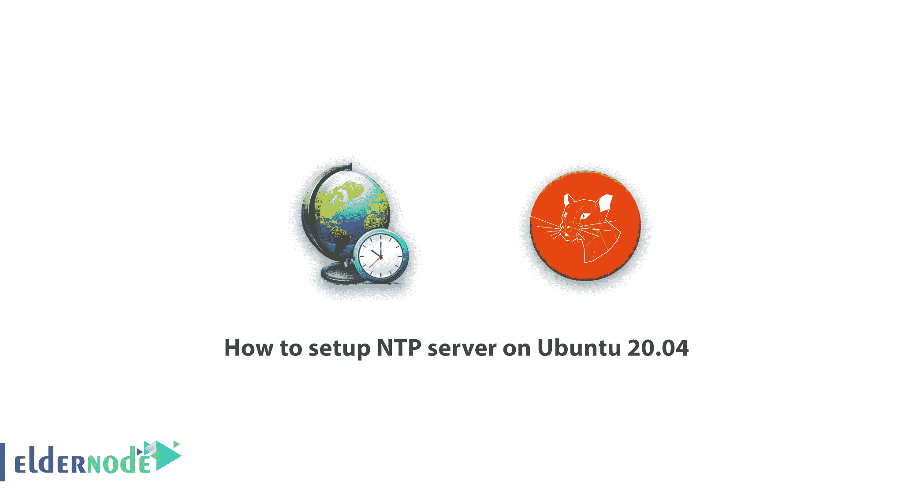

# 如何在 Ubuntu 20.04 - Eldernode 博客上设置 NTP 服务器

> 原文：<https://blog.eldernode.com/setup-ntp-server-on-ubuntu-20-04/>



逐步了解如何在 Ubuntu 20.04 上设置 NTP 服务器。NTP 服务器是一种用于多种客户端和服务器的多个网络时钟的同步协议。NTP 服务器具有允许两个系统之间以一纳秒的精度进行同步的功能，因此这两个系统可以轻松地进行通信。系统时间不仅适用于用户，也适用于计算机本身。事实上，时间戳使两台或多台计算机之间的通信和正确提供网络服务变得很容易，并优化了网卡。创建 NTP 协议是为了防止两台或多台计算机之间由于不同的系统时间而可能发生的不幸事件。在这篇文章中，我们试图让你了解**如何在 Ubuntu 20.04** 上设置 NTP 服务器。如果您需要购买 [Ubuntu VPS](https://eldernode.com/ubuntu-vps/) 服务器，请参见 [Eldernode](https://eldernode.com/) 中提供的软件包。

## 教程在 Ubuntu 20.04 上设置 NTP 服务器

### 什么是 NTP 协议？

NTP 代表网络时间协议，是基于 IP 的网络中使用的最古老的协议之一。NTP 协议是由特拉华大学的大卫·l·米尔斯于 1985 年开发的。使用这种协议，有可能同步和使用精确的时钟到计算机网络中的原子钟的水平。通常，在网络或连接到全球网络的任何系统中，通过连接到时间服务器，可以微调该网络的一个或多个系统的时钟。NTP 使用通用同步时钟或协调世界时(UTC)来协调计算机时钟，UTC 是一种原子时标准。

### NTP 协议是如何工作的？

在最基本的情况下，NTP 服务器由同步设备组成，如客户端和接收 UTC 时间并将其传递给客户端的 NTP 服务器。客户端和服务器通过一系列请求和响应进行通信，如下所示:

**–**客户端向时间服务器发送 NTP 请求包，确认执行时间。(源开始时间)

**–**服务器确认收到请求包的时间。

**–**服务器再次向客户端发送响应包。

**–**客户收到响应包时确认目的地时间。

这个过程可能只需要十亿分之一秒，但是时间戳允许客户端计算环岛中的延迟。它还检查其内部时间与服务器提供的时间之间的差异，并在必要时精确重置时钟。

在本文的剩余部分，加入我们来教你如何在 Ubuntu 20.04 上设置 NTP 服务器。

## 在 Ubuntu 20.04 上设置 NTP 服务器

要在 [Ubuntu](https://blog.eldernode.com/tag/ubuntu/) 20.04 上安装 NTP 服务器，需要遵循以下步骤。在第一步中，您必须使用以下命令来更新系统存储库:

```
$ sudo apt update -y
```

成功更新系统后，现在可以使用以下命令行安装 NTP 服务器了:

```
$ sudo apt install ntp
```


如上图所示，系统会询问您是否要继续安装过程。键入“ **Y** ”并按 Enter 键继续安装。

接下来，您需要确认 NTP 服务器的安装。为此并检查系统中 NTP 服务器的安装状态，您需要键入并运行以下命令:

```
$ sntp --version
```


## 如何在 Ubuntu 20.04 上配置 NTP 服务器

因为程序需要能够与公共 ntp 服务器同步时间，所以您必须在成功安装 NTP 服务器后编辑 **ntp.conf** 文件。为此，键入并运行以下命令:

```
$ sudo nano /etc/ntp.conf
```

执行上述命令后，将出现一个页面，您可以在其中看到以下信息:

```
pool 0.ubuntu.pool.ntp.org iburst  pool 1.ubuntu.pool.ntp.org iburst  pool 2.ubuntu.pool.ntp.org iburst  pool 3.ubuntu.pool.ntp.org iburst
```

您必须用您想要的 NTP 池服务器替换上述命令，并输入您想要的区域。这里我们已经替换了北美 NTP 池服务器。您还可以通过访问 [NTP 站点](http://support.ntp.org/bin/view/Servers/NTPPoolServers)来查看和选择 NTP 池服务器列表。替换以下命令后，您必须**保存**文件并退出。

```
pool 0.north-america.pool.ntp.org iburst  pool 1.north-america.pool.ntp.org iburst  pool 2.north-america.pool.ntp.org iburst  pool 3.north-america.pool.ntp.org iburst
```

现在是时候使用下面的命令和**重启**系统了:

```
$ sudo systemctl restart ntp
```

重新启动后，使用以下命令查看系统状态，并查看 NTP 服务器是否处于活动状态:

```
$ sudo systemctl status ntp
```


## 结论

由于新的和不同类型的软件和硬件的出现，网络管理员关心的问题之一是同步这些工具的时间。通过这样做，除了免受可能的攻击之外，还可以更精确地存储信息。在本文中，我们试图教你如何在 Ubuntu 20.04 上设置 NTP 服务器。如果你想在 Windows 中这样做，请参考文章[教程通过 PowerShell 配置 NTP 服务器](https://blog.eldernode.com/ntp-server-configuration-via-powershell/)和[教程在 Windows Server 2019 中配置 NTP 服务器](https://blog.eldernode.com/configure-ntp-server-in-windows-server/)。