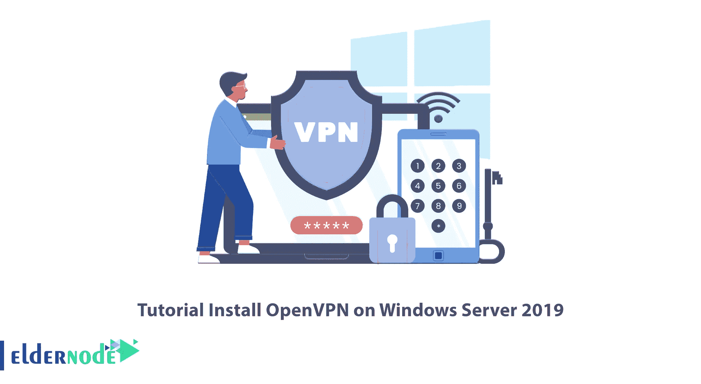
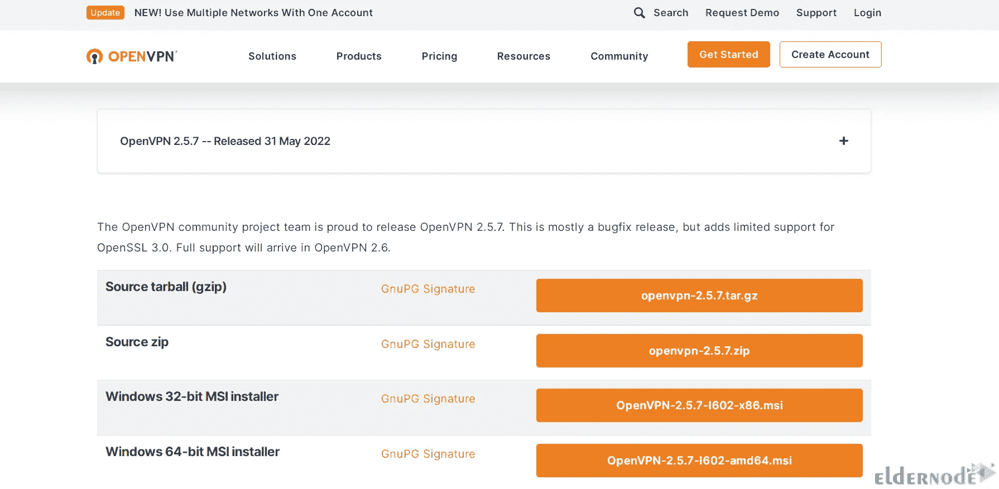
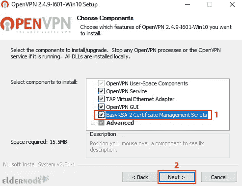
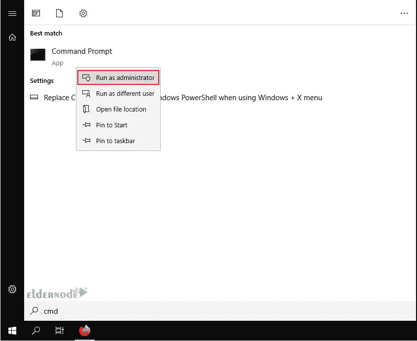

# 如何在 Windows Server 2019 - Eldernode 上设置 OpenVPN

> 原文：<https://blog.eldernode.com/setup-openvpn-on-windows-server-2019/>



如果你想保护你的网上隐私或加密你在网上的信息，使其不落入黑客之手；你应该使用 VPN。任何 VPN 的主要元素是它所使用的 VPN 协议。在本文中，我们将教你如何在 Windows Server 2019 上安装 OpenVpn。大多数 VPN 支持多种协议，如 IKEv2、L2TP 和 SSTP，但 OpenVPN 协议被认为是世界上最流行和最好的 VPN 协议。在这篇文章中，我们将教你如何在 Windows Server 2019 上设置 OpenVPN。如果你想购买自己的[](https://eldernode.com/buy-rdp/)**，你可以查看 [Eldernode](https://eldernode.com/) 网站上提供的套餐。**

## ****教程在 Windows Server 2019 上设置 OpenVPN****

### ****什么是 OpenVPN？****

**Openvpn 是目前最流行和广泛使用的 vpn 协议。与其他基于 IPSec 的隧道协议(如 L2tp)不同，Openvpn 依赖 SSL / TLS 进行身份验证和数据加密。这种标准安全技术用于从一个地方到另一个地方或从一点到另一点进行安全的远程连接。使用 SSL 来保护金融交易、数据传输、电子邮件和其他东西非常流行。**

**OpenVPN 兼容所有主流操作系统，如 Windows、Android、iOS、Mac 和 Linux。它是开源的，支持高达 256 位的加密。**

##### **可用的 OpenVPNs 如下:**

****–>****OpenVPN 社区版:**开源免费版，没有用户限制。**

****–>OpenVPN 接入服务器:**它基于社区版，但提供额外的付费和专有功能，如轻松管理管理门户、LDAP 集成等。**

****–>OpenVPN-as-a-Service:**这是一种无需安装 VPN 服务器的解决方案。只需购买 OpenVPN Cloud，您就可以连接到世界各地的托管服务。**

**在 [Windows 培训](https://blog.eldernode.com/tag/windows/)标签的这一步，你将学习如何在 Windows Server 2019 上安装 OpenVPN。**

### ****先决条件****

**–访问端口 1194 以连接到同一网络**

**–Windows Server 2019**

**您可以通过向防火墙添加规则来允许端口 1194 上的 UDP 流量，从而实现这一点。**

## ****如何在 Windows Server 2019 上安装 OpenVPN****

**前往官方 [OpenVPN](https://openvpn.net/community-downloads/) 网站下载 OpenVPN 社区版的最新 Windows 64 位 MSI 安装程序:**

****

**下载完成后，转到下载的文件并双击它。单击所需功能旁边的图标进行选择。检查**“easy RSA 2 证书管理脚本”**并点击**下一步**:**

****

**安装完成后，您应该生成证书和密钥来访问 VPN。为此，通过在开始菜单上键入 cmd 并右键单击命令提示符图标来打开终端。选择“以管理员身份运行”:**

****

**转到以下路径:**

**现在您可以开始配置 OpenVPN 了:**

```
`C:\Program Files\OpenVPN\easy-rsa`
```

**在这一步中，您需要在文本编辑器中打开 vars.bat 文件:**

```
`init-config`
```

**通过用您的业务数据切换“US”、“CA”等来编辑后续行:**

```
`notepad vars.bat`
```

****–>KEY _ CN 和 KEY_NAME:** 它们对于每个构建请求都是唯一的，并且引用通用名称字段和证书的名称。**

```
`set KEY_COUNTRY=US set KEY_PROVINCE=CA set KEY_CITY=SanFrancisco set KEY_ORG=OpenVPN set [[email protected]](/cdn-cgi/l/email-protection)`
```

****–>KEY _ OU:**指的是一个“组织单元”，如果没有要求，可以设置为任意值。**

****–>PKCS11 _ values:**它们是指用于硬件安全模块和智能卡的设置，如果您使用它们的话。**

**保存文本编辑器文件并退出。**

**要应用更改，请输入以下命令:**

****房屋证书和钥匙****

```
`vars`
```

```
`clean all`
```

#### **为了创建证书颁发机构(CA)证书和密钥，我们需要运行以下命令:**

**这将提示您输入您的国家、州和城市。这些选项也有默认值，显示在括号内:**

```
`build-ca`
```

**使用以下命令，我们初始化服务器的证书和密钥:**

```
`Certificate Authority "OpenVPN-CA": Country Name (2 letter code) [US]: State or Province Name (full name) [CA]: Locality Name (eg, city) [SanFrancisco]: Organization Name (eg, company) [OpenVPN]: Organizational Unit Name (eg, section) []: Common Name (eg, your name or your server's hostname) []:OpenVPN-CA Email Address [[[email protected]](/cdn-cgi/l/email-protection)]:`
```

**当提示签署证书并提交时，输入**“y”**，输入**“常用名”**作为服务器。**

```
`build-key-server server`
```

****服务器证书和密钥****

#### ****客户端证书和密钥****

```
`C:\Program Files\OpenVPN\easy-rsa>build-key-server.bat Generating a RSA private key ..............................................................................................................................................................................................................................................++++ ................................++++ writing new private key to 'keys\.key' ----- You are about to be asked to enter information that will be incorporated into your certificate request. What you are about to enter is what is called a Distinguished Name or a DN. There are quite a few fields but you can leave some blank For some fields there will be a default value, If you enter '.', the field will be left blank. ----- Country Name (2 letter code) [US]:US State or Province Name (full name) [MI]: Locality Name (eg, city) [Lansing]: Organization Name (eg, company) [OpenVPN]: Organizational Unit Name (eg, section) [changeme]: Common Name (eg, your name or your server's hostname) [changeme]:Server Name [changeme]: Email Address [[[email protected]](/cdn-cgi/l/email-protection)]: Please enter the following 'extra' attributes to be sent with your certificate request A challenge password []:XXXXXXXXXXXXXXXX An optional company name []: Using configuration from openssl-1.0.0.cnf Can't open keys/index.txt.attr for reading, No such file or directory 1832:error:02001002:system library:fopen:No such file or directory:crypto/bio/bss_file.c:74:fopen('keys/index.txt.attr','r') 1832:error:2006D080:BIO routines:BIO_new_file:no such file:crypto/bio/bss_file.c:81: Check that the request matches the signature Signature ok The Subject's Distinguished Name is as follows countryName :PRINTABLE:'US' stateOrProvinceName :PRINTABLE:'MI' localityName :PRINTABLE:'Lansing' organizationName :PRINTABLE:'OpenVPN' organizationalUnitName:PRINTABLE:'changeme' commonName :PRINTABLE:'Server' name :PRINTABLE:'changeme' emailAddress :IA5STRING:'[[email protected]](/cdn-cgi/l/email-protection)' Certificate is to be certified until Dec 24 19:01:08 2029 GMT (3650 days) Sign the certificate? [y/n]:y 1 out of 1 certificate requests certified, commit? [y/n]y Write out database with 1 new entries Data Base Updated C:\Program Files\OpenVPN\easy-rsa>`
```

#### **对于将连接到服务器的每个客户端，您应该选择一个唯一的名称来标识该用户的计算机，如以下示例中的“Michael-PC”。**

**出现提示时，输入通用名称作为您为客户端证书/密钥选择的名称。您将对将要连接到 VPN 的每台客户端计算机重复此步骤。**

**在这一部分中，您需要使用 build-dh 命令生成“Diffie Hellman”参数。为了设置加密模型，这一步是必要的。**

```
`C:\Program Files\OpenVPN\easy-rsa>build-key Michael-PC Generating a RSA private key .............................................................................................................................................................................++++ ..............................................................................++++ writing new private key to 'keys\Michael-PC.key' ----- You are about to be asked to enter information that will be incorporated into your certificate request. What you are about to enter is what is called a Distinguished Name or a DN. There are quite a few fields but you can leave some blank For some fields there will be a default value, If you enter '.', the field will be left blank. ----- Country Name (2 letter code) [US]: State or Province Name (full name) [MI]: Locality Name (eg, city) [Lansing]: Organization Name (eg, company) [OpenVPN]: Organizational Unit Name (eg, section) [changeme]: Common Name (eg, your name or your server's hostname) [changeme]:Michael-PC Name [changeme]: Michael Jordan Email Address [[[email protected]](/cdn-cgi/l/email-protection)]: Please enter the following 'extra' attributes to be sent with your certificate request A challenge password []:XXXXXXXXXXXXXXXX An optional company name []: Using configuration from openssl-1.0.0.cnf Check that the request matches the signature Signature ok The Subject's Distinguished Name is as follows countryName :PRINTABLE:'US' stateOrProvinceName :PRINTABLE:'MI' localityName :PRINTABLE:'Lansing' organizationName :PRINTABLE:'OpenVPN' organizationalUnitName:PRINTABLE:'changeme' commonName :PRINTABLE:'Michael-PC' name :PRINTABLE:'Michael Jordan' emailAddress :IA5STRING:'[[email protected]](/cdn-cgi/l/email-protection)' Certificate is to be certified until Dec 24 19:06:10 2029 GMT (3650 days) Sign the certificate? [y/n]:y 1 out of 1 certificate requests certified, commit? [y/n]y Write out database with 1 new entries Data Base Updated C:\Program Files\OpenVPN\easy-rsa>`
```

**生成共享密钥(使用 tls-auth 时需要):**

```
`C:\Program Files\OpenVPN\easy-rsa>build-dh.bat Generating DH parameters, 2048 bit long safe prime, generator 2 This is going to take a long time .................................+......................................................................................................+.............................................................................................+..................................................................................+......................................................... .............................................................................+............................+..........+........+............................................+..............................................+....++*++*++*++* C:\Program Files\OpenVPN\easy-rsa>`
```

****配置文件****

```
`"C:\Program Files\OpenVPN\bin\openvpn.exe" --genkey --secret   "C:\Program Files\OpenVPN\easy-rsa\keys\ta.key"`
```

#### **OpenVPN 提供了示例配置数据，使用开始菜单可以很容易地找到这些数据。**

**打开开始菜单，点击所有程序。然后从 OpenVPN 选项中选择 OpenVPN 示例配置文件。**

****服务器配置文件****

### **将示例“服务器配置”文件复制到 easy-rsa 文件夹中。该命令及其输出如下:**

**现在编辑 server.ovpn 文件:**

```
`copy "C:\Program Files\OpenVPN\sample-config\server.ovpn" "C:\Program Files\OpenVPN\easy-rsa\keys\server.ovpn" C:\Program Files\OpenVPN\easy-rsa>"C:\Program Files\OpenVPN\bin\openvpn.exe" --genkey --secret "C:\Program Files\OpenVPN\easy-rsa\keys\ta.key" C:\Program Files\OpenVPN\easy-rsa>copy "C:\Program Files\OpenVPN\sample-config\server.ovpn" "C:\Program Files\OpenVPN\easy-rsa\keys\server.ovpn" 1 file(s) copied. C:\Program Files\OpenVPN\easy-rsa>`
```

**在文件中找到以下行:**

```
`notepad "C:\Program Files\OpenVPN\easy-rsa\keys\server.ovpn"`
```

**然后编辑它们，如下所示:**

```
`ca ca.crt cert server.crt key server.key dh dh2048.pem`
```

**最后，保存并关闭文件。**

```
`ca "C:\\Program Files\\OpenVPN\\config\\ca.crt" cert "C:\\Program Files\\OpenVPN\\config\\server.crt" key "C:\\Program Files\\OpenVPN\\config\\server.key" dh "C:\\Program Files\\OpenVPN\\config\\dh2048.pem"`
```

****客户端配置文件****

### **客户端文件修改与服务器配置更改非常相似。**

**将示例服务器配置文件复制到 easy-rsa 文件夹中，并将客户机的常用名称作为文件名。**

****记住**:每个客户端都需要有一个唯一的文件名。**

**编辑客户端的配置文件。**

```
`copy "C:\Program Files\OpenVPN\sample-config\client.ovpn" "C:\Program Files\OpenVPN\easy-rsa\keys\Michael-PC.ovpn"    C:\Program Files\OpenVPN\easy-rsa>copy "C:\Program Files\OpenVPN\sample-config\client.ovpn" "C:\Program Files\OpenVPN\easy-rsa\keys\Michael-PC.ovpn"  1 file(s) copied.  C:\Program Files\OpenVPN\easy-rsa>` 
```

**在文件中找到以下设置，并按如下方式进行编辑:**

```
`notepad "C:\Program Files\OpenVPN\easy-rsa\keys\Michael-PC.ovpn"` 
```

**接下来，我们将编辑行“my-server-1”，将其替换为服务器的公共 IP 地址或域名。**

```
`ca ca.crt  cert client.crt  key client.key    to    ca "C:\\Program Files\\OpenVPN\\config\\ca.crt"  cert "C:\\Program Files\\OpenVPN\\config\\Michael-PC.crt"  key "C:\\Program Files\\OpenVPN\\config\\Michael-PC.key"` 
```

**保存并关闭文件。**

```
`remote my-server-1 1194    # The hostname/IP and port of the server.  # You can have multiple remote entries  # to load balance between the servers.    remote my-server-1 69.16.236.167    ;remote my-server-2 1194` 
```

**将客户端和服务器文件复制到它们相关的目录中**

#### **现在，您可以使用 **robocopy** 命令将这些文件从服务器上的 C:\ Program Files \ OpenVPN \ easy-RSA \ keys \复制到 C:\ Program Files \ OpenVPN \ config \中:**

**ca.crt**

*   **ta.key**
*   **dh2048.pem**
*   **server.crt**
*   **server.key**
*   **服务器. ovpn**
*   **您可以将以下文件从服务器上的 C:\ Program Files \ OpenVPN \ easy-RSA \ keys \复制到将使用 VPN 的每个客户端(例如，本例中的 Michael-PC)的 C:\ Program Files \ OpenVPN \ config \中**

**ca.crt**

```
`robocopy "C:\Program Files\OpenVPN\easy-rsa\keys\ " "C:\Program Files\OpenVPN\config\ " ca.crt ta.key dh2048.pem server.crt server.key server.ovpn` 
```

**ta.key**

```
`C:\Program Files\OpenVPN\easy-rsa>robocopy "C:\Program Files\OpenVPN\easy-rsa\keys\ " "C:\Program Files\OpenVPN\config\ " ca.crt ta.key dh2048.pem server.crt server.key server.ovpn  -------------------------------------------------------------------------------  ROBOCOPY :: Robust File Copy for Windows  -------------------------------------------------------------------------------  Started : Friday, December 27, 2019 12:16:02 PM  Source : C:\Program Files\OpenVPN\easy-rsa\keys\  Dest : C:\Program Files\OpenVPN\config\  Files : ca.crt  ta.key  dh2048.pem  server.crt  server.key  server.ovpn  Options : /DCOPY:DA /COPY:DAT /R:1000000 /W:30  ------------------------------------------------------------------------------  4 C:\Program Files\OpenVPN\easy-rsa\keys\  100% New File 2482 ca.crt  100% New File 432 dh2048.pem  100% New File 10901 server.ovpn  100% New File 657 ta.key  ------------------------------------------------------------------------------  Total Copied Skipped Mismatch FAILED Extras  Dirs : 1 0 1 0 0 0  Files : 4 4 0 0 0 0  Bytes : 14.1 k 14.1 k 0 0 0 0  Times : 0:00:00 0:00:00 0:00:00 0:00:00    Speed : 452250 Bytes/sec.  Speed : 25.877 MegaBytes/min.  Ended : Thursday, July 16, 2020 12:16:02 PM  C:\Program Files\OpenVPN\easy-rsa>` 
```

**迈克尔个人电脑**

**迈克尔-PC.key**

*   **迈克尔-PC.ovpn**
*   **防火墙设置**
*   **如果您有任何连接困难，请确保您在服务器的防火墙上设置了一个规则，允许在端口 1194 上传入 UDP 流量。(Win+R "wf.msc ")**
*   **结论**
*   **我们希望你会喜欢这个教程，你可以在评论区提出关于这个培训的问题，或者要解决其他关于老年节点培训的问题，请参考提问页面，尽快提出你的问题。在这篇文章中，我们教你如何在 Windows Server 2019 上安装 OpenVPN。**

**If you have any connection difficulties, ensure you set up a rule on the server’s firewall allowing incoming UDP traffic on port 1194\. (Win+R “wf.msc”)**

## **Conclusion**

**We hope you would enjoy this tutorial, you can ask questions about this training in the comments section, or to solve other problems in the field of Eldernode training, refer to the Ask page section and raise your problem in it as soon as possible. In this article, we taught you how to install OpenVPN on Windows Server 2019.**