# Debian 10 - Eldernode 博客上的 Pandora FMS 安装教程

> 原文：<https://blog.eldernode.com/setup-pandora-fms-on-debian-10/>

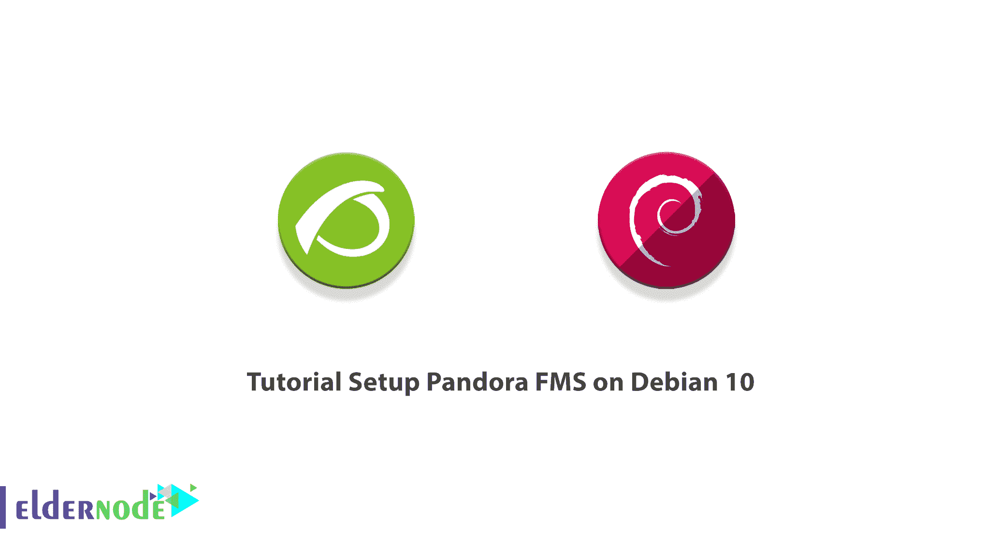

Pandora Flexible Monitoring System 是一款免费的开源且高度可扩展的 IT 基础设施监控工具。Pandora FMS 是根据 GNU 通用公共许可证的条款发布的。使用 Pandora FMS 可以管理系统和应用程序等网络设备。由于 Pandora FMS 被设计为模块化、多平台和易于定制，因此它支持对网络、服务器、应用程序、数据库、云和虚拟化、日志、用户体验和业务流程的监控。本文介绍了在 Debian 10 上设置 Pandora FMS 的教程**。您可以访问 [Eldernode](https://eldernode.com/) 的可用软件包，并以最优惠的价格和支持订购您自己的 **[Linux VPS](https://eldernode.com/linux-vps/)** 。**

## 如何一步一步在 Debian 10 上设置 Pandora FMS

作为管理员，你需要使用软件来监控计算机网络。使用 Pandora FMS，您可以从不同的操作系统、服务器、应用程序和硬件系统中对多个参数的状态和性能进行可视化监控。 [Linux](https://blog.eldernode.com/tag/linux/) 是 Pandora FMS 的首选操作系统，但在 Windows 下也能完美运行。 [CentOS](https://blog.eldernode.com/tag/centos/) 7 是推荐的分布。在 [Debian](https://blog.eldernode.com/tag/debian/) / [Ubuntu](https://blog.eldernode.com/tag/ubuntu/) 和 SUSE Linux 中都有安装包。

### **潘多拉 FMS 的组件**

潘多拉监控系统有四个组成部分。让我们读更多关于他们的书。

1-潘多拉 FMS 服务器

一个基于 Perl 的程序，负责执行检查、收集、聚合和处理数据。他们把数据存入数据库。所有服务器都集成到一个多线程应用程序中。

**2-潘多拉 FMS 控制台**

一个基于 PHP 的用户界面来操作和管理[监控](https://blog.eldernode.com/linux-server-monitoring-commands/)系统。它由一个数据库和一个 web 服务器提供支持。它还负责显示数据库中的信息。

**3-数据库**

关于监控系统的数据存储在数据库中。

**4-软件代理**

安装在受监控系统上的应用程序，作为守护程序或服务运行，收集数据并将其发送到 Pandora FMS 服务器。

### **安装设置的先决条件****Debian 10 上的潘多拉 FMS**

为了让本教程更好地工作，请考虑以下先决条件:

_ 拥有 Sudo 权限的非 root 用户。

_ 要进行设置，请遵循我们在 Debian 10 上的[初始服务器设置。](https://blog.eldernode.com/initial-setup-with-debian-10/)

_ 要查看系统硬件要求，请查看下表:

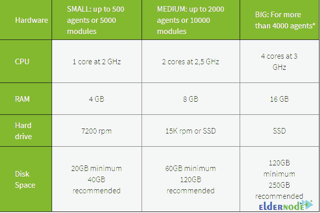

## **如何在 Debian 10 | Debian 9** 上安装潘多拉 FMS

如果您尚未安装 Pandora FMS，请阅读本节内容，并按照所需的步骤进行安装。但是如果你的 Debian 10 服务器上已经安装了 Pandora，那么请阅读本文中的**如何用 Pandora FMS** 监控 Debian 10 部分，看看如何设置 Pandora FMS。

但是，让我们从将您的系统包更新到更新版本开始。使用以下命令来完成此操作:

```
apt-get update -y
```

当您更新软件包时，运行下面的命令来安装 Pandora FMS 所需的所有**依赖项**:

```
apt-get install snmp snmpd libnet-telnet-perl libgeo-ip-perl libtime-format-perl libxml-simple-perl libxml-twig-perl libdbi-perl libnetaddr-ip-perl libhtml-parser-perl xprobe2 nmap libmail-sendmail-perl traceroute libio-socket-inet6-perl libhtml-tree-perl libsnmp-perl snmp-mibs-downloader libio-socket-multicast-perl libsnmp-perl libjson-perl -y
```

### **如何安装 LAMP 服务器**

在这一部分中，您必须安装 [Apache 服务器](https://blog.eldernode.com/install-apache-web-server-debian/)、 [MariaDB](https://blog.eldernode.com/mariadb-installation-on-debian-10/) 、PHP 和其他系统所需的依赖项。因此，键入:

```
apt-get install apache2 mariadb-server php php-common php-gmp php-curl php-mbstring php-xmlrpc php-mysql php-gd php-bcmath php-xml php-cli php-zip php-pear php-zip php-sqlite3 php-snmp php-db graphviz php-curl php-ldap dbconfig-common unzip git -y
```

所有软件包安装完成后，编辑 **php.ini** 文件并定义推荐的设置:

```
nano /etc/php/7.4/apache2/php.ini
```

然后，更改以下几行:

```
memory_limit = 256M
```

```
upload_max_filesize = 100M
```

```
max_execution_time = 360
```

```
max_input_vars = 2000
```

```
date.timezone = Europe/Paris
```

### **如何配置 MariaDB 数据库**

因为默认情况下没有设置 MariaDB 的 root 密码，所以运行下面的脚本在您的系统中设置它:

```
mysql_secure_installation
```

然后回答以下所有问题来设置 root 密码:

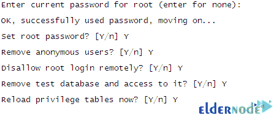

接下来，运行以下命令登录到 **MariaDB shell** :

```
mysql -u root -p
```

出现提示时提供您的 root 密码，然后使用以下命令启用 **mysql_native_password** 插件:

```
MariaDB [(none)]> USE MySQL;
```

```
MariaDB [(none)]> UPDATE user SET plugin='mysql_native_password' WHERE
```

```
User='root';
```

要为 Pandora 创建一个**数据库**和**用户**，输入:

```
MariaDB [(none)]> CREATE DATABASE pandora;
```

```
MariaDB [(none)]> GRANT ALL PRIVILEGES ON pandora.* to [[email protected]](/cdn-cgi/l/email-protection)'localhost'
```

```
IDENTIFIED BY 'pandora';
```

然后，要清除特权并退出 MariaDB shell，请运行:

```
MariaDB [(none)]> FLUSH PRIVILEGES;
```

```
MariaDB [(none)]> EXIT;
```

现在，你需要编辑 **/etc/mysql/my.cnf** 文件并定义 **sql_mode** 。

```
nano /etc/mysql/my.cnf
```

添加以下几行:

```
[mysqld]
```

```
sql_mode=NO_ENGINE_SUBSTITUTION
```

最后，您可以**保存**并关闭文件。使用以下命令**重启**Maria db 服务以应用更改:

```
systemctl restart mariadb
```

### **如何下载潘多拉 FMS**

要下载 Pandora FMS 的最新版本，请运行以下命令从 Github 获取:

```
cd /var/www/html/
```

```
git clone https://github.com/pandorafms/pandorafms.git
```

然后，您可以对下载的目录授予适当的权限和所有权:

```
chown -R www-data:www-data /var/www/html/pandorafms
```

```
chown -R www-data:www-data /var/www/html/pandorafms/pandora_console/
```

```
chmod -R 775 /var/www/html/pandorafms/pandora_console/
```

现在，**编辑**潘多拉配置文件:

```
nano /var/www/html/pandorafms/pandora_console/include/config.inc.php
```

最后，**取消对**的注释，并根据您的数据库设置更改以下行:

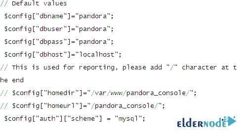

完成后，**保存**并关闭文件。

### **如何为潘多拉 FMS 配置 Apache**

在这一部分，您可以使用以下命令创建一个新的 Apache 虚拟主机配置文件:

```
nano /etc/apache2/sites-available/pandora.conf
```

然后，添加以下几行:

```
<VirtualHost *:80>
```

```
ServerAdmin [[email protected]](/cdn-cgi/l/email-protection)
```

```
ServerName pandora.eldernode.com
```

```
DocumentRoot /var/www/html/pandorafms/pandora_console
```

```
<Directory /var/www/html/pandorafms/pandora_console>
```

```
AllowOverride All
```

```
</Directory>
```

```
ErrorLog /var/log/apache2/error.log
```

```
CustomLog /var/log/apache2/access.log combined
```

```
</VirtualHost>
```

**保存**并关闭文件。使用以下命令启用 Pandora 虚拟主机:

```
a2ensite pandora
```

然后，重新加载 Apache 服务以应用配置更改:

```
systemctl restart apache2
```

## **如何用潘多拉 FMS** 监控 Debian 10

Pandora FMS 提供了显著的特性，使您能够通过一系列协议和内置服务灵活地监控服务器、应用程序和网络设备及其资源。一旦安装完全完成，您就可以访问潘多拉 FMS 并开始使用它。

打开你的网络浏览器，输入网址**http://pandora.eldernode.com/install.php**。如果安装步骤已经成功通过，您可以查看**安装向导**页面:

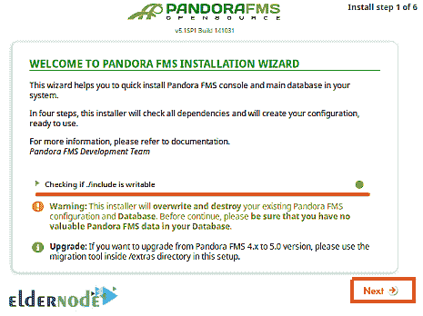

点击**下一个**按钮，看到如下页面:

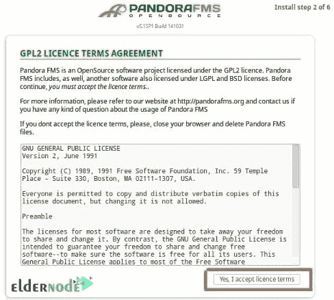

点击“**是，我接受许可条款**”。您应该会看到以下页面:

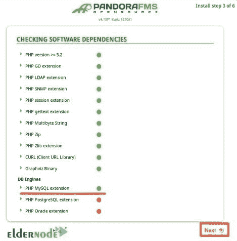

确保所有的 PHP 扩展都已安装，然后点击**下一步**按钮。您应该会看到以下页面:

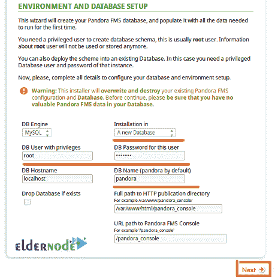

提供您的 root 用户名、MariaDB root 密码、数据库名称、Pandora 的路径，然后点击**下一个**按钮。您应该会看到以下页面:

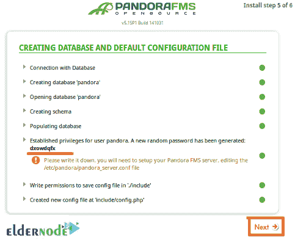

这将更改 Pandora 数据库用户的密码。所以你需要在**config.php**文件中定义你最初的潘多拉数据库密码。打开您的终端并编辑 config.php 文件:

```
nano /var/www/html/pandorafms/pandora_console/include/config.php
```

然后，使用您的原始密码更改“ **$config["dbpass"]** ”字段:

```
// Begin of automatic config file
```

```
$config["dbtype"] = "mysql"; //DB type (mysql, postgresql...in future others)
```

```
$config["mysqli"] = true;
```

```
$config["dbname"]="pandora";
```

```
$config["dbuser"]="pandora";
```

```
$config["dbpass"]="pandora";
```

```
$config["dbhost"]="localhost";
```

**保存**并关闭文件。然后，返回潘多拉安装向导，点击**下一步**按钮。您应该会看到以下页面:

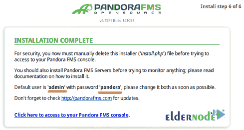

最后，再次打开您的终端并删除**install.php**文件:

```
rm -rf /var/www/html/pandorafms/pandora_console/install.php
```

现在，回到 Pandora FMS 安装向导，点击“**点击此处访问您的 Pandora FMS 控制台**”。您应该会看到 Pandora FMS 登录屏幕:

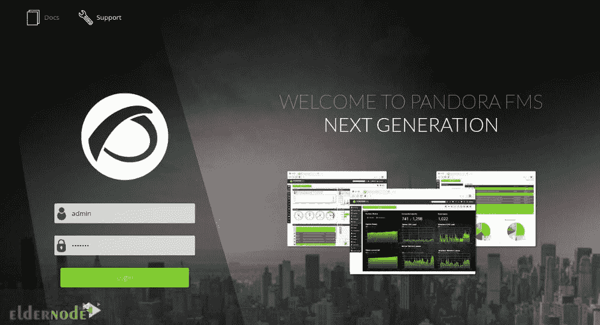

最后，提供默认的管理员用户名 admin 和密码 pandora。点击**登录**按钮。您应该会在以下屏幕上看到 Pandora 仪表板:

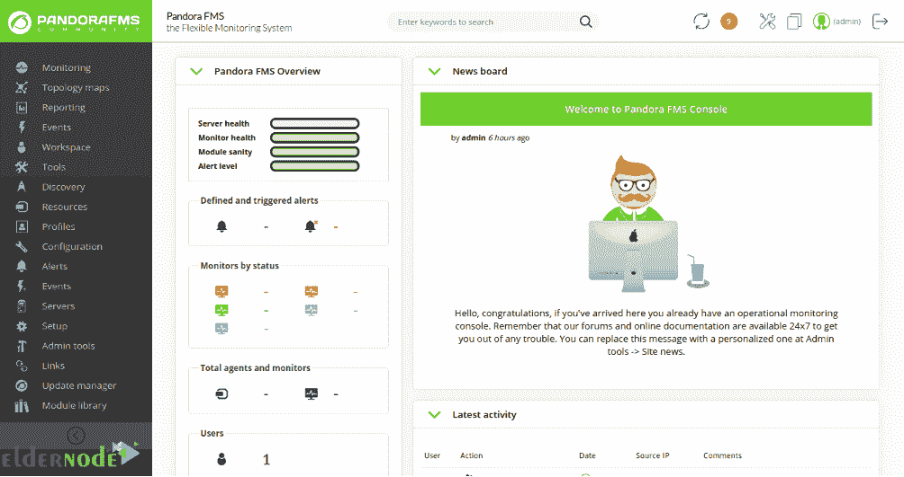

## 结论

本文介绍了在 Debian 10 上安装 Pandora FMS 的教程。要从 Pandora FMS 开始监控，您可以添加客户端系统。如果你有兴趣了解更多，请参考[如何在 Windows 10 RDP 上安装潘多拉 FMS](https://blog.eldernode.com/install-pandora-fms-on-windows-10/)。