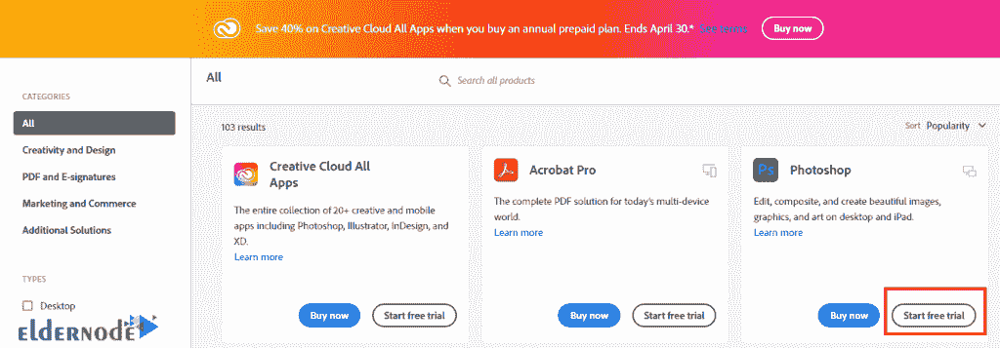

# 如何在 Windows VPS - Eldernode 博客上设置 Photoshop

> 原文：<https://blog.eldernode.com/setup-photoshop-on-windows-vps/>

Photoshop 是使用最广泛、最流行的图形软件之一，许多人每天都在使用它。事实上，我们每天处理的许多图像和平面设计都是由 Photoshop 软件创建的。这种软件的特性导致 Photoshop 被用于各种任务，例如修图和照片编辑、创建横幅、名片等等。在这篇文章中，我们将教你如何在 Windows VPS 上**设置 Photoshop。**

## **教程在 Windows VPS 上设置 Photoshop**

Adobe Photoshop 软件是最流行的创建和修改图像的程序，也是 Adobe 有价值的产品之一。这就是为什么在这篇文章中，我们决定向您介绍这个软件。在本文的续篇中，我们将一步步教你如何在 [Windows VPS](https://eldernode.com/windows-vps/) 上安装 Photoshop。请加入我们。

### **介绍 Photoshop 及其功能**

介绍 Photoshop 软件，最好先提供一个 Photoshop 做什么的定义。Photoshop 是一个非常强大的图形处理器，可以对图像进行编辑、修饰和重建等更改。此外，Photoshop 可以创建新的图像或组合不同的图像。这使得 Photoshop 培训成为很多企业的必备。

Adobe 是该软件的所有者和开发者。这个软件是由 Knoll 兄弟在 80 年代后期开发的，但是 Photoshop 是由 Adobe 在 1990 年正式推出的。随着时间的推移，该软件已被添加到其应用程序和功能中，并已能够极大地影响这一时期的摄影和图形艺术。

Photoshop 的重要功能包括:

1.一键选择主题，提高这种可能性

2.一键删除照片背景

3.快速层编辑

4.新的内容感知填充

5.新属性面板

6.智能对象的重要新功能

7.Tilda 键“~”及其有趣的功能

8.快速关闭不需要的文档

9.提高换档性能

10.新型优质经纱

## **如何在 Windows VPS 上安装 Photoshop**

在本节中，你将学习如何在 [Windows 服务器](https://blog.eldernode.com/tag/windows/) 上安装 Photoshop。为此，只需遵循以下步骤。首先，你需要从[创意云网站](https://creativecloud.adobe.com/apps/all/desktop/pdp/photoshop)栏目购买 Photoshop。然后点击**下载**如下图。请注意，您必须登录到 Creative Cloud 帐户才能执行此操作。

如果想用免费版，可以参考 [Creative Cloud apps 目录](https://www.adobe.com/products/catalog.html)页面。然后点击**开始免费试用**。

现在你需要去你下载文件的地方。双击它开始 Photoshop 安装过程。在打开的窗口中，选择您想要的**语言**，然后点击**继续**。

***注意:*** 安装本软件需要几分钟时间，请稍候。

程序安装完成后，点击**关闭**。

### **在 Windows VPS 上设置 Photoshop**

正如您在上一步中看到的，安装 Photoshop 非常容易。成功安装 Photoshop 后，你现在可以在**开始菜单**中输入 **Photoshop** 来启动它。然后在如下所示显示的结果中，点击它运行。

成功完成本教程提到的所有步骤后，Photoshop 就会启动。您可以在下图中看到 Photoshop 环境:

## 结论

根据图形艺术家的说法，Photoshop 是一个神奇的软件，是最受欢迎的图像编辑软件之一，广泛用于图形活动。由于这个软件非常受欢迎，我们试图教你如何在 Windows VPS 上安装和设置 Photoshop。