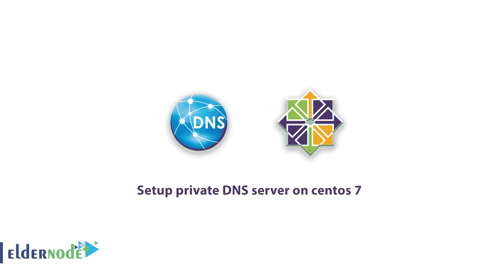

# 在 centos 8/7 - Eldernode 博客上设置专用 DNS 服务器的教程

> 原文：<https://blog.eldernode.com/setup-private-dns-server-on-centos/>



了解如何**在 centos 8/7** 上设置专用 DNS 服务器。简而言之，域名系统(DNS)是计算机、服务或连接到互联网或专用网络的任何资源的分层分布命名系统，用于处理分配给每个网站和公司的各种域的信息。最重要的是，它可以转化为与网络设备相关联的有意义且人性化的域名和数字标识符，以便在全球范围内定位和寻址这些设备。事实上，dns 服务器将域连接到服务器。在本文中，您将了解如何在 centos 版本 8 或 7 发行版中的 Linux 上安装专用 dns 服务器。您可以访问 [Eldernode](https://eldernode.com/) 中的套装来购买 [CentOS VPS](http://eldernode.com/centos-vps/) 服务器。

## 在 centos 8/7 上设置专用 DNS 服务器

下面，我们将向您介绍在 [centos](https://blog.eldernode.com/tag/centos/) 8 或 centos 7 上设置私有 DNS 服务器的过程。假设你有一个 IP 地址为 **192.168.12.8** 的服务器，你还有一个名为【eldernode.com】的域名。第一步是安装 BIND 包，然后配置它。最后，创建区域文件。跟随我们继续本教程。

***注意:*** 你必须用本文中的说明替换你的 IP 地址和网址。

### 如何在 CentOS 8 或 Centos 7 上安装 BIND 包

BIND 代表伯克利互联网域名，这是一种提供将域名转换为 IP 的能力的软件。要执行在 centos 7 上安装 BIND DNS 服务器或在 [CentOS](https://blog.eldernode.com/tag/centos/) 8 或 CentOS 7 上配置 BIND DNS 服务器的命令，您需要 **root server access** 才能使用 SSH 连接到您的服务器。您可以使用以下命令安装 BIND:

```
yum -y install bind bind-utils
```

### 如何在 CentOS 8 或 centos 7 上配置 BIND

绑定服务的绑定文件位于 **etc/named.conf/** 。打开 **etc/named.conf/** 文件，将以下两个命令行置于注释模式:

```
# listen-on port 53 {127.0.0.1; };
```

```
# listen-on-v6 port 53 {:: 1; };
```

现在你需要在下面一行添加你的网络。例如，在下面的命令中，我添加了 192.168.12.0/24。这允许网络上的客户使用 DNS 将名称转换为 IP:

```
allow-query {localhost; 192.168.12.0/24; };
```

如果您想要将所有区域移动到服务器(192.168.12.6)，请添加以下行:(**可选的**)

```
allow-transfer {192.168.12.6; };
```

### 了解如何创建区域文件

在以下命令中，我们为域**eldernode.com**编写了一个区域，该区域被添加到 **named.conf** 文件中:

```
zone "eldernode.com" IN {  type master;  file "fwd.eldernode.com.db";  allow-update { none; };  };
```

以下示例是在名为. conf 的文件**中的反向条目，称为反向区域:**

```
zone "12.168.192.in-addr.arpa" IN {  type master;  file "12.168.192.db";  allow-update { none; };  };
```

***上例中:***

**–***12 . 168 . 192 . in-addr . arpa*是反向参考的名称。

**–***主*代表主 dns。

**–***12 . 168 . 192 . db*是反向查找文件。

**–***allow-update*:既然这是原来的 DNS，就不应该有，这也是我们设置为 none 的原因。

#### 如何为区域创建查找文件

现在是时候为一个区域创建查找文件了。默认情况下，区域中的查找文件位于 **var/named/** 文件夹中。所以你需要在这个文件夹中创建一个名为 **fwd.eldernode.db** 的区域文件进行正向查找。

***注意，所有域名都必须以点号结尾。***

以下是一些特定于区域文件的关键词:

```
A – A record
```

```
NS – Name Server 
```

```
MX – Mail for Exchange 
```

```
CNAME – Canonical Name
```

那么，使用以下命令打开创建的区域文件:

```
vi /var/named/fwd.nginxweb.ir.db
```

现在输入以下内容:

```
$TTL 86400  @   IN  SOA     primary.eldernode.com. root.eldernode.com. (  2014112511  ;Serial  3600        ;Refresh  1800        ;Retry  604800      ;Expire  86400       ;Minimum TTL  )  ;Name Server Information  @      IN  NS      primary.eldernode.com.  ;IP address of Name Server  primary IN  A       192.168.12.8  ;Mail exchanger  eldernode.com. IN  MX 10   mail.eldernode.com.  ;A - Record HostName To Ip Address  www     IN  A       192.168.12.100  mail    IN  A       192.168.12.150  ;CNAME record  ftp     IN CNAME        www.eldernode.com.
```

在 **var/named/** 文件夹下为“反向区域”创建一个名为 12.168.192.db 的“**区域**文件。同时为上述区域设置反向指针:

```
PTR – Pointer  SOA – Start of Authority
```

```
# vi /var/named/12.168.192.db    $TTL 86400  @   IN  SOA     primary.eldernode.com. root.eldernode.com. (  2014112511  ;Serial  3600        ;Refresh  1800        ;Retry  604800      ;Expire  86400       ;Minimum TTL  )  ;Name Server Information  @ IN  NS      primary.eldernode.com.  ;Reverse lookup for Name Server  8        IN  PTR     primary.eldernode.com.  ;PTR Record IP address to HostName  100      IN  PTR     www.eldernode.com.  150      IN  PTR     mail.eldernode.com.
```

创建区域文件后，**再次重启**绑定服务。

```
 systemctl restart named.service
```

您还可以使用以下命令使服务在启动时启动:

```
 systemctl enable named.service
```

您能够在 centos 8/7 上成功安装、配置和设置 dns 服务器。现在，如果你做得对，你的域名将连接到服务器。

## 结论

BIND 软件是默认 DNS 软件之一，当然也是这项服务最受欢迎的软件，专门针对 Unix/Linux 操作系统。它在 DNS 服务器中的主要功能是将域名转换成 IP 地址。在 Linux 服务器上安装和配置 BIND 是服务器配置中最重要的事情之一。在本文中，我们试图教您如何在 centos 8 或 centos 7 上设置专用 DNS 服务器。