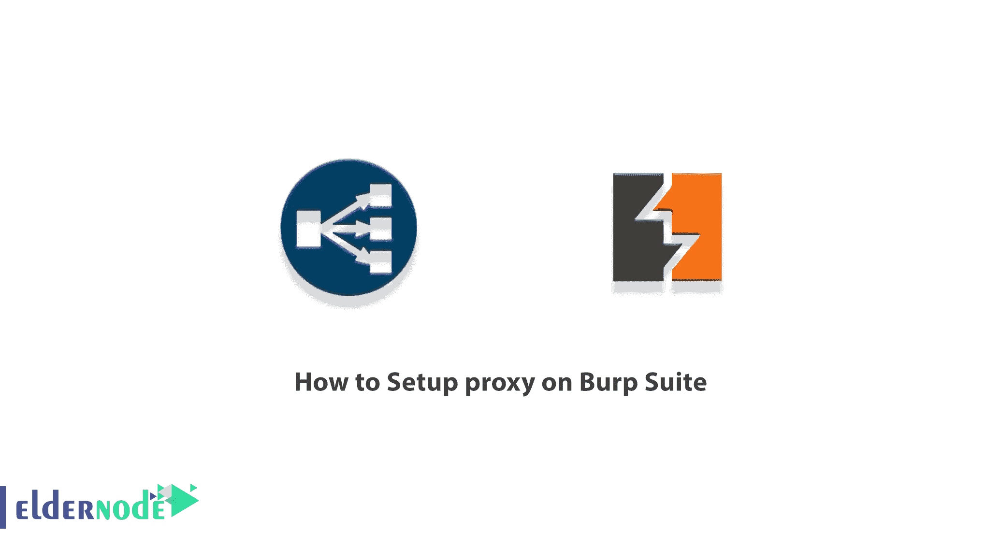
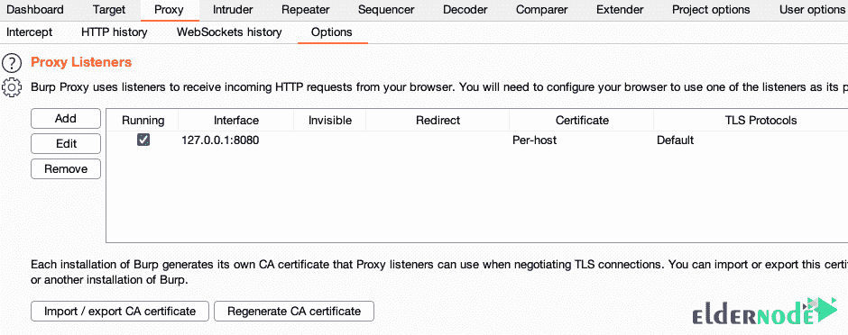
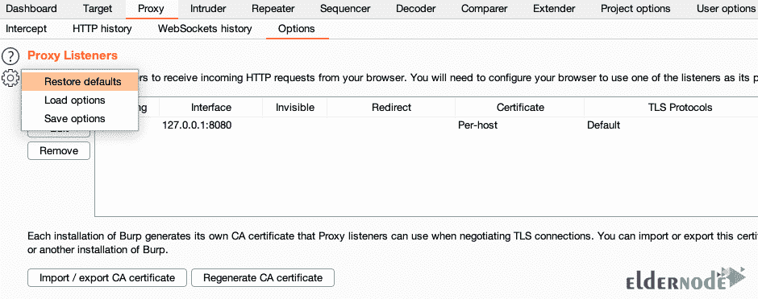
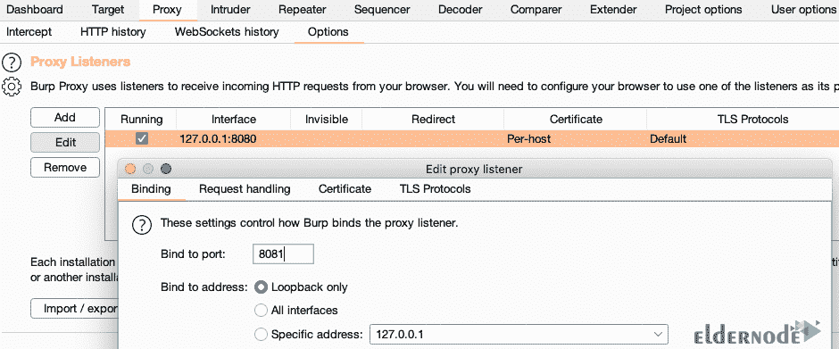
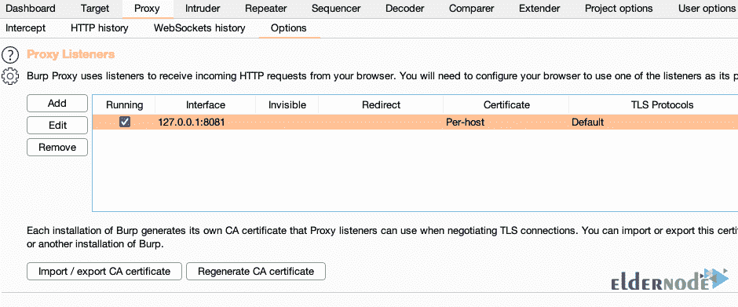

# 如何在 Burp Suite - Eldernode 博客上设置代理

> 原文：<https://blog.eldernode.com/setup-proxy-on-burp-suite/>

Burp Suite 是一个用于检查 web 应用程序安全性的应用程序框架，它包括几个工具，允许您无缝地检查现代 web 应用程序的组件。Burp Suite 本质上是一个本地 web 代理，可用于分析用户浏览器和目标站点之间的 HTTP/S 请求和响应，并在必要时进行编辑。在这篇文章中，我们将教你如何在 Burp Suite 上设置代理。需要注意的是，如果你想买一个 **[VPS 服务器](https://eldernode.com/vps/)** ，可以在 [Eldernode](https://eldernode.com/) 中看到可用的包。

## **教程设置代理上打嗝套件**

Burp Suite 工具是渗透测试、黑客和 web 应用程序安全领域的一个非常强大的工具。这个工具为你提供了很多很棒的特性，是渗透测试和网站安全领域最好的工具之一。因此，每个安全专家都有必要学习使用这个工具，以便能够专业地实现他们的渗透测试。使用[打嗝套件](https://blog.eldernode.com/tag/burp-suite/)最重要的部分之一就是设置一个默认可用的代理。在下一节中，加入我们来教你如何在 Burp Suite 上设置代理。

## **逐步在打嗝套件上设置代理**

有趣的是，Burp 的代理侦听器是一个本地 HTTP 代理服务器，它侦听来自浏览器的传入通信。然后，您可以跟踪浏览器发送和接收的所有 HTTP 请求和响应。所以我们不得不说，这是 Burp 以用户为中心的工作流程的核心。

应该注意，默认情况下，Burp 会在环回接口的端口 8080 上创建一个监听器。注意，当您第一次想要启动 Burp 时，您需要检查这个监听器是否是活动的并且正在运行。为此，只需遵循以下步骤:

打开**打嗝**后，进入**代理**>>**选项**页签。

在“**代理监听器**面板中，您必须通过“**运行**复选框选择接口输入 127.0.0.1:8080。这样做将决定听者的活动和听力。请遵循以下步骤:

注意，否则，点击面板左上角的“**设置**图标，选择“**恢复默认值**”。您需要返回到“**运行**”框，查看代理监听器当前是否正在运行。

如果复选框被选中，检查监听器是否处于活动状态。如果未激活，您必须遵循以下步骤:

如果以上步骤仍然没有运行代理监听器，默认的 **8080 端口**可能不可用。如果是这样，您需要尝试另一个端口。请按照以下步骤操作:

第一步，您必须选择输入 127.0.0.1:8080 并点击“**编辑**按钮。这样做将打开“**编辑代理监听器**对话框。

然后在下一步的“**绑定到端口**”字段中，输入您认为空闲的新端口号，并单击“**确定**”。

在下一步中，您应该尝试通过选择“**运行**复选框来激活监听器。

### **如何检查浏览器代理配置**

一旦您配置了您的浏览器代理设置，您应该按照下面的步骤，以确保它正常工作。请注意，如果浏览器配置设置正确，您可以通过以下步骤轻松检查您的浏览器代理配置。

1.第一步是确保代理侦听器已启用。此外，检查您是否正确配置了浏览器。

2.第二步是你要打饱嗝。然后打开你配置的浏览器，到任意一个 **HTTP** 地址。请注意，此时您的浏览器必须等待请求完成。就像试图加载一个页面一样。这是因为 Burp 拦截了您的浏览器试图发送的 HTTP 请求。

***注意:*** 我们建议现阶段暂时不要用 HTTPS。

3.第三步，按照下面的步骤依次进行。在打嗝中，转到“**代理**”选项卡。然后打开下方的“**拦截**选项卡。应该注意，这两个选项卡都应该突出显示。最后，在“**拦截**选项卡中，您应该会在主面板中看到 HTTP 拦截请求。

4.在下一节中，你应该注意“**拦截是在**按钮上。请注意，如果您点击此按钮，它将变为“**拦截关闭**”，然后将发布来自 Burp 的请求。

5.在最后一步中，您可以返回浏览器，查看请求页面的加载情况。

如果您正确地完成了以上所有操作，您就完成了将外部浏览器与 Burp Suite 配合使用的强制配置步骤。如果您在执行这些步骤时遇到困难，请联系我们。

## 结论

Burp Suite 是一个用于检查 web 应用程序安全性的实用框架，它包括几个工具，允许您无缝地检查现代 web 应用程序的组件。代理是该程序的主要工具，可用于检查和编辑所有 web 流量。在本文中，我们试图向您介绍如何在 Burp Suite 上设置代理。