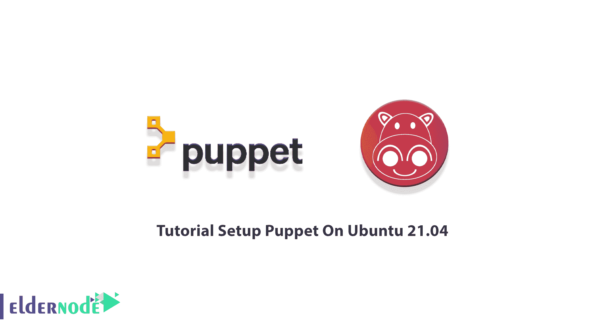

# Ubuntu 21.04 & 20.04 教程设置木偶- Eldernode 博客

> 原文：<https://blog.eldernode.com/setup-puppet-on-ubuntu/>



Puppet 是一个开源的、跨平台的企业自动化工具，用于管理和自动化服务器的配置。对于管理员来说，这是一个有用的工具，因为它能够通过网络自动配置所有的计算机系统，添加用户，安装软件包，等等。Puppet 是用 Ruby DSL 语言编写的，遵循客户机-服务器模式。加入我们来回顾 Ubuntu 21.04 上的**教程设置木偶。要找到您考虑的软件包，请访问 [Eldernode](https://eldernode.com/) 并购买您自己的 [Ubuntu VPS](https://eldernode.com/ubuntu-vps/) 托管服务。**

## **如何在 Ubuntu 21.04 上设置木偶**

之前给大家介绍过[木偶](https://blog.eldernode.com/puppet-service-for-linux/)。您可以使用它来远程执行管理任务和服务器管理。Puppet 可以在[的 Linux](https://blog.eldernode.com/tag/linux/) 、Unix 和[的 Windows](https://blog.eldernode.com/tag/windows/) 上使用。Puppet 可以设置在具有多个模块的客户端-服务器模型中，在本指南中，我们使用 Ubuntu 21.04 作为我们的 Puppet master 或 Puppet server。

### **在 Ubuntu 21.04 上安装木偶的先决条件**

为了让本教程更好地工作，请考虑以下先决条件:

_ 拥有 Sudo 权限的非 root 用户。要设置，请遵循我们在 Ubuntu 21.04 上的[初始服务器设置。](https://blog.eldernode.com/initial-server-setup-on-ubuntu-21-04/)

_ 两个或更多(主客户端和其他客户端)运行 Ubuntu 21.04 系统。

_ 与私有或公共网络相连的系统。

## **在 Ubuntu 21.04 上安装傀儡师和代理**

Puppet 使用客户机-服务器模型，其中 Puppetmaster 控制 Puppet 代理的配置信息。让我们来看一下在 Ubuntu 21.04 上安装 Puppet 所需的步骤，然后准备配置和设置它。

*第一步:*

像往常一样，从更新 Puppet master 和 Puppet client 系统上的所有包开始。运行以下命令来更新它们:

```
apt-get update -y
```

*第二步:*

现在，为了让节点通过主机名一起通信，**在两个节点上设置主机名**。为此，在两个节点上编辑 **/etc/hosts** 文件:

```
nano /etc/hosts
```

然后，在两个节点上添加以下行:

```
puppet-master-ip puppetmaster puppet
```

```
puppet-client-ip puppetclient
```

当你完成**保存**和**关闭**文件。

*第三步:*

默认情况下，Puppet 包在 Ubuntu 21.04 默认存储库中不可用。因此，为了在主节点上安装傀儡服务器，您需要在您的服务器上安装傀儡库。使用以下命令下载 Puppet 的最新版本:

```
wget https://apt.puppetlabs.com/puppet6-release-focal.deb
```

成功下载后，运行以下命令进行安装:

```
dpkg -i puppet6-release-focal.deb
```

安装完成后，运行以下命令来更新存储库并安装 Puppet 服务器:

```
apt-get update -y
```

```
apt-get install puppetserver -y
```

*第四步:*

现在您已经成功地安装了 Puppet 服务器，更改 Puppet Javaprocess 内存分配大小。为此，您需要编辑**/etc/default/puppetserver**文件:

```
nano /etc/default/puppetserver
```

完成后，**保存**，**关闭**文件。

*第五步:*

现在，你可以**启动傀儡服务**并且**使**它在系统重启时启动。所以，运行:

```
systemctl start puppetserver
```

```
systemctl enable puppetserver
```

*第六步:*

在这一步中，您可以通过运行下面的命令来验证 Puppet 服务的**状态**:

```
systemctl status puppetserver
```

## **如何安装和配置傀儡代理**

现在已经安装了 puppet 服务器，您可以在客户机节点上安装 Puppet 代理了。

首先，使用下面的命令**下载并安装 Puppet 存储库**:

```
wget https://apt.puppetlabs.com/puppet6-release-focal.deb
```

```
dpkg -i puppet6-release-focal.deb
```

在安装了上面的存储库之后，运行下面的命令来**安装傀儡代理**:

```
apt-get update -y
```

```
apt-get install puppet-agent -y
```

安装完 Puppet 代理后，打开 Puppet 配置文件进行编辑:

```
nano /etc/puppetlabs/puppet/puppet.conf
```

然后，添加下面一行来定义傀儡主人信息:

```
[main]  certname = puppetclient  server = puppetmaster
```

***注意* :** 确保在客户端的 **/etc/hosts** 文件中定义了这些主机名。

然后，您可以**保存**并**关闭**该文件。

现在，运行下面的命令**停止**、**启动**、**使**傀儡代理在客户端启动时自动启动:

```
sudo systemctl stop puppet
```

```
systemctl start puppet
```

```
systemctl enable puppet
```

同样，要验证傀儡的**状态**，运行以下命令:

```
systemctl status puppet
```

通过这种方式，安装并配置了傀儡代理。

### **如何签署傀儡代理人证书**

由于 Puppe 使用客户机-服务器体系结构，您应该在代理节点配置它之前批准每个代理节点的证书请求。在此部分中，切换回服务器节点。要列出服务器上所有可用的**证书**，请运行以下命令:

```
/opt/puppetlabs/bin/puppetserver ca list
```

然后，为了给**的所有证书**签名，运行以下命令:

```
/opt/puppetlabs/bin/puppetserver ca sign --all
```

一旦在输出中得到“*成功签署了傀儡客户端*的证书请求”和“*成功签署了傀儡主机*的证书请求”，这意味着傀儡主机能够通信并控制代理节点。

最后，使用下面的命令**在傀儡代理节点上测试傀儡主**和**代理通信**:

```
/opt/puppetlabs/bin/puppet agent --test
```

## 结论

在本文中，您了解了如何在 Ubuntu 21.04 上设置 Puppet。要做到这一点，您首先要学习安装傀儡师和代理。接下来，您回顾了 Puppet 代理的安装和配置。最后，通过签署傀儡代理证书，您已经成功地完成了本指南。因此，您将能够添加多个代理，并使用 Puppet 轻松管理它们。在使用该工具时向我们发送反馈，以帮助您的朋友使用您在[社区](https://community.eldernode.com/)上的新体验。