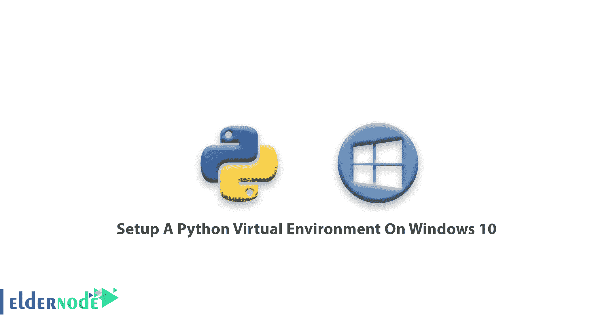

# 如何在 Windows 10 上设置 Python 虚拟环境-教程

> 原文：<https://blog.eldernode.com/setup-python-virtual-environment-on-windows/>



如何在 Windows 10 上设置 Python 虚拟环境？一个[虚拟环境](https://docs.python.org/3/library/venv.html#:~:text=A%20virtual%20environment%20is%20a,part%20of%20your%20operating%20system.)或一个 venv 是一个 Python 模块，为每个任务或项目创建一个独特的环境。它会安装您需要的特定于该设置的软件包，同时保持您的项目整洁有序。

Venv 从不实际修改系统的默认 Python 版本或安装在系统上的模块。

使用 venv 本质上考虑到了独特的工作环境，同时避免了对其他使用的 Python 变种的任何破坏，但与我们的项目无关。

在本文中，我们将教你如何在 [Windows 10](https://eldernode.com/tag/windows-10/) 中配置 Python 虚拟环境。

[**购买 Windows 虚拟专用服务器**](https://eldernode.com/windows-vps/)

**开机前提示:** 为了充分利用 venv 在 Windows 10 上的所有功能，我们建议启用 Linux ( WSL )的 Windows 子系统。

如何在 Windows 10 上设置 Python 虚拟环境？

## 为什么使用 WSL 以及如何启用它

**–**Python的很多教程都是为 Linux 环境编写的。

**–**大多数开发者使用基于 Linux 的打包 / 安装工具。

**–**使用 WSL 保证了开发和生产 **环境**的兼容性。

要启用 WSL，请按照下列步骤操作:

**1。T3 到开始。**

**2。** 搜索开启或关闭 Windows 功能

**3。T3 点击链接打开 Windows 控制面板。**

**4。T3 打开窗口功能弹出菜单。**

**5。** 在列表中向下滚动找到“ Windows 子系统 for Linux ”选项。

**6。**T3 选择复选框。

**7。** 重启。

### 如何安装 Linux

有多个 Linux 发行版支持 WSL。你可以从[微软商店](https://www.microsoft.com/en-us/p/ubuntu/9nblggh4msv6?activetab=pivot:overviewtab)找到并安装它们。

我们建议从 Ubuntu 18.04 LTS 发行版开始，因为它是最新的，有很好的支持社区，并且有很好的文档记录。

**1。** 要安装 Ubuntu，点击这个 [Ubuntu 18.04 LTS](https://www.microsoft.com/store/productId/9N9TNGVNDL3Q) 链接。

这将打开T2 微软商店，在那里你可以点击获取按钮。

**2。** 下载完成后，在**开始菜单**中输入“ Ubuntu 18.04 LTS ”。

**3。** 现在，你将被要求**创建**一个用户名和密码，因为这将是你第一次使用这个操作系统。

**4。** 你现在将以默认用户身份自动登录。

**5。** 最后，你需要**在新的操作系统上运行** **和** **更新**。

您可以通过运行以下命令来实现:

```
sudo apt update && sudo apt upgrade
```

**注意:** Windows 不处理该操作系统的升级，因此您需要通过手动运行更新和升级命令来确保 Ubuntu 保持最新。

你可以使用 PowerShell 安装你的发行版。

为了**安装**其中一个发行版，导航到包含新下载的 Linux 发行版的文件夹。

一旦进入那个文件夹，**在 **PowerShell** 中运行**下面的命令

**注意:** app_name.aspx 是分发文件的名称。

```
Add-AppxPackage .\app_name.appx
```

接下来，您必须使用 **Powershell 将发行版的路径添加到您的 Windows 环境路径中。**

(例如 C: \ 用户 \ 管理员 \ Ubuntu )。

```
$userenv = [System.Environment]::GetEnvironmentVariable("Path", "User")    [System.Environment]::SetEnvironmentVariable("PATH", $userenv + ";C:\Users\Admin\Ubuntu", "User")
```

现在，你可以通过输入【uubuntu.exe】的来启动**的**发行版。

接下来，您应该初始化新实例。

### 如何发布发行版

为了完成新安装的发行版的初始化，你需要启动一个**新实例**。

你可以通过点击**微软应用商店**中的启动按钮，或者通过启动发行版来完成操作。从开始菜单打开 exe 文件。

**注意:** 如果使用 [Windows 服务器](https://eldernode.com/tag/windows-server/)，可以从发行版的安装文件夹中启动发行版的启动程序的可执行文件(**Ubuntu.exe**)。

在安装的最后阶段，发行版的文件将被解压缩并存储在您的 PC 上。

> **这个过程可能需要几分钟。**

### 设置步骤

在 windows 上安装虚拟环境有**四个基本步骤**:

**1。T3 安装 Python**

**2。T3 安装 Pip**

**3。安装 VirtualEnv**

**4。安装 VirtualEnvWrapper-win**

#### 第一步。安装 Python

[Python 3.8.5](https://www.python.org/ftp/python/3.8.5/python-3.8.5.exe) 是 Python 最新的主要版本。

**注:** 现在有一个基于 web 的安装程序，用于 **Windows** 。该安装程序将在安装过程中下载所需的软件。

**–**还有包含 Windows 版本的 Python 可再发行文件，这使得将 Python 包含在另一个软件包中变得更加容易。

> **如果你安装了上面列表中的 Ubuntu 18.04，Python3 是预装的。**

#### 第二步。安装 PIP

Python3 通常预装了 pip，但是，如果您得到错误“ pip 命令未找到”，只需使用以下方法安装 pip:

```
curl https://bootstrap.pypa.io/get-pip.py -o get-pip.py
```

**–**下载 [get-pip.py，](http://pip.readthedocs.io/en/stable/installing/#do-i-need-to-install-pip)并确保你正在将文件保存到你的**桌面**。

**–**在您的 **Windows 命令提示符**下，导航到您的桌面并运行 get-pip.py 脚本。

之后，pip 应该在系统范围内工作。

```
python3 get-pip.py
```

您可能需要在命令提示符下拥有管理权限才能完成此任务。

有关这方面的更多信息，请按照 Microsoft TechNet 网站上的说明从[以管理员身份启动命令提示符](https://docs.microsoft.com/en-us/windows-server/administration/windows-commands/start)。

```
cd Desktop  Python get-pip.py
```

#### 第三步。安装 Virtualenv

在 **Windows 命令提示符**中键入以下命令:

```
pip install virtualenv
```

在您的 windows 命令提示符下，前往您的项目位置进行启动 virtualenv :

```
cd my_project
```

一旦进入项目文件夹，运行:

```
virtualenv env
```

在**窗口**， virtualenv (venv)创建一个名为:

```
\env\Scripts\activate.bat
```

在**窗口**上激活 virtualenv ，激活脚本在脚本文件夹中:

```
\pathto\env\Scripts\activate
```

**例如:**

```
 C:\Users\'Username'\venv\Scripts\activate.bat
```

#### 第四步。安装 VirtualEnvWrapper-win

我们推荐使用两种主要方法来安装这个批处理脚本:

**一)** 使用画中画

```
pip install virtualenvwrapper-win
```

**B)** 从源安装

```
git clone git://github.com/davidmarble/virtualenvwrapper-win.git
```

然后你可以 cd 到 virtualenvwrapper-win 文件夹，然后运行:

```
python setup.py install
```

**亦作，见:**

[教程在 Windows 上安装 Python](https://eldernode.com/install-python-on-windows/)

[如何为 Python 设置系统变量路径](https://eldernode.com/set-system-variable-path-for-python/)

[教程在 Windows 上安装 PIP](https://eldernode.com/install-pip-on-windows/)

**尊敬的用户**，我们希望您能喜欢这个[教程](https://eldernode.com/category/tutorial/)，您可以在评论区提出关于本次培训的问题，或者想解决[老年人节点培训](https://eldernode.com/blog/)领域的其他问题，请参考[提问页面](https://eldernode.com/ask)部分，并尽快提出您的问题。腾出时间给其他用户和专家来回答你的问题。

如何在 Windows 10 上设置 Python 虚拟环境？

好运。