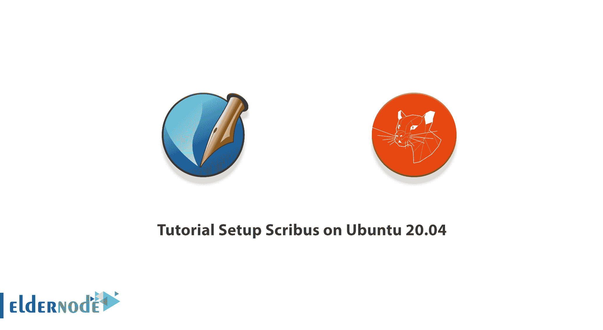
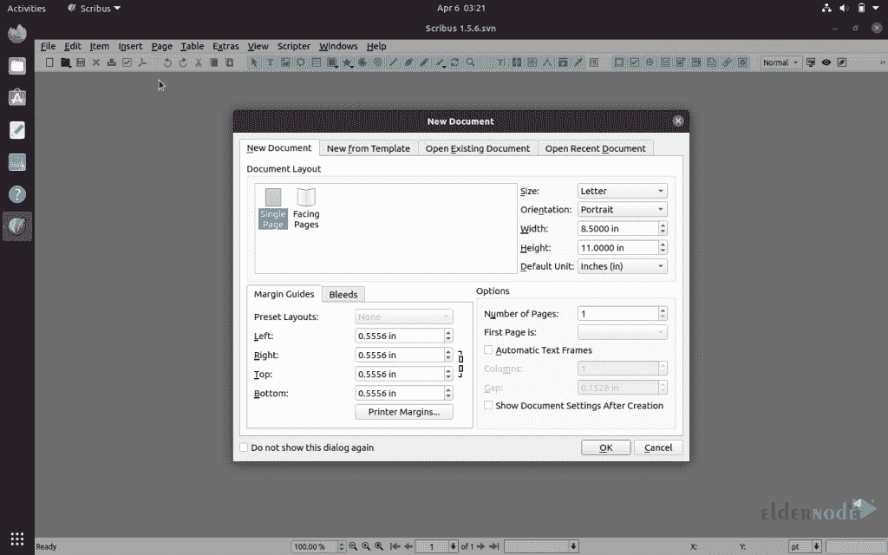
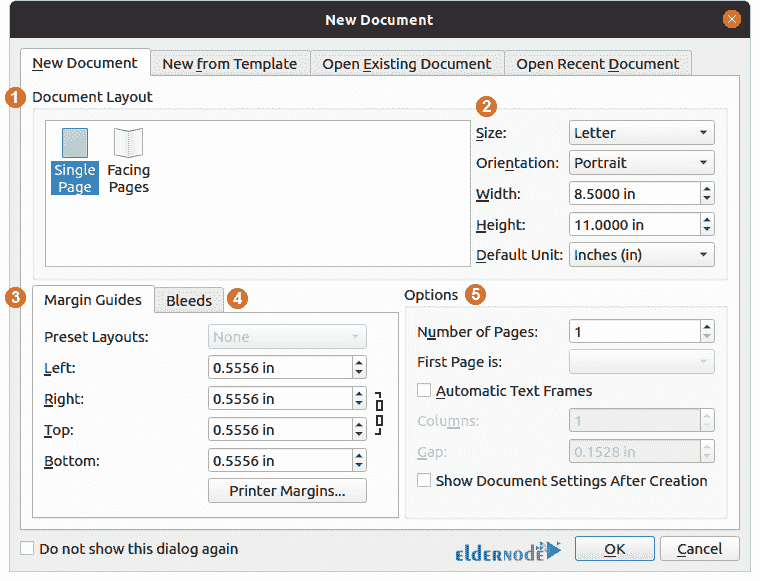
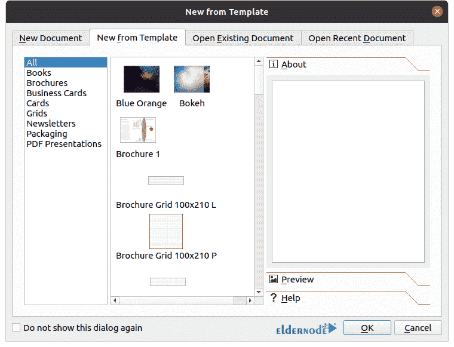
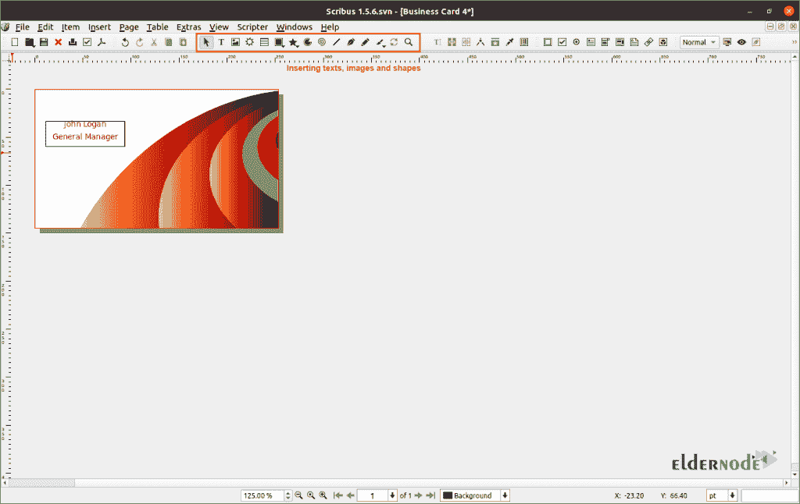

# Ubuntu 20.04 & 21.04 教程设置 Scribus-elder node 博客

> 原文：<https://blog.eldernode.com/setup-scribus-on-ubuntu/>



Scribus 是一个桌面出版应用程序。它是用 C++编写的，用户界面基于 Qt 框架。Scribus 用于设计和出版小册子、报纸、杂志、海报、书籍，甚至时事通讯。此外，它是一个免费和开源的跨平台应用程序。在这篇文章中，我们将教你关于 Ubuntu 20.04 上的**教程设置 Scribus。如果你想买一台 [Ubuntu VPS](https://eldernode.com/ubuntu-vps/) 服务器，请查看 [Eldernode](https://eldernode.com/) 主机中的可用软件包。**

## **如何在 Ubuntu 20.04 上设置 Scribus**

在下一节中，我们将有一个 Scribus 的定义。然后我们会一步步教你如何在 [Ubuntu](https://blog.eldernode.com/tag/ubuntu/) 20.04 上安装 Scribus。最后，我们将教你如何设置 Scribus。请继续关注本文的其余部分。

### **Scribus 是什么？**

Scribus 是一个为布局设计的免费开源工具。因此，您将有一个页面布局的替代方案。这款桌面出版软件适用于所有常见的操作系统。如果您习惯于为 InDesign 等其他软件付费，请遵循本指南，查看 Ubuntu 20.04 上的 Scribus 安装，以便免费使用这款桌面出版软件，实现相同的功能。但是考虑到你将被限制在 wiki 页面上获取操作信息。但是，值得一试！

## **如何在 Ubuntu 20.04 | 21.04**T3 上安装/设置 Scribus

在这一节，我们将教你如何一步一步地在 Ubuntu 20.04 上安装 Scribus。为此，只需按顺序执行以下步骤。第一步，你可以通过访问 [Scribus AppImage 网站](https://www.scribus.net/downloads/)下载。请注意，在本教程中，我们将使用官方的 PPA 安装。

您必须首先使用以下命令**添加存储库**:

```
sudo add-apt-repository ppa:scribus/ppa
```

然后，您可以通过运行以下命令来更新包列表:

```
sudo apt update
```

最后，您可以通过运行以下命令轻松地安装 Scribus:

```
sudo apt install scribus
```

### **如何在 Ubuntu 20.04 上设置和使用 Scribus**

在上一节中，我们教了你如何在 Ubuntu 20.04 上安装 Scribus。加入我们这一节来解释如何在 Ubuntu 20.04 上设置 Scribus。

你必须首先运行 Scribus。



然后，在“**新文档**选项卡中，您会看到以下选项:



基于指定编号的上图描述如下:

1.本节与**文件布局**相关。在此部分，您可以选择两个选项之一**单页**或**对开页**。

2.使用此部分，您可以选择默认页面尺寸(Letter、A4、自定义)、选择方向(纵向/横向)、设置自定义页面尺寸以及更改默认单位(磅、十二点活字、厘米、毫米、英寸)

3.在这里，您可以根据自己的要求设置页边距

4.您可以使用此部分向文档添加出血

5.与文档相关的各种其他选项

有趣的是，Scribus 附带了预构建的模板。要选择这些预制模板，您需要打开“**从模板**新建”选项卡:



本节包含几个模板，包括小册子、名片、时事通讯、书籍、PDF 演示文稿等。



用户界面组织良好，非常友好。需要注意的是，大部分快捷键都很好记。您还可以添加文本、图像、矢量形状、多边形和圆弧。这些界面的另一个优点是，您还可以更改颜色和渲染设置。

结论

## 我们在本文开始时向您介绍了 Scribus。然后我们教你如何在 Ubuntu 20.04 上安装 Scribus。最后，我们教你如何设置 Scribus。

We introduced you to Scribus at the beginning of this article. Then we taught you how to install Scribus on Ubuntu 20.04\. Finally, we taught you how to setup Scribus.