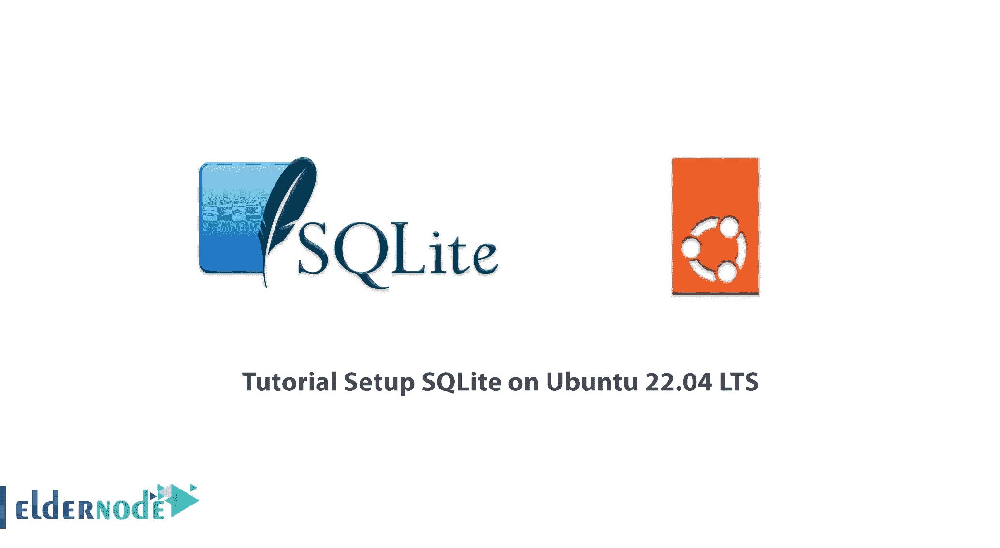

# Ubuntu 22.04 LTS - Eldernode 博客上的 SQLite 安装教程

> 原文：<https://blog.eldernode.com/setup-sqlite-on-ubuntu-22-04/>



存储和检索数据的工具之一叫做 SQLite，它是免费的，功能强大，支持各种类型的操作系统，包括 Windows、Linux、Android 和 Mac OS。在这篇文章中，我们将回顾如何在 Ubuntu 22.04 LTS 上设置 SQLite，看看如何不受限制地使用这个公共领域软件。需要注意的是，如果你想买一个 [**Ubuntu VPS**](https://eldernode.com/ubuntu-vps/) 服务器，可以在 [Eldernode](https://eldernode.com/) 网站上看到提供的软件包。

## **如何在 Ubuntu 22 服务器上安装 SQLite**

### **什么是 SQLite？**

SQLite 是一个全面、可靠、嵌入式和公共领域的 SQL 引擎数据库。该软件是世界上使用最广泛的数据库之一，可以在其他编程过程中用作库，其代码可供公众使用。SQLite 文件格式是跨平台或多平台的，其数据可以很容易地在 32 位和 64 位系统之间复制。


### **SQLite 的特性**

**1。使用动态数据类型** :在每一列中存储任意值，不考虑其数据类型。

**2。通过一个连接访问多个数据库文件** :只需一个命令，你就可以将不同数据库的表连接在一起，或者将数据从一个表复制到另一个表。

**3。在 RAM 中创建数据库，而不是使用文件系统** 。

**4。自包含** :这个特性表示启动需要操作系统部分的最小支持，并提供执行本身的必要需求。

**5。无服务器** :该数据库与集成程序协同工作并访问数据库文件。这样，对数据库的读写就直接通过对其文件的读写来完成。

**6。事务性** :如果系统出现问题，并且正在运行一个尚未完成的事务，则数据库返回到该事务之前的状态。

### **SQLite 有什么用？**

-> PHP 框架对 SQLite 的支持。

->使用 SQLite 作为 Drupal CMS 中的主要数据库系统。

->来自 SQLite 的 Android 和 iOS 移动开发者的首选。

->使用此数据库系统管理 Firefox、Chrome、Skype 和 Dropbox 软件。

-> Adobe、McAfee、Bentley 和 Bosch 为其产品使用该公司数据库系统。

在这篇文章的续篇中，加入我们来一步一步地教你如何在 [Ubuntu](https://blog.eldernode.com/tag/ubuntu/) 22.04 LTS 上设置 SQLite。

## **在 Ubuntu 22.04 上安装 SQLite LTS**

要开始安装，首先**更新您的系统**以确保所有软件包都是最新的:

```
sudo apt update
```

```
sudo apt upgrade -y
```

要开始安装，在您的终端中使用以下命令来从默认的 APT 存储库中安装 SQLite 3 :

```
sudo apt install sqlite3
```

然后**按以下顺序确认 SQLite 3 的安装版本**:

```
sqlite3 --version
```

通过编译，你可以获得 Ubuntu 资源库中的最新版本。在这一步中，您应该使用以下命令**安装 build-essentials** 包:

```
sudo apt install build-essential -y
```

然后使用下面的 **wget 命令**从 **SQLite 下载页面**下载最新版本:

```
wget https://www.sqlite.org/2022/sqlite-tools-linux-x86-3390000.zip
```

**将文件**解压到创建的目录:

```
unzip sqlite-tools-linux-x86-3390000.zip
```

然后将文件移动到之前创建的目录中:

```
sudo mv sqlite-autoconf-3370200 /opt/sqlite
```

现在转到所需的文件夹开始编译 SQLite:

```
cd /opt/sqlite
```

运行以下命令**开始编译过程**:

```
/opt/sqlite ./configure --prefix=/usr
```

**make** 命令用于启动构建过程。您还可以指定要在编译中使用的内核数量，以加快进程:

```
make -j 2
```

**(-j)** 表示系统中的内核数量，以加快构建速度。 **(-j)** 的默认选项是 **1** ，但是如果你有一个强大的服务器，你可以把它设置的尽可能的高。要指定系统上的核心数量，请运行以下代码:

```
nproc
```

**如果你有两个内核**，你会看到下面的输出(因为有两个内核，我们在 **make** 命令中使用了 **(-j2)** ):

```
2
```

如果你有 12 个内核，你可以拥有内核 **(-j6)** ，并把一半或更多的内核贡献给这个进程。

完成构建过程后，**使用以下命令开始安装**:

```
sudo make install
```

然后**确认安装**和版本号:

```
sqlite3 --version
```

## 结论

在本文中，您了解了 SQLite，它是存储数据的最强大的工具之一，并研究了它的特性和应用。本文还教你如何在 Ubuntu 22.04 LTS 上安装 SQLite，并免费无限制地使用它。