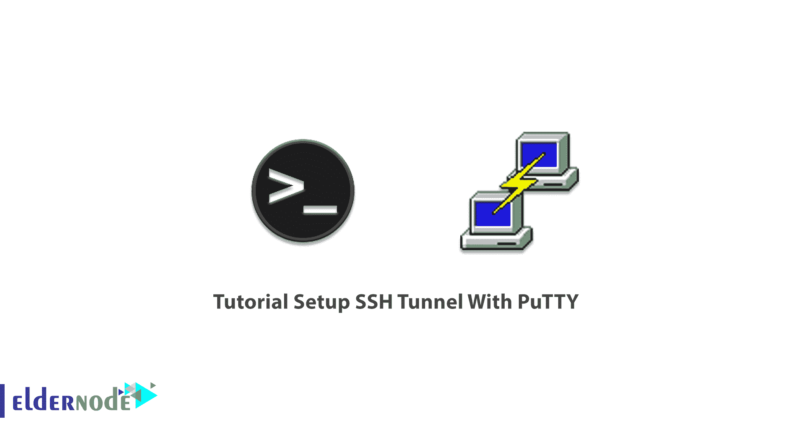
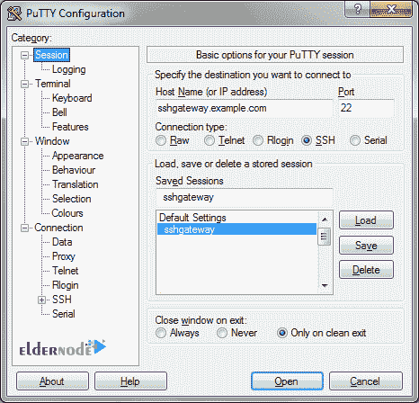
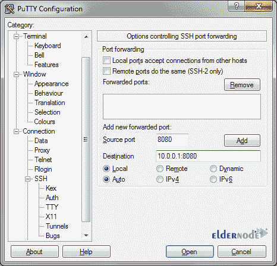

# 教程使用 Putty - Eldernode 博客设置 SSH 隧道

> 原文：<https://blog.eldernode.com/setup-ssh-tunnel-with-putty/>

Putty 是一个开源的免费终端仿真器、串行控制台和网络文件传输应用程序。Putty 支持安全远程终端上的许多变体。此外，Putty 还支持一些网络协议，比如 SCP、 [SSH](https://blog.eldernode.com/ssh-connection-softwares/) 、 [Telnet](https://blog.eldernode.com/difference-between-ssh-and-telnet/) 、rlogin 和原始套接字连接。 [Putty](https://blog.eldernode.com/what-is-putty-and-what-does-it-do/) 能够连接到串口。Putty 最初是为 Microsoft Windows 编写的，但它已经被移植到各种其他操作系统上。在本文中，您将学习教程**使用 Putty** 设置 SSH 隧道。要体验新一代的质量和支持，请尝试 Eldernode [Linux VPS](https://eldernode.com/linux-vps/) 和 [Windows VPS](https://eldernode.com/windows-vps/) 并保持专业。

## **如何用 Putty 设置 SSH 隧道**

PuTTY 是一个免费的 SSH 和 Telnet 客户端，适用于 [Windows](https://blog.eldernode.com/tag/windows/) 。加入我们，以一种新的简单方式学习使用 PuTTY 设置 SSH 隧道。查看以下步骤，并成功完成本指南。

### **用油灰设置 SSH 隧道**

### **如何加载网关**

如果您以前没有这样做过，那么您需要创建并保存 SSH 网关服务器。然后，从保存的会话列表中选择它，并单击“加载”。

### **如何配置隧道**

现在，您必须单击左侧 vav 树中的 Connection，然后单击 SSH 和 Tunnels。接下来，在“源端口”下输入您想要本地连接的端口。然后提供目的地地址。

*注意*:可以从 SSH 网关获得的服务器，但不能从作为“目的地”的本地机器获得

### **如何用 Putty 创建 SSH 隧道**

要创建 SSH 隧道，请在 Putty 的类别窗格中打开“SSH”选项，然后选择“隧道”选项。已经创建的隧道在右边，下面是另一个即将创建的隧道。通过单击添加按钮，它将设置配置。

要连接到您的网关，请单击“打开”并登录。只要您保持 SSH 终端窗口打开，所有到您本地主机上源端口的流量都将在目的地转发。

### **如何创建新的 SSH 隧道**

您需要在“源端口”字段中添加一个端口号来添加隧道。这将是您要连接的本地计算机上的端口。然后，您必须输入目标 IP 地址，后跟一个冒号和端口号。接下来，单击“添加”按钮，它将被添加到隧道列表中。

当您连接到 SSH 服务器时，在端口 1435 上连接到 127.0.0.1 实际上会通过 SSH 服务器连接到 10.10.1.143 端口 143。

注意:源端口需要在您的本地机器上可用，目的地必须可以从 SSH 服务器访问，这样才能工作。

### **如何移除现有的 SSH 隧道**

任何时候您需要删除一个现有的 SSH 隧道，您只需在转发端口列表中点击它并点击“删除”按钮。

### **如何创建多个 SSH 隧道**

您还可以创建多个 SSH 隧道。您必须确保每个源端口的唯一性。

## **结论**

在本文中，向您展示了使用 Putty 设置 SSH 隧道的教程。SSH 隧道或 SSH 端口转发用于在客户机和服务器之间创建加密的 SSH 连接。如果您有兴趣了解更多信息，请找到我们的相关文章[教程在 Linux 服务器上连接 ssh](https://blog.eldernode.com/tutorial-connect-to-ssh-on-linux/)。