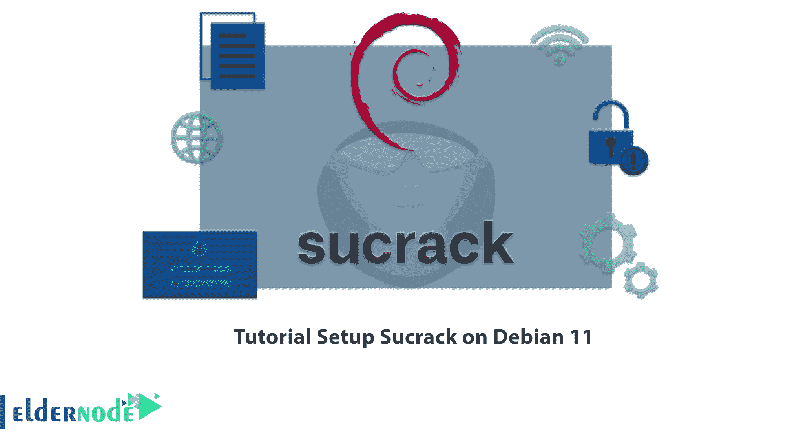

# Debian 11 - Eldernode 博客上的教程设置 Sucrack

> 原文：<https://blog.eldernode.com/setup-sucrack-on-debian-11/>



破解是进入安全系统的一种方法。黑客的目的是渗透系统，从而打破系统的安全屏障。Sucrack 是破解工具之一。Sucrack 通过 Su 破解本地账户。首先，让我们稍微了解一下 Sucrack，然后查看**如何在 Debian 11** 上设置 Sucrack。你可以在 [Eldernode](https://eldernode.com/) 网站上查看 [**Linux VPS**](https://eldernode.com/linux-vps/) 服务，如果你想购买的话。

## **如何在 Debian 11 上设置 Sucrack**

### **Sucrack**简介

Sucrack 是一个多线程的 Linux 工具，它通过连接到一个**伪终端**来获取用户的密码，从而实现 Su 方法。不能使用简单的 shell 脚本从 STDIN 导入密码。这个工具，用 C 语言写的，可以同时进行多次登录。使用该工具会消耗大量 CPU 性能，并导致日志很快填满。

## **在 Debian 11 上设置 Sucrack**

在这篇来自 Debian 培训系列的文章中，我们打算教你如何使用 3 种方法在 Debian 11 上设置 Sucrack。在 Debian 11 上安装 Sucrack 有三种方法:

1->使用 **apt-get**

2->使用 **apt**

3->使用**能力**

### **如何使用 apt-get 在 Debian 11 上设置 Sucrack**

首先运行以下命令**更新 apt 数据库**:

```
sudo apt-get update
```

然后**使用以下命令安装 Sucrack** :

```
sudo apt-get -y install sucrack
```

### **如何使用 apt** 在 Debian 11 上设置 Sucrack

和前面的方法一样，首先运行下面的命令**更新 apt 数据库**:

```
sudo apt update
```

然后使用以下命令**安装 Sucrack** :

```
sudo apt -y install sucrack
```

### **如何使用资质** 在 Debian 11 上设置 Sucrack

要使用这种方法，首先要在 Debian 11 上安装 aptitude。然后**通过运行以下命令更新 apt 数据库**:

```
sudo aptitude update
```

现在**使用下面的命令安装 Sucrack** :

```
sudo aptitude -y install sucrack
```

## **如何在 Debian 11 上卸载 Sucrack**

您可以使用下面的命令**从 Debian 11 中删除 Sucrack** :

```
sudo apt-get remove sucrack
```

通过运行以下命令，您可以**删除 Sucrack 配置、数据及其所有依赖关系**:

```
sudo apt-get -y autoremove --purge sucrack
```

## **常见问题**

[sp _ easy agreement]

## 结论

如你所知，Sucrack 是通过 Su 破解本地账户的破解工具之一。在本文中，您了解了在 Debian 11 上安装 Sucrack 的不同方法。您还学习了如何从 Debian 11 中删除 Sucrack，如果您不需要它的话。