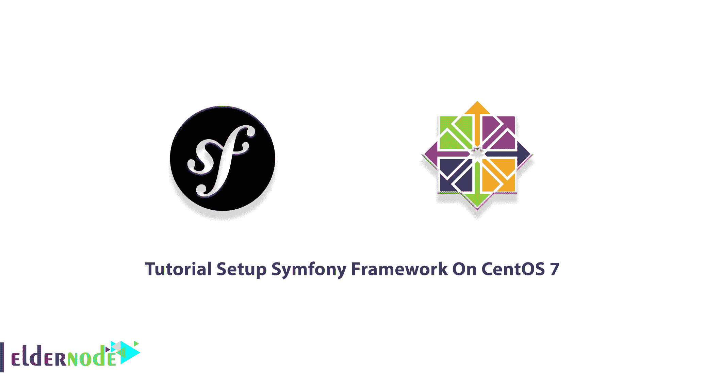
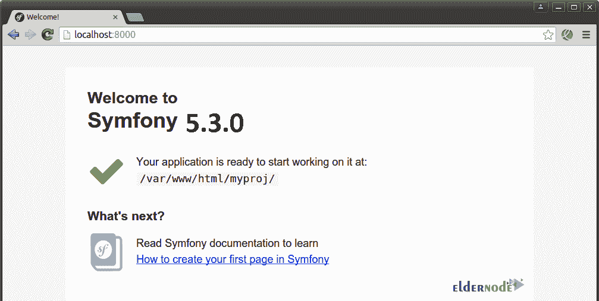

# 教程在 CentOS 7 和 8 上设置 Symfony 框架

> 原文：<https://blog.eldernode.com/setup-symfony-framework-on-centos/>



框架不是绝对必要的，但是为了更好更快地开发，你可以使用这些工具。Symfony 是一组 PHP 组件。一个 Web 应用程序框架、一种理念和一个社区一起和谐地工作。Symfony Framework 是创建网站和 web 应用程序的领先 PHP 框架。构建在 Symfony 组件之上。由于其灵活性和高性能，它是开发企业应用程序的首选。如果您有一个开发的应用程序，您可以使用一个框架使它与市场标准互操作。因此，加入我们这篇文章来回顾一下 CentOS 7 或 8 上的**教程设置 Symfony 框架。通过访问 [Eldernode](https://eldernode.com/) ，您可以选择一个完美的 [CentOS VPS](https://eldernode.com/centos-vps/) 来购买您自己的一个继续本指南。**

## **Symfony 框架介绍**

Symfony 是一个用 PHP 编写的免费、开源、流行的 web 应用程序框架。由于 Symfony 与其他数据库系统兼容，它给你完全控制配置。你可能看过《Vogue》杂志，甚至是它的订阅。好吧！大型多人在线浏览器游戏 eRepublik 和内容管理框架 eZ 也使用 Symfony 框架。和我们一起回顾一下在 [CentOS](https://blog.eldernode.com/tag/centos/) 7 上安装和设置 Symfony 框架的过程。

### **在 CentOS 7 上安装 Symfony 框架的先决条件**

为了让本教程更好地工作，请考虑以下先决条件:

_ 拥有 [Sudo 权限](https://blog.eldernode.com/create-new-sudo-user-centos-8/)的非 root 用户。

_ 指向您的 IP 地址的有效域名

此外，您需要一些包:

_ PHP 5.4 或以上

_ Apache 2.0 或以上

_ MariaDB 5.6 或更高版本

## **如何在 CentOS 7 上安装 Symfony 框架**

Symfony 框架带有一组可重用的组件和一个用户友好的网络界面。让我们浏览一下本指南的步骤，并复习完成本部分所需的所有步骤。

*第一步:*

首先，使用以下命令将 REMI 和 EPEL rpm 库添加到您的系统中:

```
rpm -Uvh http://free.nchc.org.tw/fedora-epel/7/x86_64/e/epel-release-7-5.noarch.rpm
```

```
rpm -Uvh http://rpms.famillecollet.com/enterprise/remi-release-7.rpm
```

*第二步:*

然后，您需要设置一个正在运行的 LAMP 服务器来开始 Symfony 安装。如果你已经运行了[灯](https://blog.eldernode.com/install-lamp-stack-on-centos-8/)堆栈，跳过这一步。如果没有，运行下面的命令来设置灯堆栈。

**1-安装 Apache**

```
yum --enablerepo=remi,epel install httpd 
```

**2-安装 MySQL**

```
yum --enablerepo=remi,epel install mysql-server
```

```
service mysqld start
```

```
/usr/bin/mysql_secure_installation
```

**3-安装 PHP**

```
yum --enablerepo=remi,epel install php php-mysql php-intl
```

```
service httpd restart
```

*第三步:*

因为 Symfony 为创建新项目提供了自己的安装程序，所以你需要在你的系统上安装一个 Symfony 安装程序。所以，运行:

```
curl -LsS https://symfony.com/installer -o /usr/local/bin/symfony
```

```
chmod a+x /usr/local/bin/symfony
```

*第四步:*

一旦在你的系统上安装了 Symfony 安装程序，创建一个新的 Symfony 应用程序。要启动新的 Symfony 应用程序，请导航至您的 web 文档根目录:

```
cd /var/www/html
```

```
symfony new myproj
```

然后，运行以下命令切换到新创建的目录，并检查所有要求是否都正确安装在您的系统上:

```
php myproj/bin/symfony_requirements
```

*注意*:如果一切正常，你将得到*Y我们的系统已经准备好运行 Symfony 项目*消息。

*第五步:*

是时候在开发模式下启动应用程序了。因此，运行下面的命令来查看浏览器中的变化，您可以启动 Symfony 开发 web 服务器:

```
php bin/console server:run
```

*注意:*默认情况下，web 服务器会在端口 8000 上启动。

### **如何配置防火墙**

如果您的系统中启用了 [firewalld](https://blog.eldernode.com/configure-firewalld-on-centos-8/) 服务，您将需要允许 HTTP/HTTPS 端口通过 firewalld。

要检查防火墙服务，请运行以下命令:

```
systemctl status firewalld
```

要启动 firewalld 服务并使其能够在系统重新启动后启动，请运行:

```
systemctl start firewalld 
```

```
systemctl enable firewalld
```

接下来，使用以下命令允许 HTTP 和 HTTPS 端口通过防火墙 d:

```
firewall-cmd --permanent --add-service=http
```

```
firewall-cmd --permanent --add-service=https
```

最后，运行以下命令来重新加载防火墙并应用更改:

```
firewall-cmd --reload
```

### **如何在 CentOS 7** 上访问新的 Symfony 应用

成功安装后，您可以在浏览器中访问新的 Symfony 应用程序。因此，您现在可以通过访问*http://127 . 0 . 0 . 1:8000**或**http://localhost:8000*在您的浏览器中访问新的 Symfony 应用程序。



### **如何在 CentOS 7 上创建 Apache virtual host**

为了给 Symfony 配置一个子域，您需要在目录 **/etc/httpd/cond.d/** 下创建一个新的 Apache 配置文件，并为您的 Symfony 应用程序添加虚拟主机:

```
vim /etc/http/conf.d/symfony5.example.com.conf
```

然后，将以下内容添加到目录中:

```
<VirtualHost *:80>  ServerName symfony5.example.com  DocumentRoot /var/www/html/myproj/web    <Directory /var/www/html/myproj/web>  AllowOverride All  Order Allow,Deny  Allow from All  <IfModule mod_rewrite.c>  Options -MultiViews  RewriteEngine On  RewriteCond %{REQUEST_FILENAME} !-f  RewriteRule ^(.*)$ app.php [QSA,L]  </IfModule>  </Directory>    ErrorLog /var/log/httpd/myproj_error.log  CustomLog /var/log/httpd/myproj_access.log combined  </VirtualHost>
```

当更改完成后，重启Apache 服务器以使更改生效:

```
service httpd restart
```

要访问新的 Symfony 5 应用程序，你可以在浏览器中用你的域名创建一个主机文件条目，如http://symfony5.example.com。根据您的设置，只需更改 symfony5.example.com 的和 127.0.0.1 :

```
echo "127.0.0.1 symfony5.example.com" >> /etc/hosts
```

现在，您应该被重定向到 Symfony 默认仪表板。

## 结论

在本文中，您了解了如何在 CentOS 7 上设置 Symfony Framework。首先，您回顾了如何使用 Symfony 安装程序来设置 Symfony，然后您学习了创建一个新的 Symfony 应用程序。您现在可以享受安装在 CentOS 7 上的 Symfony 5，并开始使用 Symfony 构建出色的应用程序。如果你用了别的方法安装 Symfony Framework，那就在[社区](https://community.eldernode.com/)上让你的朋友知道，比较一下。