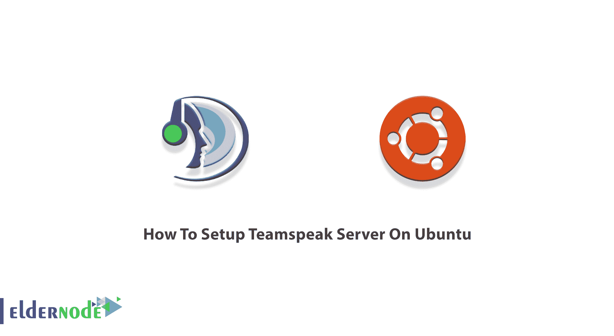
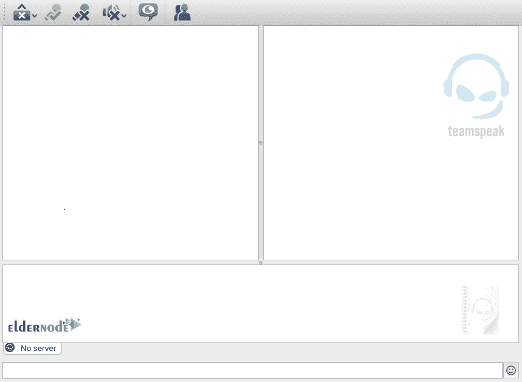
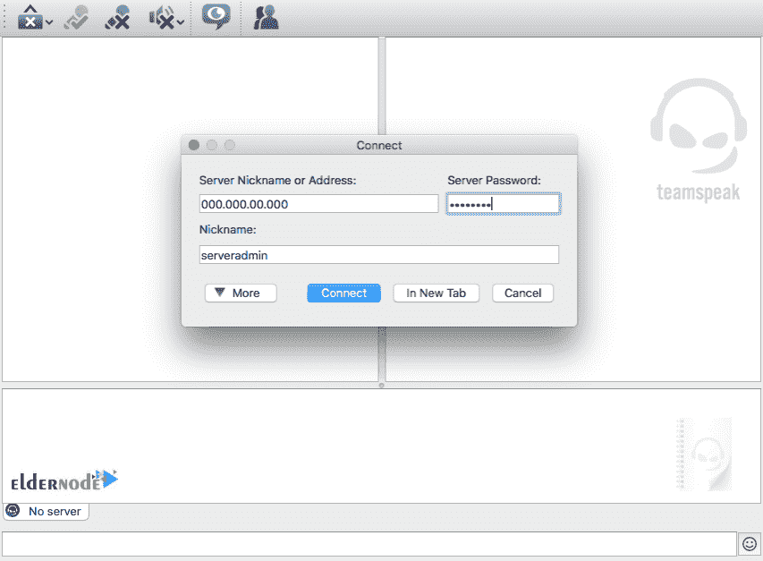
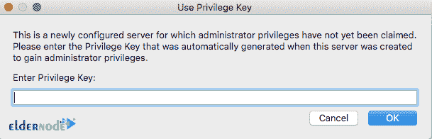

# 如何在 Ubuntu 20.04 和 21.04 上设置 Teamspeak 服务器

> 原文：<https://blog.eldernode.com/setup-teamspeak-server-on-ubuntu/>



TeamSpeak 是一个专有的网络电话(VoIP)应用程序，用于与朋友或同事交流。这个轻量级工具是为聊天频道上的用户之间的音频通信而设计的，很像电话会议。由于它提供了一个竞争的空间，TeamSpeak 主要被游戏玩家使用。他们使用这个软件与多人视频游戏中同一团队的其他玩家进行交流。在这篇文章中，你将学习如何在 Ubuntu 20.04 或 21.04 上设置 Teamspeak 服务器。访问 [Eldernode](https://eldernode.com/) 获取您需要的所有包裹。购买你自己的 **[Ubuntu VPS](https://eldernode.com/ubuntu-vps/)** 和我们在一起。

## **教程在 Ubuntu 上设置 Teamspeak 服务器**

TeamSpeak 是一个免费的非常流行的语音通信应用程序，用于互联网上的实时语音聊天。TeamSpeak 服务器在 Linux、macOS、Microsoft Windows 和 FreeBSD 上作为专用服务器运行，并使用基于客户端的用户界面或命令行界面来控制服务器管理和配置。

要开始使用 TeamSpeak，您需要制作一个 **TeamSpeak 服务器**。然后，必须为用户在其设备上安装**客户端。TeamSpeak 客户端可用于 [Linux](https://blog.eldernode.com/tag/linux/) 、macOS、 [Windows](https://blog.eldernode.com/tag/windows/) 、Android 和 iOS。**

### **在 Ubuntu 上安装 TeamSpeak 的先决条件 20.04 | 21.04**

为了让本教程更好地工作，请考虑以下先决条件:

_ 拥有 Sudo 权限的非 root 用户。要设置，请遵循我们在 Ubuntu 21.04 上的[初始服务器设置。](https://blog.eldernode.com/initial-server-setup-on-ubuntu-21-04/)

_ 使用 [SSH 协议](https://blog.eldernode.com/set-up-ssh-keys-ubuntu-20/)安全连接

## **在 Ubuntu 上制作 TeamSpeak 服务器 Step to Step**

打开你的服务器的**终端**，按照下面的步骤制作一个 TeamSpeak 服务器。

*第一步:*

像往常一样，通过运行以下命令，从更新您的系统的**开始:**

```
apt-get update
```

```
apt-get upgrade
```

*第二步:*

现在，您已经准备好**创建一个新的系统用户**。为此，您需要首先添加 n 个新用户。所以，运行:

```
adduser --disabled-login teamspeak
```

您将被要求输入个人用户的详细信息，并确认他们是正确的。但是，所有字段都可以留空。

然后，您可以**访问新创建用户的主目录**。因此，键入:

```
cd /home/teamspeak
```

*第三步:*

是时候**下载并提取** TeamSpeak 服务器了。要下载该软件的最新版本，请运行以下命令:

```
wget http://dl.4players.de/ts/releases/3.12.1/teamspeak3-server_linux_amd64-3.12.1.tar.bz2
```

**完成后提取**存档文件:

```
tar xvf teamspeak3-server_linux_amd64-3.12.1.tar.bz2
```

由于所有内容都将出现在***teamspeak 3-server _ Linux _ amd64***目录中，接下来的事情就是将所有内容都移动到 ***/home/teamspeak*** 并移除下载的存档:

```
cd teamspeak3-server_linux_amd64
```

```
mv * /home/teamspeak
```

```
cd ..
```

```
rm -rf teamspeak3-server_linux_amd64-3.12.1.tar.bz2
```

### **TeamSpeak 许可协议**

接受许可协议是强制性的。使用下面的命令快速完成此操作，并创建一个新的空文件:

```
touch /home/teamspeak/.ts3server_license_accepted
```

创建的文件名为**. ts 3 server _ license _ accepted**，它将作为许可协议。

## **如何在 Ubuntu 上配置 TeamSpeak 服务器**

现在软件已经安装好了，您可以在服务器启动时**启动 TeamSpeak** 。运行以下命令，在***/lib/systemd/system***目录下创建一个名为***team speak . service***的文件:

```
sudo nano /lib/systemd/system/teamspeak.service
```

**将**输出的内容粘贴到新创建的文件中，**保存**该文件。

现在，要激活脚本并使其在服务器启动时启动，请运行:

```
systemctl enable teamspeak.service
```

```
systemctl start teamspeak.service
```

要检查服务器状态，请键入

```
service teamspeak status
```

如果它显示 active(正在运行),这意味着服务器**正在正确运行**。

对于**到服务器的第一次连接**,您需要获得特权密钥。第一次登录时，会有提示。因此，您将需要这些信息:

```
cat /home/teamspeak/logs/ts3server_*
```

### **如何在 Ubuntu 上连接 TeamSpeak 客户端**

在这个部分中，您可以连接一个客户端。你只需要 **[从网站上下载最新的 TeamSpeak](https://www.teamspeak.com/en/your-download/)** 客户端。下载成功后，打开**客户端**并登录:



然后，**在客户端内部创建一个新的连接**。将显示一个对话框，在其中输入服务器 IP、昵称和密码:



首次连接时，您将被要求输入管理员权限的**密钥。因此，您需要插入密钥来完全控制通道:**



此时，你只需要发送**服务器 IP 和密码**就可以和你的朋友使用 TeamSpeak 了。

### **如何配置防火墙**

如果您的系统上有防火墙，请遵循本节内容。要启用 TeamSpeak 流量，您必须设置防火墙。

为了让 TeamSpeak 服务器正常工作，在使用 [UFW](https://blog.eldernode.com/setup-firewall-ufw-ubuntu-20/) 防火墙时解锁端口:

```
iptables -A INPUT -p udp --dport 9987 -j ACCEPT
```

```
iptables -A INPUT -p udp --sport 9987 -j ACCEPT
```

```
iptables -A INPUT -p tcp --dport 30033 -j ACCEPT
```

```
iptables -A INPUT -p tcp --sport 30033 -j ACCEPT
```

```
iptables -A INPUT -p tcp --dport 10011 -j ACCEPT
```

```
iptables -A INPUT -p tcp --sport 10011 -j ACCEPT
```

## 结论

在本文中，您了解了如何在 Ubuntu 上设置 Teamspeak 服务器。我们不希望你遇到严重的问题。只需按照本指南的所有必要步骤，在你的 Ubuntu 上安装和设置 TeamSpeak 的私有服务器。现在，您已经准备好开始与您的朋友交流或游戏，并享受其出色的功能和低延迟。