# 在专用服务器上设置 VMware ESXi 的教程- Eldernode 博客

> 原文：<https://blog.eldernode.com/setup-vmware-esxi-on-dedicated-server/>

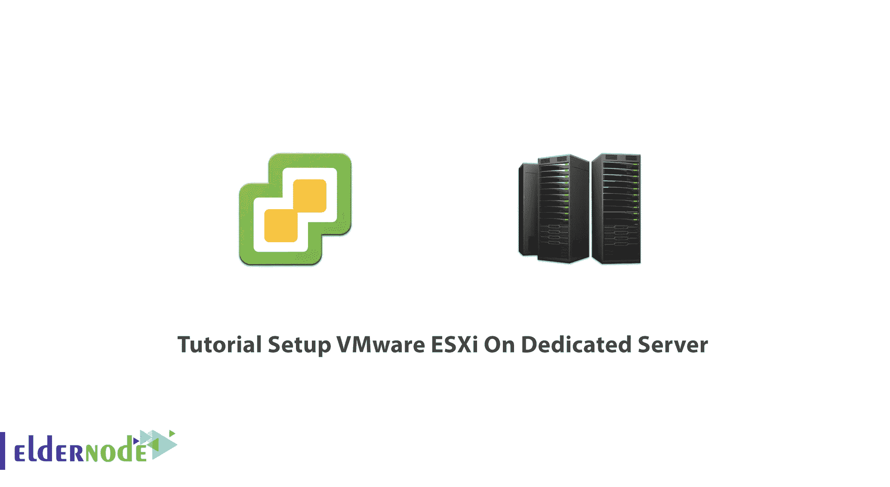

有时，您需要一台或多台服务器来启动新的应用程序。您可能担心新软件会与您以前的软件接口，并且您可能希望分离它们的服务器并提供专用服务器。您必须付费购买新的服务器，但是技术世界已经提供了虚拟化来解决这样的问题，通过使用虚拟化方法，您将能够安装软件或应用程序，而无需购买新的硬件和服务器。VMware 就是这些虚拟机软件中的一种。在本文中，我们将**在专用服务器**上设置 VMware ESXi。如果你想买一个 [**专用服务器**](https://eldernode.com/dedicated-server/) ，可以查看 [Eldernode](https://eldernode.com/) 网站上提供的套餐。

## **如何在专用服务器上设置 VMware ESXi**

### **什么是 VMware？**

VMware 是一种虚拟机软件，它为云计算和虚拟化提供了一个平台，并支持在 Windows 或 Linux PC 上运行的多种操作系统。它是一家成立于 1998 年的加州公司，旨在为 It 基础设施虚拟化提供一个平台。该公司以 vSphere VMware 虚拟机管理程序闻名于世。自 1998 年以来，VMware 发展迅猛。该公司于 2004 年被 EMC 收购。该虚拟机支持一个操作系统的多个版本，或者可能有几个不同的操作系统可以在基于 x86 的设备上同时运行。

借助 VMware 服务器虚拟化，虚拟机管理程序可以安装在一台物理服务器上，从而允许多台虚拟机在同一台物理服务器上运行。每个虚拟机都可以运行自己的操作系统，这意味着多个操作系统可以在一台物理服务器上运行。

在本文的其余部分，我们将一步一步地教您如何在专用服务器上设置 VMware ESXi。

### **VMware 特性**

–支持 Kubernetes 容器

–利用分布式资源调度程序改进资源管理

–集中式生命周期管理

–增强的安全性

–业务连续性

## **在专用服务器上安装 VMware ESXi**

首先，你应该去 **VMware 的官方网站**和**创建一个账户**。创建账户后，**从 **[VMware](https://customerconnect.vmware.com/en/web/vmware/evalcenter?p=free-esxi7)** 官网免费下载 ESXI ISO 文件**。您应该有 ESXi 安装程序。

你可以使用一个可启动的 u 盘，或者加载到 CD 或 DVD 或其他任何东西上。然后，在安装它之前，您需要在 ESXi 中引导。

安装程序将列出引导，实际的安装程序将开始。将加载构建 ESXi 环境所需的所有文件:

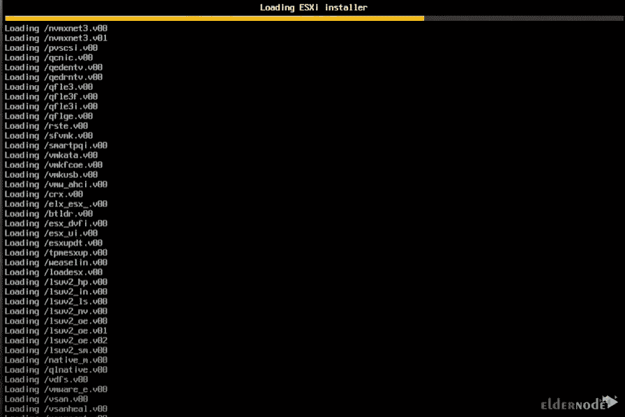

您已经获得了 ESXi 和所有已分配的实际资源空间，包括已分配的 CPU 类型和 gig 内存:

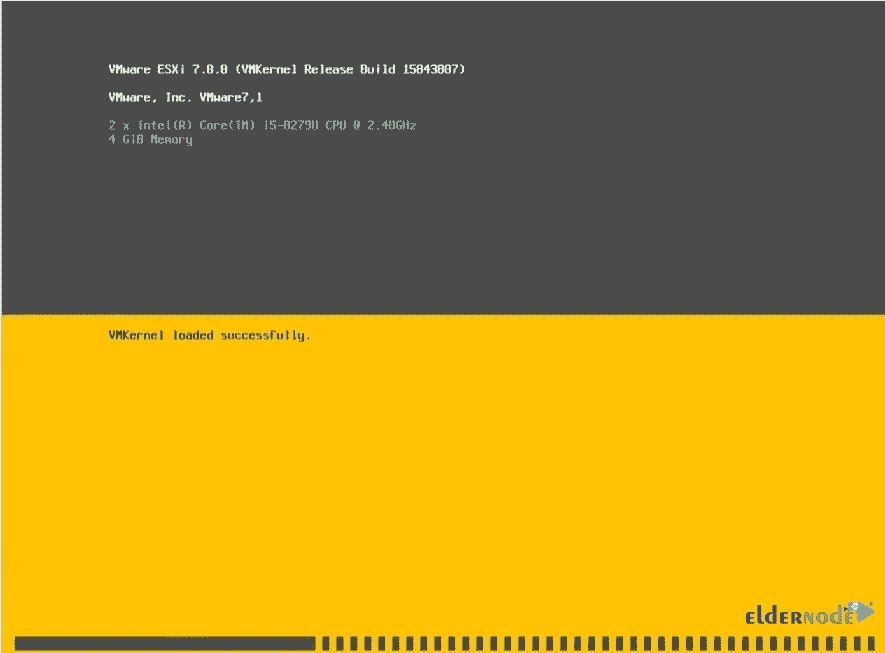

现在，您应该会看到欢迎屏幕。按**进入**继续:

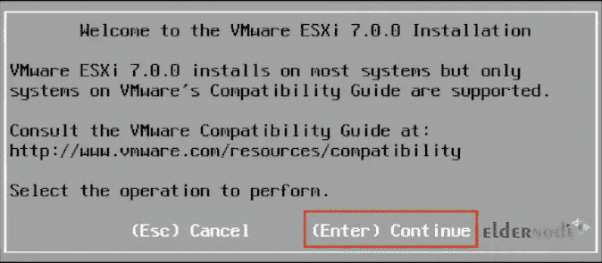

在下一步中，您将看到 VMware **最终用户许可协议**页面。如果您接受条款和条件，只需按下 **F11** :

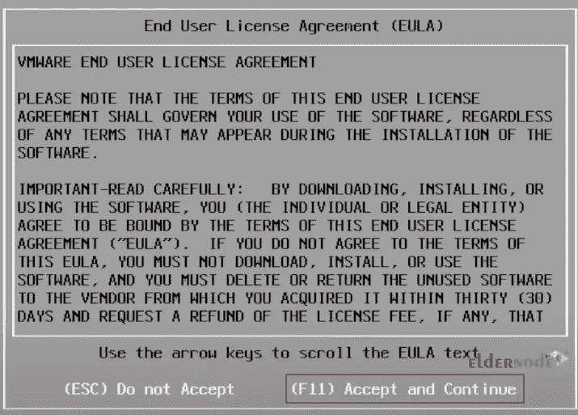

然后，它将扫描可用的设备:

现在您应该**选择一个磁盘来安装**。您选择的硬盘可以是安装 ESXi 时分配给您或您可以使用的任何大小。

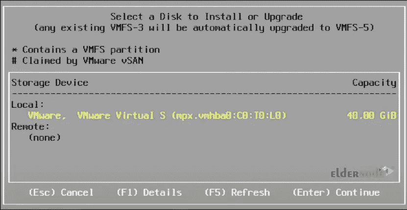

然后选择您的**位置**并按**进入**:

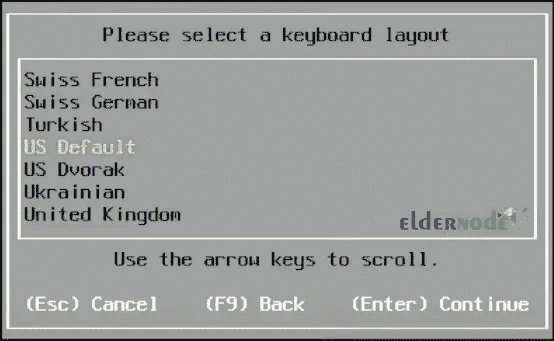

接下来，您需要**输入您的 root 密码**，这是您的 ESXi 的主密码。请记住，当您登录 ESXi 主机时，它会要求您提供根凭据:

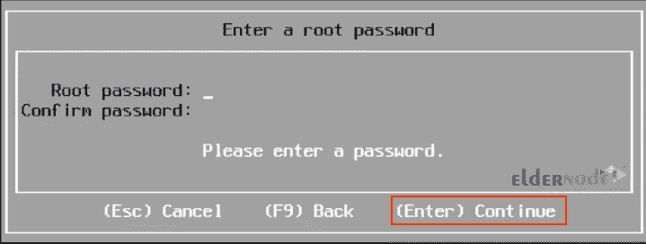

这一步是在所需的位置配置安装。您将再次收到分区警告。只需按下 **F11** 即可开始安装:

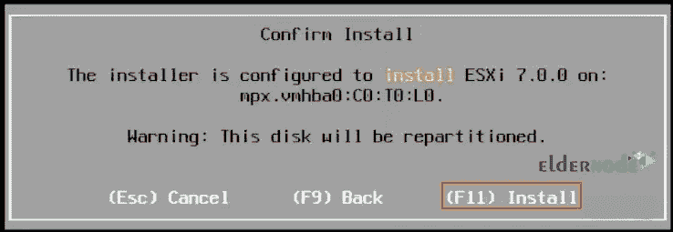

安装将开始。请等待安装完成。

安装完成后，**重启你的服务器**。您可以在重新启动之前移除安装媒体:

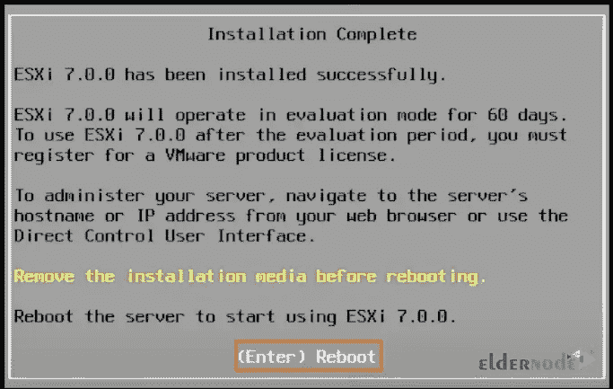

就是这样！VMware ESXi 已安装，可以使用了。

## **在专用服务器上设置 VMware ESXi**

您在下面看到的 IP 地址是通过 DHCP 自动分配给您的。最好为您的 ESXi 主机设置一个静态 IP 地址。按 **F2** 定制系统并查看日志:

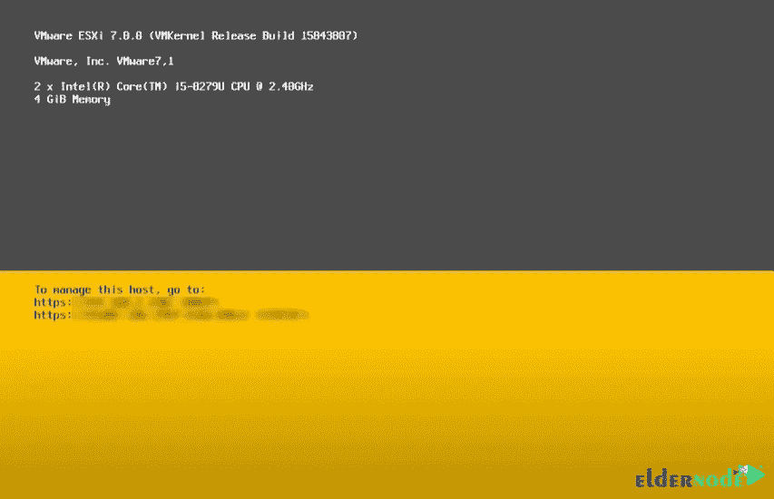

然后，您必须重新输入您的超级用户密码:

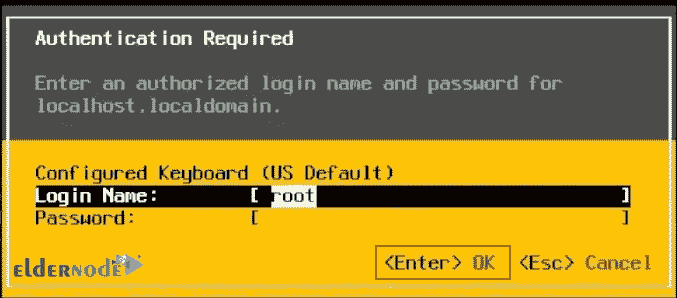

在此步骤中，有一些系统配置可供您配置密码和管理网络、测试管理配置、配置键盘或故障排除选项(如果您想进入 ESXi shell)。选择**配置管理网络**，按**进入**:

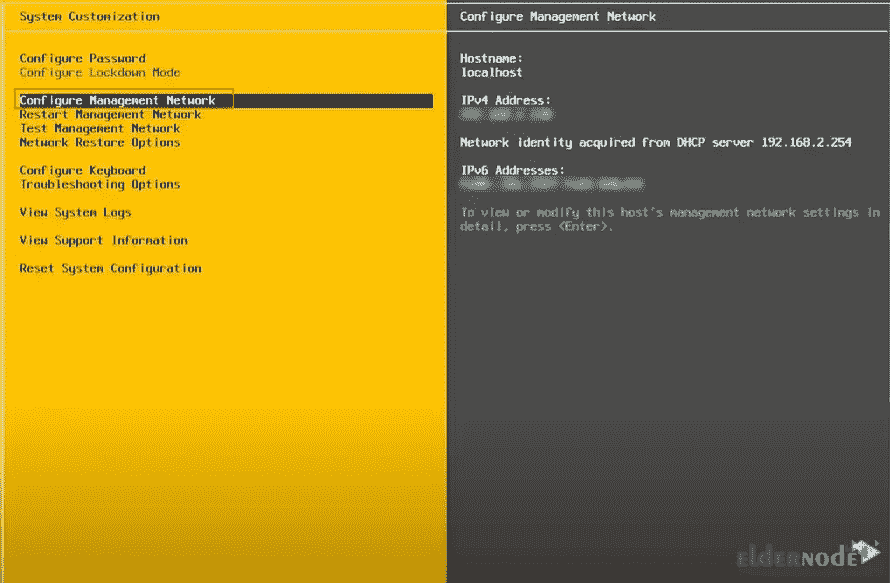

现在你应该选择 **IPv4 配置**并再次按下**进入**。如果您有多个网络适配器，也可以更改网络适配器；如果您想使用虚拟局域网，也可以设置 VLAN:

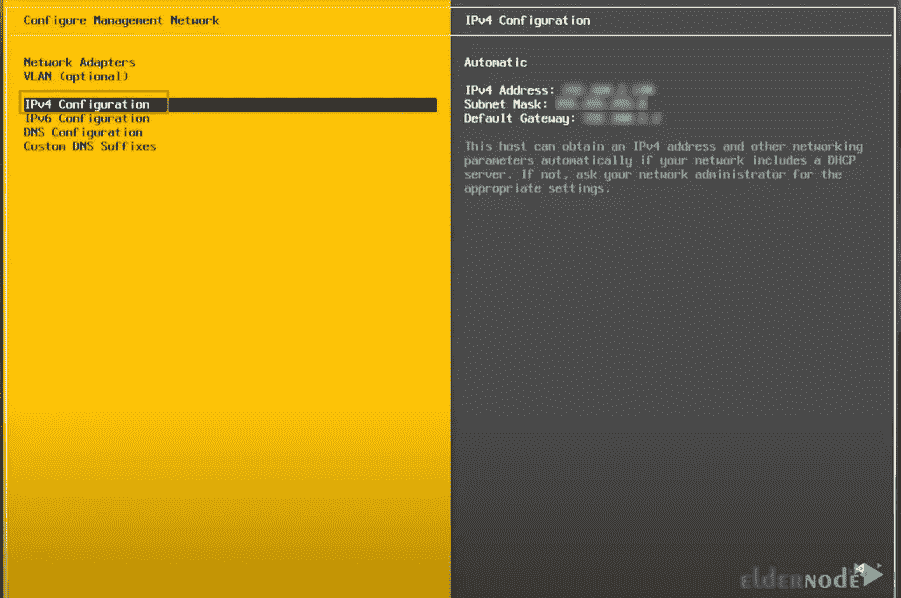

您需要选择**设置静态 IPv4 地址和网络配置**并按下**空格键**。然后下来选择 **IPv4 地址**。你实际上是在制造一些静态的东西，一些被用作你的环境的一部分的东西:

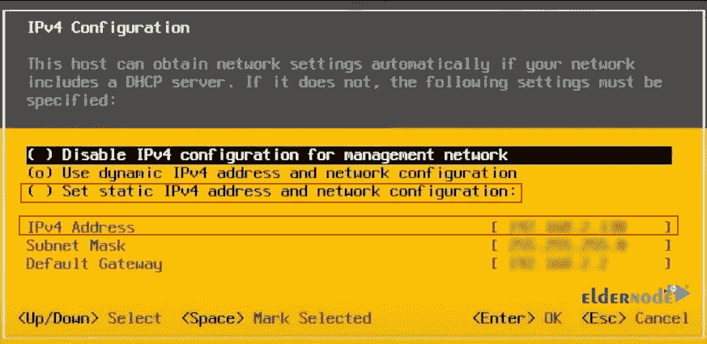

现在回到下面的页面，这次选择 **IPv6 配置**。此外，您可以将您的 **DNS 设置**放入 **DNS 配置**部分:

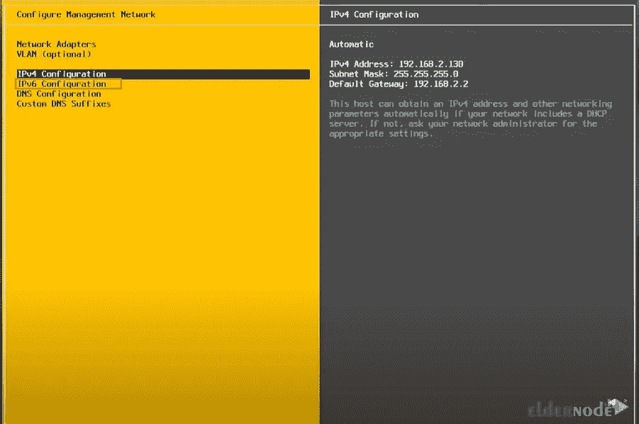

如果您不打算使用它，请选择**禁用 IPv6(需要重启):**

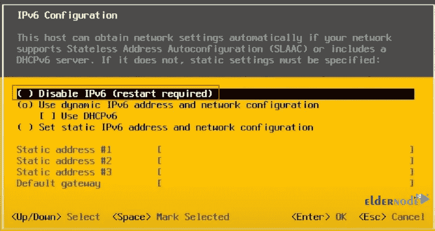

接下来按下 **Esc** 退出。您将被要求重启您的主机以应用更改，因此请按 **Y** :

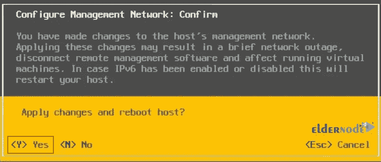

系统重启后，您将返回到 **F2** ，您应该再次输入您的密码。

ESXi 后端的基本设置现已完成。

### **如何在专用服务器上访问 VMWare**

在下一步中，您应该打开 web 浏览器，从前端导航到 ESXi 主机。您的计算机是什么并不重要，因为他们可以看到安装了新 ESXi 主机的网络。

现在导航到 ESXi 主机 IP 地址。为此，将您的 IP 地址放在地址栏中，然后按**进入**。输入 IP 地址后，你会看到**这个连接不是私有的**。因为它没有您现在分配给它的 SSL 证书。点击显示详细信息，并根据您使用的浏览器访问该网站。

你应该访问这个网站。您将看到虚拟机的**登录屏幕。此登录页面显示，计算机已成功建立了与 ESXi 主机的连接。再次使用根凭据登录。**

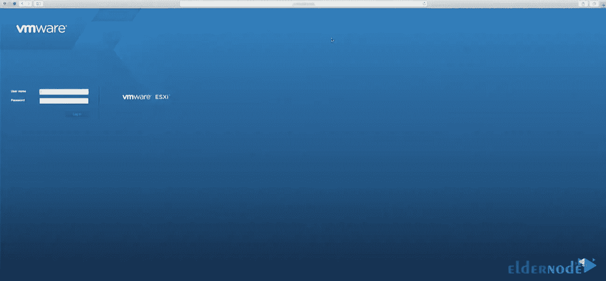

登录后，您将看到下面的页面，其中包含有关您的配置的所有信息。这意味着 VMware ESXi 安装已经创建了一个作为服务器的主机，并且具有一些信息，包括关于您的主机的信息、关于分配的 RAM 或 CPU 数量的信息。

您可以转到**管理**部分进行各种定制设置，或者转到**虚拟机**并创建和管理虚拟机。**存储**部分是你的数据存储器。您可以一起构建磁盘数据组，并让您的虚拟机驻留在数据存储中。**网络**部分是您的网络配置或虚拟 next 虚拟交换机，为您的 VMware 环境提供网络连接:

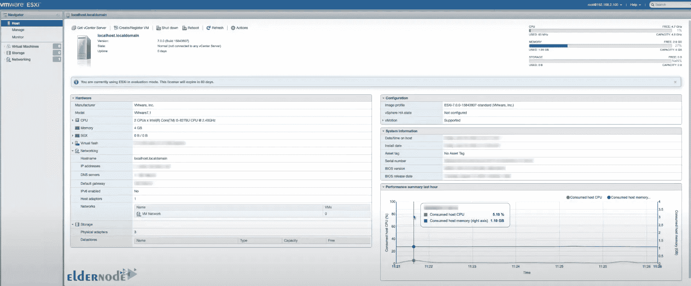

## 结论

VMware ESXi 基于 VMkernel 操作系统，它与运行于其上的代理交互。ESXi 直接在系统硬件上运行，无需操作系统。在本文中，我们向您介绍了如何在专用服务器上安装和设置 VMware ESXi。我希望这篇文章对你有用。如果你有任何问题，可以在评论区联系我们。