# 如何在 5 分钟内设置 VMware vSphere Replication

> 原文：<https://blog.eldernode.com/setup-vmware-vsphere-replication/>

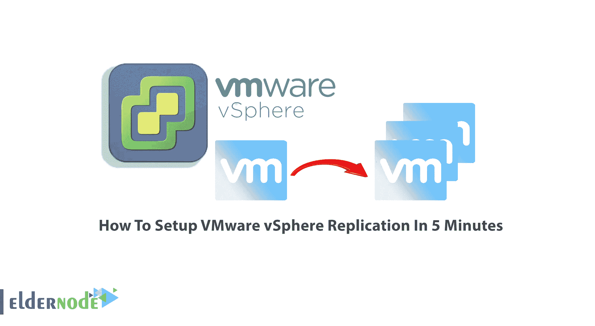

VMware vSphere 无疑是虚拟化平台中提供的最佳基础架构，它在该领域提供了许多全面的设施，并创建了云基础架构。在本文中，我们打算在 5 分钟内逐步教您如何设置 VMware vSphere Replication。你可以访问 [Eldernode](https://eldernode.com/) 网站上提供的套餐到 **[购买 VPS](https://eldernode.com/vps/)** 服务器。

## **教程设置 VMware VSP here Replication**

### **VMware VSP here Replication 简介**

VMware vSphere Replication 是一款基于虚拟机管理程序的复制解决方案，适用于与 VMware vCenter 完全集成的 vSphere [虚拟机](https://blog.eldernode.com/create-a-virtual-machine-in-vmware-esxi-6-5/)。该软件为组织创建了复制解决方案，并为组织的虚拟化基础架构创建了灾难恢复，因此网络管理员可以保护他们的数据。使用该软件，您可以在您的站点上创建本地数据保护基础架构。如果您有多个站点，可以使用此解决方案在两个站点之间创建灾难恢复。您也可以使用该软件转移数据中心。

在下一部分中，我们将解释[VMware](https://blog.eldernode.com/setup-vmware-esxi-on-dedicated-server/)VSP here Replication 的功能，以及如何安装它。

### VMware VSP here Replication 的特性

在本节中，我们将提到 VMware vSphere Replication 的一些功能。这些功能包括:

–能够创建灵活的配置

–消除存储锁定

–降低网络带宽

–基于虚拟机管理程序的虚拟机复制

–复制管理

–复制配置

–虚拟机同步和种子拷贝

–智能传输

–非侵入式复制

## **在 5 分钟内安装 VMware VSP here Replication**

在本节中，我们打算教您如何安装 VMware vSphere Replication。为此，只需遵循以下步骤。

第一步是[通过访问 VMware 网站创建一个用户帐户](https://customerconnect.vmware.com/account-registration)。填写相关字段后，点击页面底部的**注册**创建您的用户账户。现在，请访问 [VMware vSphere Replication 下载](https://customerconnect.vmware.com/en/downloads/get-download?downloadGroup=VR8502)页面，并单击立即下载。

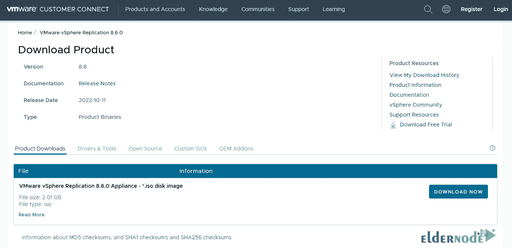

转到下载文件的位置并运行安装文件。现在，您需要登录到 vSphere vCenter web client 并运行 vSphere Replication OVF。点击**部署 OVF 模板…** ，如图所示:

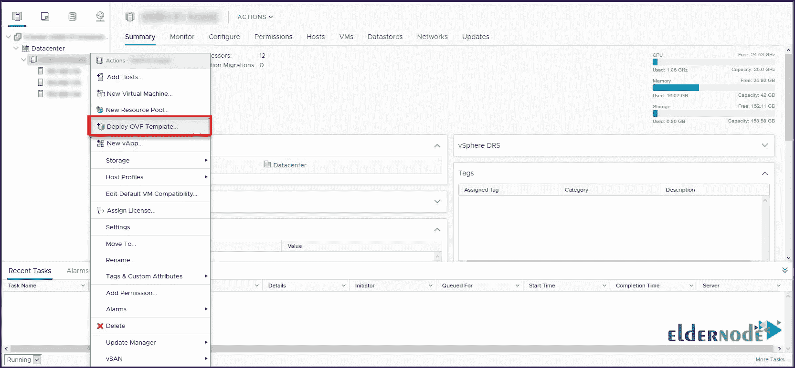

如您所见，有必要选择以下文件在 OVF 使用:

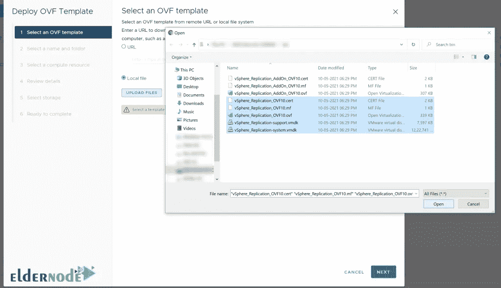

选择所需文件后，需要选择 OVF 的文件夹位置，然后点击**下一个**:

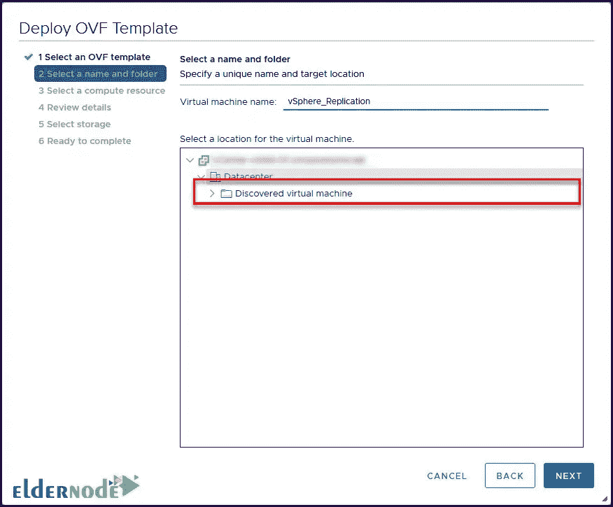

在下一步中，您需要选择要部署 vSphere Replication 设备的主机或群集，然后单击**下一步**:

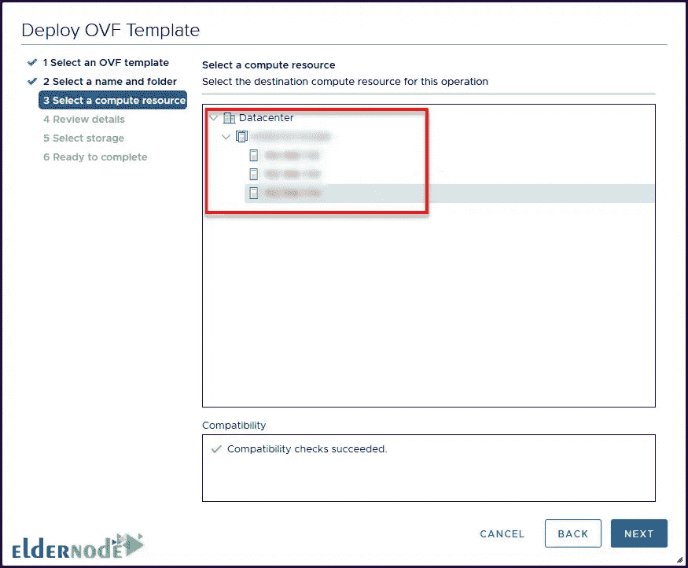

在查看详细信息阶段，将向您显示详细信息。点击**下一步:**

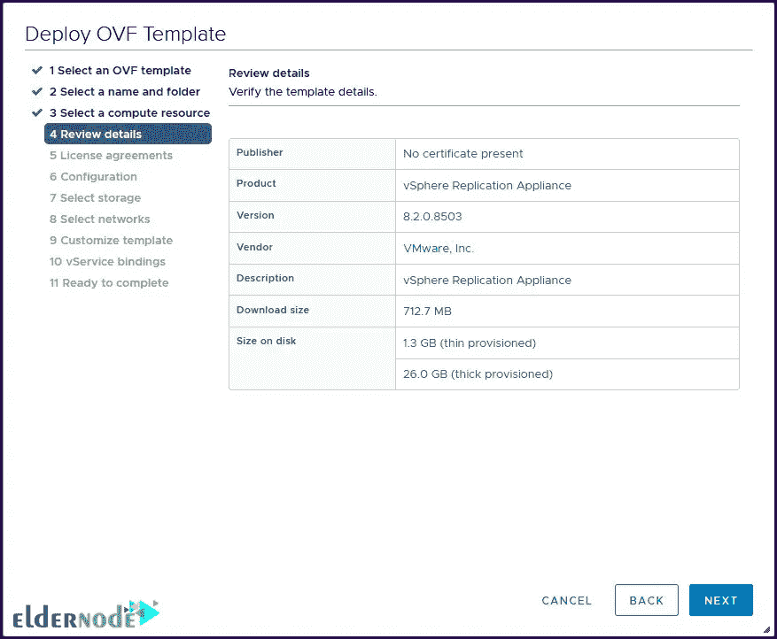

然后，接受许可协议，以便您可以进入下一步。

在步骤 6 中，您可以根据需要选择部署配置:

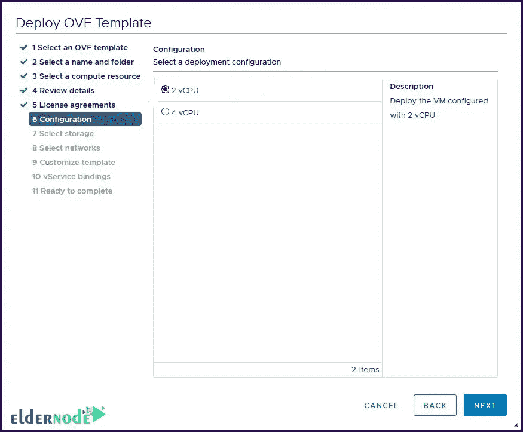

选择存储空间以部署设备。您还可以指定虚拟磁盘的格式，然后单击下一个的**:**

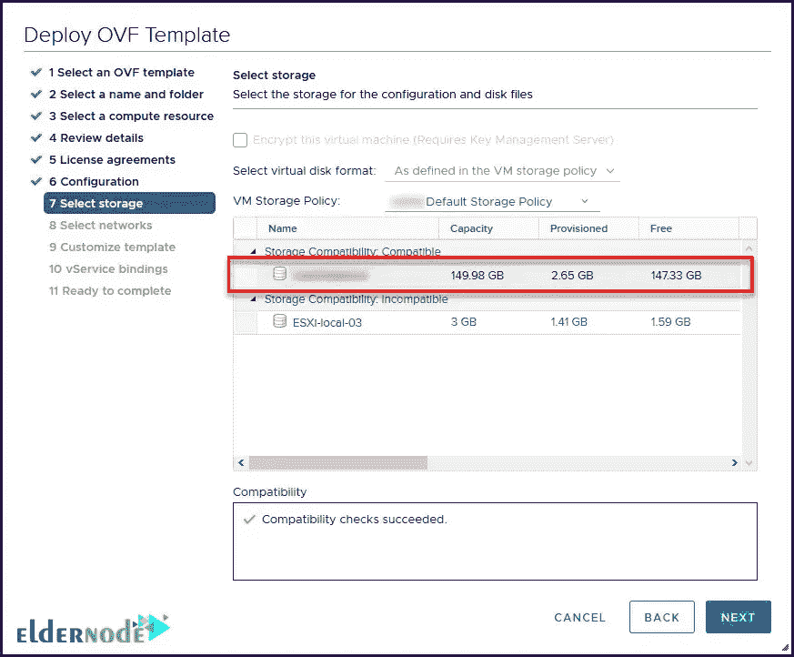

在选择网络步骤中，我们建议您选择静态 IP 地址。那么你可以选择 IP 分配为静态。

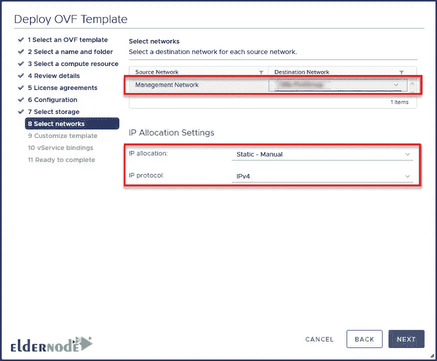

在第 9 步中，您可以配置 vSphere Replication 应用装置的网络设置和其他必需的设置。您也可以设置 Root & Admin 用户的密码，然后点击**下一步**:

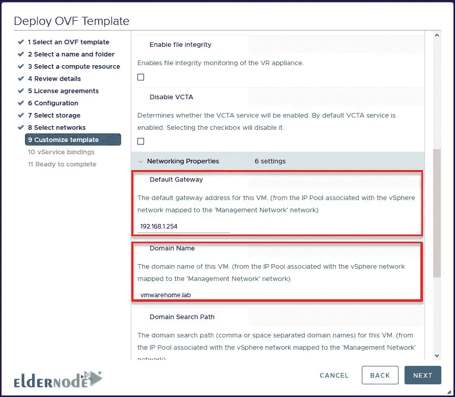

*

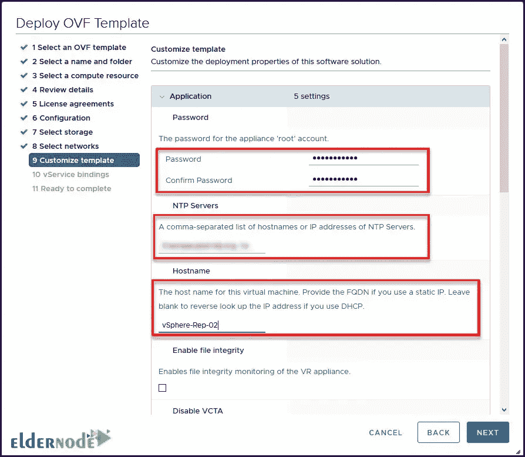

*

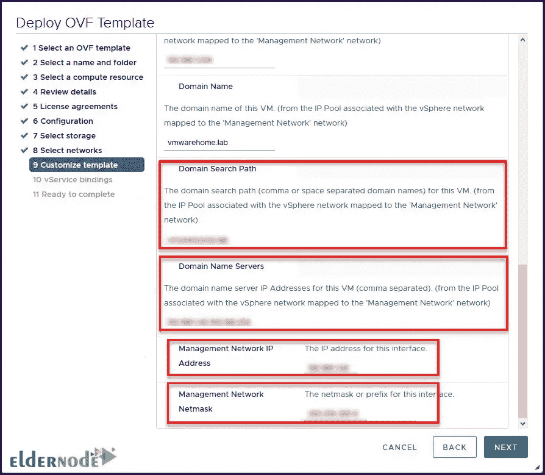

现在，您需要选择 vSphere Replication 应用装置将连接到 vCenter 服务的服务绑定。确保 VR 和 vCenter 或 PSC 在同一个网络上，以便相互联系:

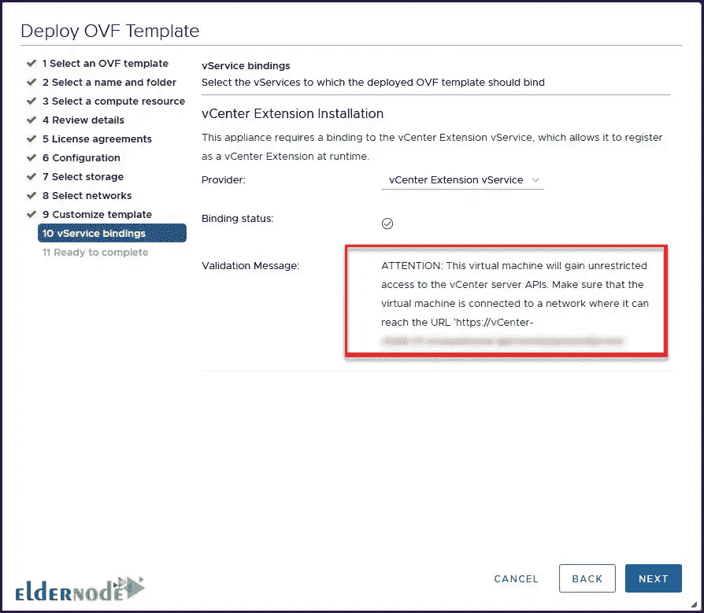

最后一步，点击**完成**完成安装过程:

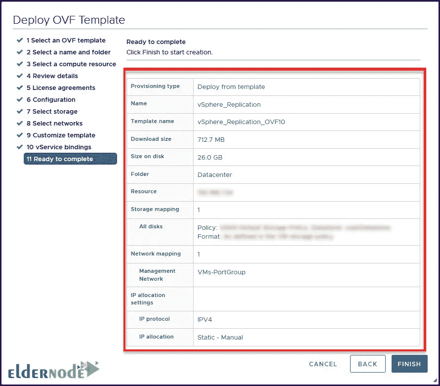

## 结论

如今，相当一部分企业使用虚拟化来提高扩展效率并降低硬件成本。同时，VMware vSphere 是世界上最杰出、最先进的虚拟化产品之一。在本文中，我们尝试先提及 VMware vSphere Replication 的一些功能。然后，我们教了如何在 5 分钟内设置 VMware vSphere Replication。如果你有任何问题，可以在评论区和我们分享。