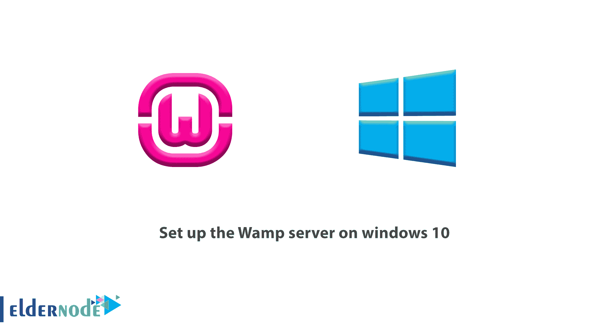

# 在 windows 10 上设置 Wamp 服务器-在 windows 10 上安装 WAMP 服务器

> 原文：<https://blog.eldernode.com/setup-wamp-windows-10/>

在这篇文章中，我们学习在 windows 10 上设置 Wamp 服务器。Wamp server 是为 Windows 发布的一个 PHP 和 MySQL [web 服务器](https://eldernode.com/category/web-server/)包，以便 PHP 编程语言爱好者可以在 Windows 上本地执行他们的测试。 WampServer 的功能和 Xampp 一模一样，用户选择其中一个方便使用。

在之前的文章中，我们讨论了如何在 Windows 10 上安装 Xampp 并解释了它的功能，现在在这篇文章中，我们将教你如何安装 Wampserver 。

WampServer 代表**Windows**Apache**MySQL****PHP**，由 Romain Bourdon 设计发行。一个类似版本的 WampServer 已经为 Mac 系统发布，名为 MAMP，代表 Mac Apache MySQL PHP。

### WampServer 功能

**1-** 立即执行

**2-** 支持最新版本的 PHP

**3-** 支持最新版本的 Apache

**4-** 全面支持 MySQL

**5-** 逍遥自在

### 安装 WampServer 的先决条件

要安装 WampServer 并正确运行它，你需要在你的系统上安装 Visual C ++库。

为此，请从对面的链接下载并安装 vrcedit 。( [**下载 Visual C++**](https://www.microsoft.com/en-us/download/details.aspx?id=30679)

然后转到在 windows 10 上设置 Wamp 服务器。

## 在 windows 10 上设置 Wamp 服务器

**1-** 首先下载 WampServer 文件。

[**下载 32 位版本的 WAP server**](https://sourceforge.net/projects/wampserver/files/WampServer%203/WampServer%203.0.0/wampserver3.0.6_x86_apache2.4.23_mysql5.7.14_php5.6.25-7.0.10.exe/download)

[**下载 64 位版本的 WAP server**](https://sourceforge.net/projects/wampserver/files/WampServer%203/WampServer%203.0.0/wampserver3.0.6_x64_apache2.4.23_mysql5.7.14_php5.6.25-7.0.10.exe/download)

注意 WampServer 有两个版本，32 位和 64 位，你必须为你的操作系统选择正确的版本。

**2-** 下载完成后，**双击安装文件上的**开始安装过程。

**3-** 第一步，选择想要的语言。

**4-** 检查完 WampServer 协议许可后，点击下一步。

**5-** 在本节中，您将收到一条消息，提示您安装您在先决条件安装步骤中安装的 Visual C ++库。

点击下一个。

**6-** 在此页面中，指定 WampServer 的安装路径。

**7-** 在此部分，指定您将在**开始栏**中看到的文件夹的名称，点击下一个。

**8- 最后**，点击安装开始安装WAP server。

*

**

***

**最后**，点击完成成功完成 WampServer 的安装。

从现在开始，你可以在你的系统上用 WampServer 拥有一个 PHP web 服务器。

请记住，通过安装 Wamp，您可以在 Windows 中拥有一个完整的 web 服务器，并使用您的个人虚拟主机。要推出这项服务，你还可以 [**购买一台 Windows 虚拟服务器**](https://eldernode.com/windows-vps/) 并使用它。

**要了解更多关于运行 XAMMP 和其他相关配置的信息，可以点击下面的链接。**

[1。如何在 Windows 10 上配置 XAMPP](https://eldernode.com/configure-xampp-on-windows-10/)

[2。了解如何使用 XAMPP 在 Windows 10 中设置 VPS](https://eldernode.com/learn-how-to-setup-vps-in-windows-10-using-xampp/)

[3。如何在 XAMPP 创建 FTP](https://eldernode.com/create-ftp-in-xampp/)

[4。如何在 XAMPP 更新 PHP 版本](https://eldernode.com/update-php-version-in-xampp/)

**尊敬的用户**，我们希望您喜欢**在 windows 10** 上设置 Wamp 服务器，您可以在评论区提出关于本次培训的问题，或者解决[老年人节点培训](https://eldernode.com/blog/)领域的其他问题，请参考提问页面，并尽快提出您的问题。腾出时间给其他用户和专家来回答你的问题。

好运。

Goodluck.