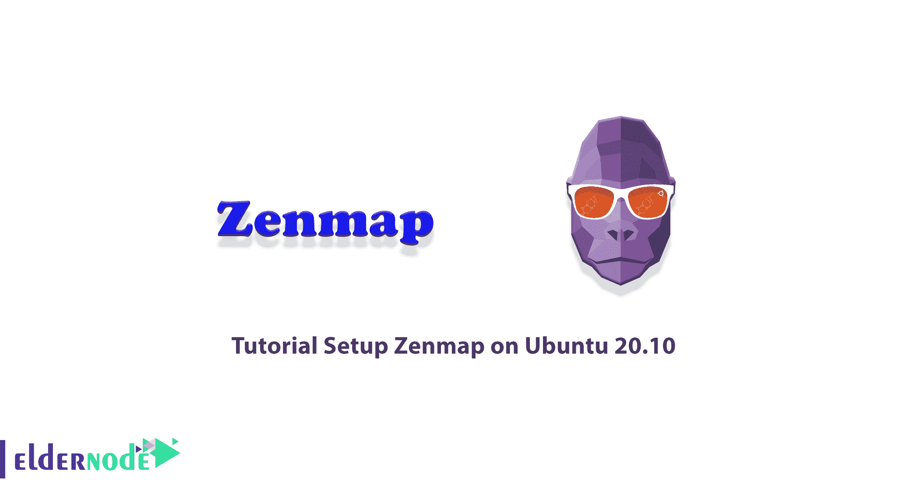
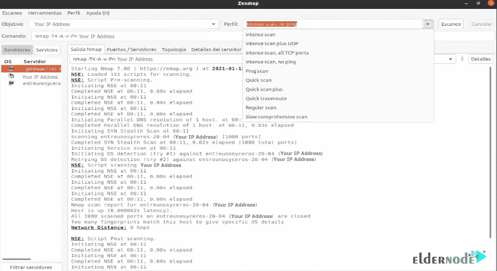

# 在 Ubuntu 20.10 - Eldernode 博客上安装 Zenmap 的教程

> 原文：<https://blog.eldernode.com/setup-zenmap-on-ubuntu/>



Zenmap 是由 nmap 开发的网络扫描和分析工具。Zenmap 和 nmap 工具的主要区别在于它的图形界面，可以适合初学者，也可以加快工作进程。这意味着您可以简单地进行图形化扫描，而无需使用 Linux 终端。Zenmap 在 [Kali Linux](https://blog.eldernode.com/tag/kali-linux/) 等操作系统上也是默认可用的，供黑客和安全专业人士使用，从一开始就不用安装就可以使用。在这篇文章中，我们将教你关于在 Ubuntu 20.10 上设置 Zenmap 的**教程。如果你想购买一台 **[Ubuntu VPS](https://eldernode.com/ubuntu-vps/)** 服务器，你可以访问 [Eldernode](https://eldernode.com/) 中提供的软件包。**

## **如何在 Ubuntu 20.10 上一步步设置 Zenmap**

Zenmap 是 Nmap [安全](https://blog.eldernode.com/tag/security/)扫描器的官方图形用户界面(GUI)。这是一个免费的开源多平台应用程序，为有经验的 Nmap 用户提供高级功能，使 Nmap 对初学者来说更容易。有趣的是，经常使用的扫描可以保存为配置文件，以便重复使用。

命令创建器允许创建 [Nmap 命令行](https://blog.eldernode.com/tutorial-nmap-commands/)交互。另一方面，扫描结果可以保存并在以后查看。可以比较已保存的扫描以了解差异。最近的扫描结果存储在可搜索的数据库中。

在本文的续篇中，加入我们来全面了解 Zenmap 及其在 [ubuntu](https://blog.eldernode.com/tag/ubuntu/) 20.10 上的安装方法。

### **Zen map 是什么？**

Zenmap 是 nmap 的免费开源图形用户界面。这个工具可以在许多操作系统上使用，比如 Linux、Windows、Mac OS X、BSD 等等。，并使 Nmap 对初学者来说很容易。Zenmap 并不意味着取代 nmap，而是让它更有用。Zenmap 中经常使用的扫描可以保存为配置文件，以便重复使用。在下一节中，我们将向您介绍 Zenmap 的一些特性。请加入我们。

### **Zenmap 特性**

在这一节，我们想提一下 Zenmap 的一些最重要的特性。这些功能包括:

**1。交互式和图形结果查看**

这个特性表明 Zenmap 可以显示正常的 nmap 输出。您还可以将其显示设置为显示一台主机的所有端口或具有特定服务的所有主机。应该注意，此功能在一个方便的屏幕上提供了有关主机或 com 扫描的详细信息。

**2。比较**

使用比较功能，您可以用它来以图形方式显示两次扫描之间的差异。这可以帮助您跟踪网络中出现的新主机或服务，或者正在消失的现有主机。

**3。重复性**

使用重复性功能，您可以使用 Zenmap 命令配置文件多次执行相同的扫描。

**4。易用性**

Zenmap 很好用。对于没有太多 Linux shell 经验的人特别有用。

在下一节中，请加入我们，一步步教你如何在 Ubuntu 20.10 上安装 Zenmap。

## **如何在 Ubuntu Linux 上安装 Zenmap**

由于 Zenmap 在官方 Ubuntu 资源库中不再可用，您需要手动下载并安装它。为此，您必须首先使用以下命令**更新**系统和已安装的软件包:

```
sudo apt update
```

然后，您需要通过运行以下命令来安装 Nmap :

```
sudo apt install nmap
```

值得注意的是，Zenmap 使用 Python GTK 来创建图形用户界面。所以在你开始安装 Zenmap 之前，你需要**在你的 Ubuntu 20.10 系统上安装 Python GTK** 。为此，您可以使用以下命令:

```
wget http://archive.ubuntu.com/ubuntu/pool/universe/p/pygtk/python-gtk2_2.24.0-5.1ubuntu2_amd64.deb
```

```
sudo apt install ./python-gtk2_2.24.0-5.1ubuntu2_amd64.deb
```

下一步，您应该通过访问以下地址下载 Zenmap Debian 包:

```
http://archive.ubuntu.com/ubuntu/pool/universe/n/nmap/
```

您也可以使用以下命令来完成此操作:

```
wget http://archive.ubuntu.com/ubuntu/pool/universe/n/nmap/zenmap_7.60-1ubuntu5_all.deb
```

最后，您可以使用以下命令**安装 Zenmap** :

```
sudo apt install ./zenmap_7.60-1ubuntu5_all.deb
```

### **在 Ubuntu 20.10 上设置 Zenmap**

在您成功安装了 Zenmap 之后，我们现在想教您如何运行和设置它。注意，要访问 Zenmap 特性，Zenmap 必须以 root 用户身份运行。因此，您必须在命令终端中运行以下命令:

```
sudo zenmap
```

你可以通过运行上面的命令在 Ubuntu 20.10 上使用 Zenmap。请注意，要扫描网络，您只需键入 IP 地址或主机名。

从下拉框中，用户可以从各种分析中进行选择，如**全扫描**、**简单扫描、**或 **ping 扫描**以确认计算机可用性。如下图所示，在右侧的 Nmap 输出窗口中，您可以看到 Nmap 中的各个步骤。



## 结论

Zenmap 是一款安全扫描仪，它的图形用户界面提供了数百种不同的选项。这个图形工具允许用户保存和比较所执行的扫描。他们还能够查看网络拓扑图、网络中一台或所有主机上运行的视口，并将扫描结果存储在可搜索的数据库中。在本文中，我们试图向您介绍在 Ubuntu 20.10 上安装 Zenmap 的教程。