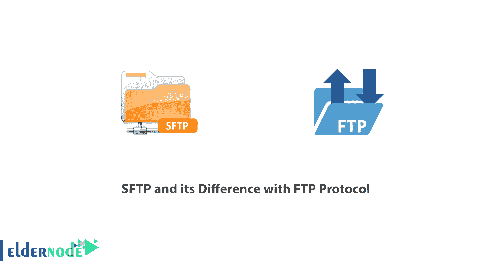
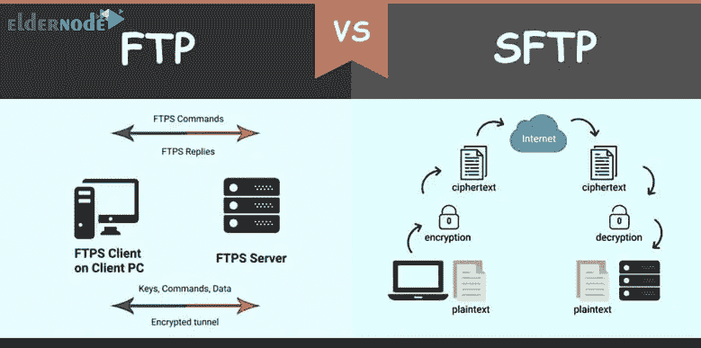

# SFTP 及其与 FTP 协议的区别——elder node Blog

> 原文：<https://blog.eldernode.com/sftp-and-difference-with-ftp-protocol/>

[SFTP](https://en.wikipedia.org/wiki/SSH_File_Transfer_Protocol) 及其与 [FTP](https://en.wikipedia.org/wiki/File_Transfer_Protocol) 协议的区别。**把一个文件从一个系统转移到另一个系统很简单，一点也不复杂。但有时我们可能会遇到问题。例如，两个系统可能有不同的文件类型和不同的呈现方式文本和数据，也可能有不同的文件夹结构。这就是为什么你需要知道**数据传输协议**。**

在这篇文章中，我们将回答什么是 SFTP？

[***在 Eldernode***](https://eldernode.com/windows-vps/) 购买 Windows 虚拟专用服务器

我们已经讨论过什么是 FTP ，我们知道 FTP 协议用于在两个系统之间传输文件，并通过在系统之间创建两条通信链路来克服这些问题。其中一条链路用于**传输信息**，另一条用于**控制通信**。

### 什么是 SFTP 协议？

**SFTP** 或安全文件传输协议是 FTP 协议的安全版本。确保在安全环境中访问和传输数据。

**注:**又称“ SSH 文件传输协议”。

在 **SFTP 协议**中，数据连接和命令连接都被加密，以保护两个系统之间交换的信息和密码。

SFTP 协议的功能类似于 FTP。然而，SFTP 使用 SSH 来传输文件。

### SFTP 的安全

SFTP 协议对你的数据进行加密，并在无法渗透的条件下传输。

这种传输以这样一种方式进行，即没有人能看到正在传输什么数据。宋承宪为 SFTP 提供必要的安全。SFTP 安全强度的一个重要因素是用于保护传输数据的加密方法。

简单地说，SFTP 是一种允许使用安全 Shell ( **SSH** )完成文件传输的方法。 **SFTP** 拥有 SSH 的所有安全特性。在 SFTP，所有 SFTP 通信都使用一个单一的端口。即初始认证、 FTP 命令和数据传输都是通过**端口 22** 服务器进行的。

与基于纯文本的 FTP 协议不同，SFTP 的通信是基于**数据包**的。SFTP 使用现代方法加密数据并保护其完整性。

### FTP 和 SFTP 协议有什么区别？

要比较 SFTP 和 FTP 协议，你应该注意它们提供的特性。以下是:

### FTP 功能

**1。** FTP 具有继续下载和上传连接的能力。

**2。** FTP 有一个用户界面，可以显示正在传输的文件。

**3。** 监控文件传输中的能力。

**4。** 允许你拥有多个连接。

**5。** 你可以一次上传多个文件。

**6。** FTP 基于服务器-客户端通信工作。这意味着服务器仍在等待客户端的请求。

**7。** 在 FTP 协议中，可以执行创建和删除文件夹、列出和删除文件等操作。

### SFTP 特色

**1。** 通讯是加密的，可以压缩。

**2。** 它们按照 SSH3 协议工作。

**3。** SFTP 允许你执行 SSH 命令。

**4。**T3【SFTP】支持 IPV6 HTTP 协议。

**5。** 支持基于密码和共享密钥的认证。

**6。** 可以管理和控制传输加密密钥。

**7。** 服务器的文本输出自动转换成 Unicode 系统。

### SFTP 的优点和缺点是什么？

在这一节，我们要指出使用 **SFTP** 的优点和缺点。

#### 使用 SFTP 的优势:

**A)** 通信总是安全的。

**B) TCP/ IP** 端口可以在加密通道上双向路由。

**C)**SFTP 协议运行在安全通道上。因此，数据和密码不是以简单和可听见的方式传输的。

**D)** 您可以安装软件而无需高级别访问权限。

#### 使用 SFTP 的缺点:

**A)** 通信是二进制的，不可能记录它们的报告。

**B)** SSH 密钥不容易管理和评估。

**C)** 许多已定义的标准都是可选的。这造成了不同公司生产的不同软件之间的干扰。

### SFTP 相对于 FTP 的优势

**1。** 与 FTP 不同，使用安全的加密通道进行通信。

**2。** **FTP** 运行在 TCP/ IP 协议下，但是 **SFTP** 是 SSH 协议的一部分，是一个电信软件。

**3。T3**FTP**输入输出端口在端口 21 上，而在 **SFTP** 端口 22 上。**

**4。 FTP** 没有主机间传输文件的安全通道，而 **SFTP** 提供了安全通道进行传输。

**5。 FTP** 使用两个通道进行数据传输，而 **SFTP** 使用一个通道。

**6。** **FTP** 使用服务器-客户端结构进行通信，而 **SFTP** 使用 SSH 结构。

**7。** **FTP** 采用直接传输方式，而 SFTP 采用隧道传输方式。

### 结论

SFTP 和 FTP 都是文件传输协议，但 SFTP，尽管有其优点和缺点，却是最安全的数据传输方式。

**尊敬的用户**，我们希望您能喜欢这个[教程](https://eldernode.com/category/tutorial/)，您可以在评论区提出关于本次培训的问题，或者解决[老年人节点培训](https://eldernode.com/blog/)领域的其他问题，请参考[提问页面](https://eldernode.com/ask)部分，并尽快提出您的问题。腾出时间给其他用户和专家来回答你的问题。

好运。