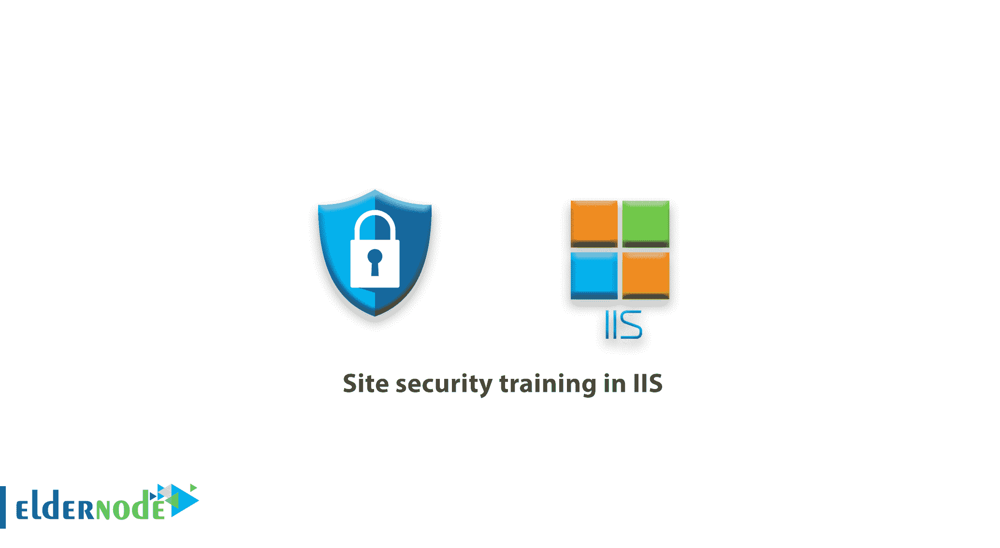
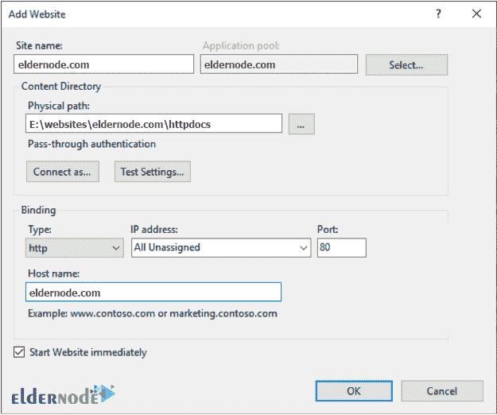
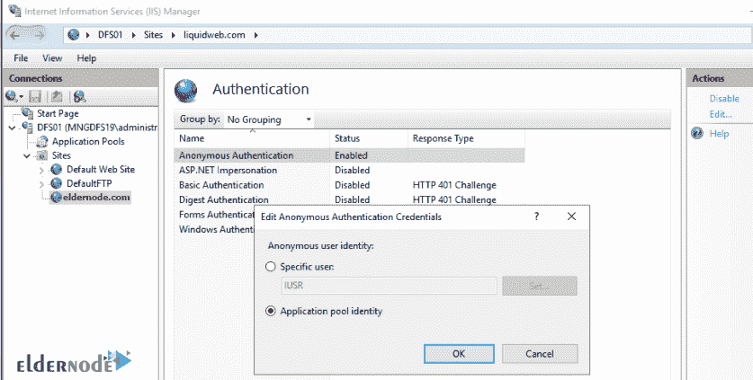
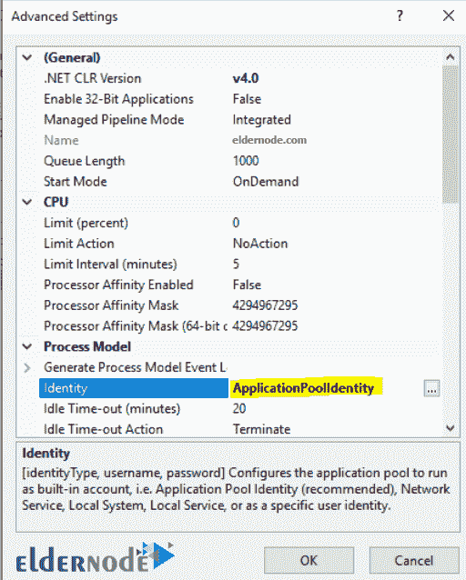
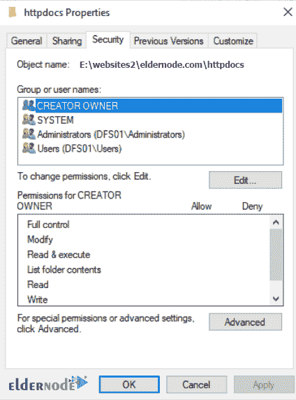
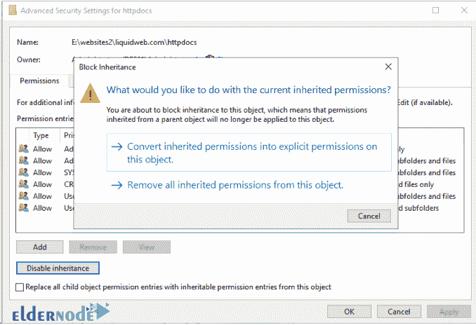
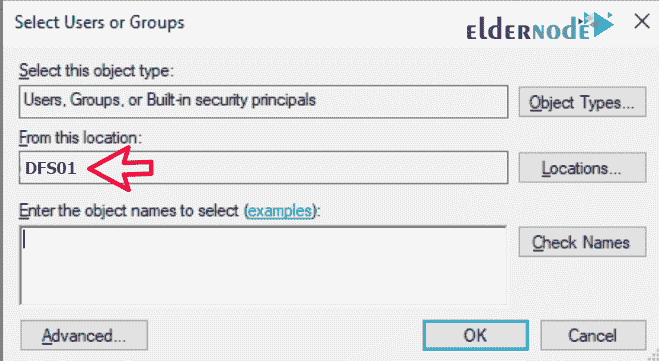
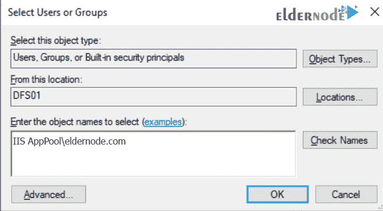
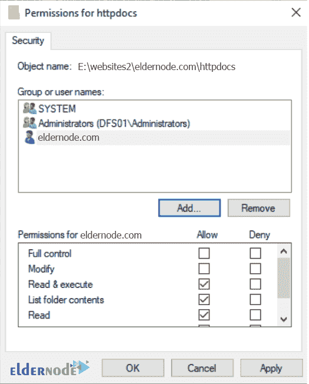

# IIS 中的站点安全培训-如何保护 IIS 中的站点

> 原文：<https://blog.eldernode.com/site-security-training-in-iis/>



IIS 中的站点安全培训。互联网信息服务 (IIS)是微软推出的一款灵活的通用 web 服务器。 IIS 运行在 Windows 系统上，交付请求的 HTML 页面或文件。当调查一个 [Windows VPS](https://eldernode.com/windows-vps/) 服务器上的站点感染或损坏时，最常见的根本原因是当谈到 IIS 应该如何访问文件内容时，文件安全性差或配置选择差。防止这种情况的最简单方法是从一个安全站点开始。

在 IIS 中建立一个网站是非常容易的，但是当涉及到安全性或易管理性时，一些默认设置并不是最佳的。首先，一些曾经被认为是必要的实践或标准不再是必要的，或者从来都不是必要的。

我们建议您按照这些步骤到建立一个网站，以确保它的建立是正确和安全的。

## 向 IIS 添加站点

**1。** 在 IIS 中添加一个**网站，打开 IIS 管理器。**

**2。在站点上右击**。

**3。**T3 选择添加网站。



我们通常建议使用**域名**作为“网站名称，以便于识别。

**4。** 在物理路径下，您需要提供您的网站内容所在的路径，或者使用“…”到导航到并选择文件夹。

**注意:**“连接为……”和测试设置……”下的配置选项不需要修改。

最好将 IP 地址设置为全部未分配，并在主机名 **字段**中输入您计划托管的域名。您只能在此提供一个值。

创建站点后，可以通过在站点上**右键单击**并转到绑定来添加额外的主机名。

根据您的需要，您可以选择 HTTPS 而不是 HTTP 。

#### IIS 中的站点安全培训

## 如何设置匿名用户

这就是在 IIS 中设置站点所需做的全部工作。

该网站可能工作，也可能不工作，网站上的**安全设置**不是最佳的。

保护你的网站的下一步是配置将访问你的文件的 IIS 用户。为此，你需要更改相关的匿名用户，并在**网站的内容文件夹**上做一些安全更改。

**1。** 在 **IIS** 中，选择左侧你的新站点。

**2。主窗口中的**双击认证。

**3。T3 选择匿名认证。**

**4。** 点击**右侧动作栏**上的编辑 …。



## IIS 中的 IUSR 是什么？

**IIS 中的一个新站点利用**[IUSR](https://docs.microsoft.com/en-us/iis/get-started/planning-for-security/understanding-built-in-user-and-group-accounts-in-iis)账户来访问文件。该帐户是内置的共享帐户，通常由 IIS 用来访问文件内容。这意味着它将使用应用程序池的身份(用户)来访问文件内容。

如果您仅计划在上托管一个域，则可以保留此配置；然而，当涉及到托管多个域名时，这是不安全的，因为任何网站都有可能使用同一个帐户从另一个网站访问文件。

作为一种标准做法，我们建议将从使用 IUSR 帐户切换到站点，而不是选择“应用程序池标识并点击 OK 。

您可以在系统上为每个站点手动创建一个用户。您需要管理额外用户的凭证，需要为两个用户(匿名用户和应用程序池用户)配置权限，以及您的服务器或组织可能有的密码复杂性和轮换要求的可能复杂性。

就安全性而言，您无需在 IIS 中进一步配置任何东西。

#### IIS 中的站点安全培训

让我们快速地看一下应用程序池的设置。为了**检查应用池上的设置**，在 **IIS** 中执行以下操作:

**1。在左侧菜单中选择** 选择应用池。

**2。** 然后为您创建的(通常与站点名称相同)站点选择**应用池** 。

**3。** 点击右边操作栏上的高级设置……。



在这里，相关的设置是标识，默认为应用池标识。这意味着为了访问文件内容，IIS 和关联的应用程序池将使用一个隐藏的、基于应用程序池名称的动态用户来访问文件。

该用户没有关联的密码，只能由 IIS 使用，并且只能访问专门授予它的文件。

因此，它消除了管理系统用户和凭证的需求。

## 如何在 IIS 中设置文件夹权限

ApplicationPoolIdentity 用户的权限很少，因此下一步也是最后一步是确保网站文件具有正确的安全设置。

**1。浏览**到你的文件系统，找到你计划存放站点文件的文件夹。

**2。** **在文件夹上右击**，进入属性。

**3。** 在属性界面中，选择安全选项卡。



文件夹上设置了许多不必要且潜在不安全的安全权限。

为了更好地保护站点，我们建议删除除了系统和管理员之外的所有组，并添加应用程序池身份用户(以及您可能需要的任何其他用户，例如 FTP 用户)；但是，要做到这一点，您需要禁用继承。

为此，点击高级，然后点击禁用继承。



这里你会看到一个弹出窗口，询问你是要复制当前设置还是不做任何设置。

更容易的是复制当前设置，然后删除不必要的权限。

所以选择将继承的权限转换成这个对象上的显式权限，然后点击确定。

此时，要删除不必要的权限，点击编辑并删除除系统和管理员组之外的所有内容。

接下来，您需要将 ApplicationPoolIdentity 用户添加到这个文件夹中。为此，点击添加… 。

现在，根据您的服务器配置，您可能会看到一个弹出窗口，要求让您验证到一个 active directory 域。

只需点击几次取消按钮，直到出现如下所示的选择用户组屏幕。



现在，您需要确保选择的“位置是您的计算机。

如果不是，点击“地点……，选择**您的电脑**。

ApplicationPoolIdenti ty 用户是隐藏用户，因此无法搜索该用户。

您必须键入用户名才能添加它。

您需要键入的 **用户名** 是:

```
IIS AppPool\<applicationpoolname>
```

请参见 后面的示例，并相应地填写您的示例:



键入用户名，点击确定。

现在您已经添加了用户，默认情况下，该用户仅被授予读取权限，您将希望验证您的**安全设置**看起来与下面的图相似，然后单击 OK :



**尊敬的用户**，我们希望您能喜欢这个[教程](https://eldernode.com/category/tutorial/)，您可以在评论区提出关于本次培训的问题，或者解决[老年人节点培训](https://eldernode.com/blog/)领域的其他问题，请参考[提问页面](https://eldernode.com/ask)部分，并尽快提出您的问题。腾出时间给其他用户和专家来回答你的问题。

好运。