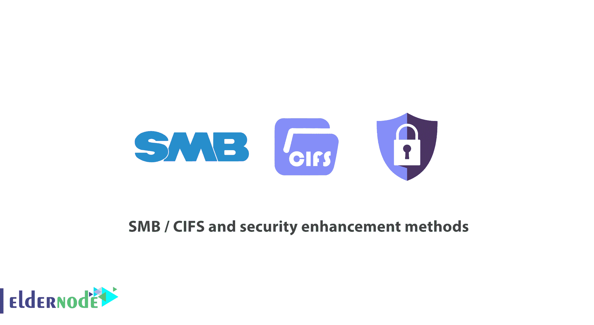

# 中小企业/ CIFS 和安全增强方法-教程| Eldernode

> 原文：<https://blog.eldernode.com/smb-cifs/>

**中小企业/ CIFS 和安全增强方法**

**Windows 安全中的 SMB 协议** **:**

在计算机网络中，SMB 或 CIFS 作为第 7 层协议(应用层)工作，它主要提供对共享文件、打印机和串行端口的访问，以及网络中设备之间的各种连接。

微软操作系统经常使用 SMB。Windows 服务包括 SMB、用于服务器部分的(服务器服务)和用于客户端部分的(工作站服务)。

Linux 操作系统使用另一个叫做 SAMBA 的 [SMB](https://en.wikipedia.org/wiki/Server_Message_Block) 版本。通常，SMB 是一种请求-响应协议，通过该协议，客户端向服务器发送 SMB 请求，服务器向客户端返回 SMB 类型的响应作为响应。(中小企业/ CIFS)

[服务器](https://eldernode.com/tag/server/)消息块协议可以以不同的方式用于会话层工作:

*   1)直接在 TCP 端口 445 上
*   2)通过 NetBIOS API，它也可以在几种传输层协议上工作。
*   3)在 TCP / IP 上的 NetBIOS 端口(UDP 137、138 和 TCP 137、139)上
*   4)在一些旧的协议上，如 NBF

**SMB 实现方式:**

*   1-客户端-服务器方法
*   2)桑巴

**执行问题:**

*   1) NetBIOS 问题
*   2)万执行问题

**中小企业的安全性:**

通过组策略进行更改

通过注册表进行更改

*   2)关闭管理共享并防止空会话枚举
*   3)禁用 TCP / IP 上的 NetBIOS
*   4)使用防火墙并关闭 TCP / IP 端口上的 NetBIOS
*   5)中小企业加密
*   6)方言协商
*   7)禁用 SMB 1.0

如有疑问或问题，可向[提问系统](https://eldernode.com/ask/)咨询，提供指导。