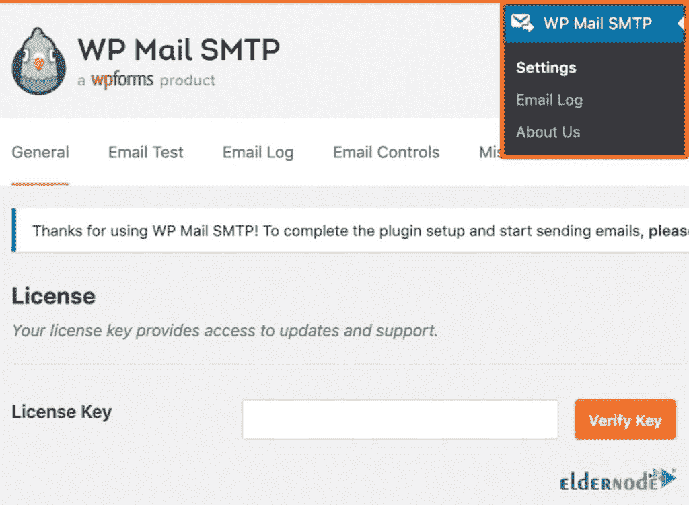
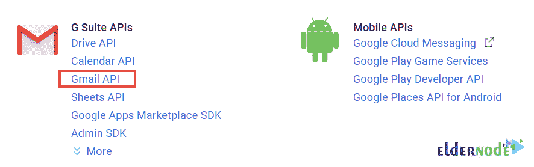

# 教程解决 WordPress CMS - Eldernode 博客上的电子邮件发送问题

> 原文：<https://blog.eldernode.com/solve-email-send-problem-on-wordpress/>

偶尔会引入不同的通信工具。其中，电子邮件仍然是网上传递信息的首选方式。作为一个网站所有者、编辑或作者，WordPress 内容管理系统允许你在没有任何编程知识的情况下管理你的网站和发布内容。WordPress 也使用电子邮件。如果 WordPress 主机服务器没有正确配置来使用 PHP mail()函数，你将面临邮件丢失。这篇文章介绍了在 WordPress **CMS** 上解决邮件发送问题的**教程。根据您的需求，在 [Eldernode](https://eldernode.com/) 上选择您考虑的套餐，购买您自己的 **[。](https://eldernode.com/wordpress-vps/)****

## **解决 WordPress CMS 上的邮件发送问题**

WordPress 提供电子邮件功能的最流行和最知名的插件之一是 WP Mail [SMTP](https://blog.eldernode.com/how-to-find-the-smtp-address/) 。**S**imple**M**ail**T**transfer**P**rotocol 是发送电子邮件的行业标准，它使用正确的身份验证来提高电子邮件的可送达性。如上所述，电子邮件发送问题最常见的原因是配置问题。但是，由于电子邮件服务提供商使用各种工具来减少垃圾邮件，他们可以检测到电子邮件确实来自它声称来自的位置。

当 [WordPress](https://blog.eldernode.com/tag/wordpress/) 网站发送的邮件经常不能通过这个测试时，你就面临着邮件发送的问题。这样，当一封邮件从你的 WordPress 站点发出时，它甚至可能不会进入收件人的垃圾邮件文件夹，更不用说收件箱了。

然而，要解决一个问题，你应该首先检查其可能的原因。在下面，你可以回顾一下 WordPress 不能发送邮件的所有原因，你会得到一个解决方案。

### **为什么 WordPress 不发送邮件**

在用你最喜欢的邮件客户端或软件发送邮件时，你可能会遇到错误。可以检查各种原因，但大多数情况下，它与您的 SMTP 服务器有关。这也可能是插件、服务器或 PHP 的问题。让我们看看当您无法发送电子邮件时可能出现的所有问题:

**1-互联网连接**

首先，检查你是否连接到互联网。这是在更改任何设置之前开始故障排除的最简单方法。

**2- SMTP 服务器详细信息**

最常见的错误是用 SMTP 参数设置邮件客户端。

**3-用户名和密码**

另一个简单的错误和检查问题的简单方法是关于用户名和密码。因此，您可以仔细检查登录详细信息。

**4- SMTP 端口**

[SMTP](https://blog.eldernode.com/send-email-via-smtp/) 通常使用端口 25 发送邮件。一些 ISP 可能会因为垃圾邮件流量而阻塞端口 25。因此，您可以使用端口 587 或 465。

**5-防病毒或防火墙设置**

您还需要验证您的防火墙或防病毒软件是否阻止了计算机的保护系统，并设置适当的规则。

**6-配置问题**

WordPress 不发送邮件最常见的是服务器配置。如果您的服务器没有配置发送电子邮件，您需要将其配置为使用 PHP mail()函数。

**7-电子邮件插件**

检查服务器也是一个简单的解决方案。要做到这一点，你需要添加一个插件来测试，以确保你甚至可以发送电子邮件。

**8-垃圾邮件控制**

你应该问问那些报告说他们没有收到你的邮件的用户关于他们的垃圾邮件文件夹的情况。由于一些电子邮件客户端是自动化的，他们可能会将来自 WordPress 的邮件识别为垃圾邮件。

## **如何修复 WordPress CMS 上的邮件发送问题**

SMTP 在网络上和跨网络移动电子邮件。因此，如果您的服务器没有配置发送电子邮件，这将使它成为可能。在本节中，您将学习使用第三方 SMTP 提供商，并将其与您的站点链接，这样它将再次发送电子邮件。

因为你的 WordPress 邮件没有被发送，让我们学习如何切换到 SMTP。

### **安装 WP 邮件 SMTP 插件**

对于任何 SMTP 服务，你必须在你的站点上安装 WP Mail SMTP 插件，以便能够将 WordPress 从使用内置的 PHP mail()函数切换到使用你的 SMTP 服务。首先，你需要从 WordPress 资源库下载、安装并激活 [WP 邮件 SMTP](https://wordpress.org/plugins/wp-mail-smtp/) 插件。当 WP 邮件 SMTP 被激活时，您就可以配置它了。要配置插件设置，在你的 WordPress 仪表盘上点击 WP 邮件 SMTP。

然后，输入您希望您网站的电子邮件来自的名称和商业电子邮件地址。

***注意* :** 电子邮件地址必须与您将用于 SMTP 邮件服务的地址相同。

即使其他类似 **WPForms** 的插件有不同的设置，你也可以强制邮件使用这个名称和邮箱地址。接下来，你应该为你的站点选择一个 SMTP 邮件服务。所以，你可以选择使用 Sendinblue、Gmail、Amazon SES 或 Office365 来设置 SMTP。

### **使用谷歌 SMTP 邮件服务器**

让我们看看如何从谷歌和该公司的 SMTP 服务器使用免费的 Gmail 帐户。要设置帐户，请打开 Gmail 网站。当你的账户设置好后，从 [WordPress 插件库](https://wordpress.org/plugins/gmail-smtp/)下载并安装 **Gmail SMTP** 插件。

激活完成后，进入**设置>Gmail SMTP**配置插件。

创建一组安全凭证来授权你的 WordPress 安装使用 Google 的电子邮件服务器。最后，使用您新创建的 Gmail 帐户详细信息或另一个 Google 帐户登录。

此时，要创建一个新项目，单击屏幕顶部的**我的项目**链接，然后单击**添加(+)** 按钮创建一个新项目。

为项目创建任意名称，然后单击“创建”按钮。然后，点击侧边栏中的**仪表板**，可以点击屏幕顶部的**启用 API 和服务**链接。

然后，在**Google Workspace API**下，选择 **Gmail API** 链接。

现在，要创建用于 Gmail API 的访问凭证，请点击**启用**链接。要继续，从侧边栏中选择**凭证**，然后点击**创建凭证**按钮。

如下图所示，在菜单中选择 **OAuth 客户端 ID** 。要创建 OAuth 客户端 ID，您需要首先设置一个产品名称。

在**应用类型**界面中，选择 **Web 应用**，然后点击**创建**按钮。输入 OAuth 客户端 ID 的名称，然后回到你的 WordPress 管理仪表板。

最后，将**授权重定向 URI** 字段的内容复制到 **Gmail API 创建客户端 ID** 页面的相关字段中。

一旦您点击**创建**按钮，一组 OAuth 客户端凭证将显示在屏幕上。

因此，你需要将**客户端 ID** 和**客户端秘密**复制粘贴到插件的**设置**页面中。

最后，点击**保存**更改继续，并点击出现的**授予权限**按钮。

就是这样！您只需输入您的 Gmail 帐户凭据即可授权连接。然后，检查您的 SMTP 状态现在显示为**已连接**。您现在可以进入**测试电子邮件**选项卡，尝试新的电子邮件连接。

## 结论

在这篇文章中，你学习了如何在 WordPress CMS 上解决邮件发送问题。你回顾了所有可能导致 WordPress 在发送邮件时出现问题的原因。所解释的解决方案对于解决其中任何一个都是有用的。最后，作为一个选项，您学习了如何使用 Google SMTP 电子邮件服务器。询问您在 [Eldernode Community](https://community.eldernode.com/) 上的朋友是否选择了其他应用程序。