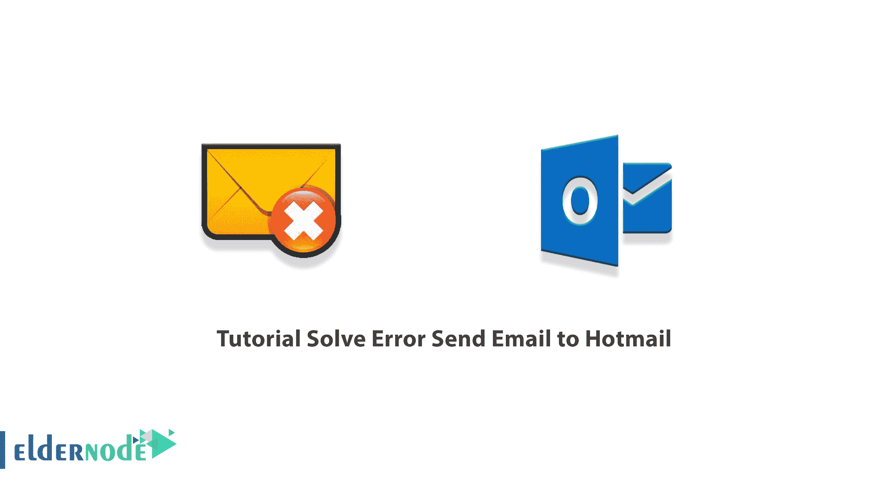
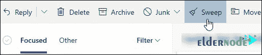
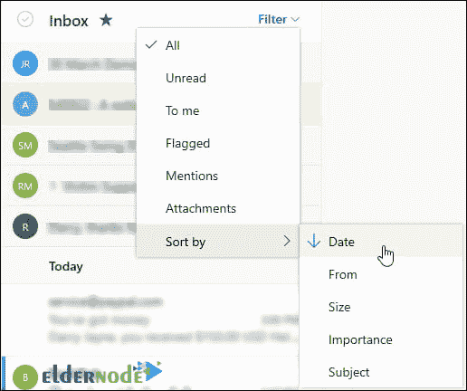

# 教程解决错误发送电子邮件到 Hotmail - Eldernode 博客

> 原文：<https://blog.eldernode.com/solve-error-send-email-to-hotmail/>

向 Hotmail 发送电子邮件时，除了发送/接收邮件之外，您可能还会遇到其他几种错误。其他服务器错误，如丢失连接错误、发送和接收错误等。所有这些错误都是由于在满足服务器或互联网连接的确切需求方面存在某种差异。在本文中，您可以阅读**如何解决向 Hotmail 发送电子邮件的错误**。如果你想购买 [**Windows VPS**](https://eldernode.com/windows-vps/) 服务器，你可以在 [Eldernode](https://eldernode.com/) 中看到可用的软件包。

## **如何解决发送邮件到 Hotmail 的错误**

### **Hotmail 常见错误列表**

在本节中，您将看到一些常见 Hotmail 错误的列表:

1_ 无法建立连接，因为目标机器主动拒绝连接。

2_ 找不到服务器。

3_ 发送和接收报告的错误(0x800ccc0f):'与服务器的连接中断。

4_ 您的服务器意外终止了连接。

5_ 发送和接收报告的错误(0x 80042109):“Outlook 无法连接到您的发送(SMTP)电子邮件服务器。

6_ 等待接收(POP)服务器 0x8004210a 的响应时操作超时。

7_ 与服务器 0x800ccc19 通信时超时

8_ 错误:0x800ccc150x800421080x800ccc0e0x800ccc0b0x800ccc790x800ccc670x800409000x800ccc810x800401190x80040600。

9_ 错误 0x8007000c

10_ 错误 0x800C013b

11_ 错误 0x8004210b

## **10 种解决发送邮件到 Hotmail 错误的方法**

在本文的其余部分，我们将介绍 10 种解决向 Hotmail 发送电子邮件错误的方法。你可以通过检查这些项目来解决收发邮件的问题。请加入我们。

### 1。检查你的垃圾邮件文件夹

这样，你就可以选择垃圾邮件文件夹，寻找丢失的邮件。请注意，如果有不应标记为垃圾邮件的邮件，请右键单击每封电子邮件，然后选择标记为垃圾邮件。您会注意到，该邮件会自动转移到您的收件箱中。

### 2。清理你的收件箱

在这一部分，我们将解释如何清理你的收件箱。如果您的收件箱已满，您将不会收到新邮件。因此，您必须遵守以下几点。

为了在收件箱中创造更多的空间，你需要通过右击**垃圾邮件** > > **清空文件夹**来**清空你的垃圾文件夹**。

你也可以从收件箱或存档文件夹中清除垃圾邮件。Sweep 允许您自动删除来自特定发件人的所有传入电子邮件，只保留来自该发件人的最后一封邮件。您也可以删除发件人超过 10 天的电子邮件。

为此，选择您想要扫描的邮件，然后选择**扫描**。

### 3。检查您的收件箱过滤器和分类设置

另一个解决接收邮件问题的方法是检查你的收件箱过滤器和排序设置。如果您的收件箱是按类别筛选的，或者您的排序顺序不同，您可能看不到您期望看到的邮件。因此，您应该注意到，过滤和排序位于邮件列表的顶部。

要过滤和排序，您需要按顺序执行以下操作:

**对于过滤**，选择过滤器，然后选择您想要查看的消息类型。

**对于排序**，选择过滤器>排序依据，然后选择您想要的排序依据。

如果想搜索最近的消息，需要**按日期**排序。

您还可以从**到**进行排序，以搜索特定的个人消息。

***注意:*** 您可以通过再次选择该选项来反转排序顺序。

### 4。检查另一个选项卡

另一种检查收发邮件的方法是检查其他标签。您应该注意到，焦点收件箱将您的收件箱分为两个选项卡，焦点和其他。

请注意，如果为您启用了收件箱，发送给您的一些邮件可能在其他选项卡中。因此，在这里您可以右键单击您希望出现在焦点中的任何邮件，然后选择“移动到焦点收件箱”或“总是移动到焦点收件箱”。

### 5。检查您的阻止发件人和安全发件人列表

另一种解决埃森发送和接收错误的方法是检查您的阻止发件人和安全发件人列表。为此，您必须遵循以下步骤。

点按“设置”部分中的“邮件”。然后在下一步，点击**垃圾邮件**。如果您在**阻止发件人和域**部分看到发件人地址，请选择他们的地址，然后选择**删除** > > **保存**。

如果发件人地址不在您的**阻止发件人**列表中，您可以将他们添加到**安全发件人和域**。请注意，您的安全发件人列表中的联系人的电子邮件将不会进入**垃圾邮件**文件夹。

选择**设置**>查看所有 Outlook 设置。

选择**邮件**>T5**垃圾邮件**。

输入发送者的电子邮件地址，然后选择**添加** > > **保存**。

### 6。检查您的电子邮件规则

另一种方法是检查电子邮件规则。要检查这些规则，您必须首先点击**设置**。然后选择**查看所有 Outlook 设置**。

下一步，点击**邮件**，然后选择**规则**。

请注意，如果有一个或多个规则阻止您查看所需的电子邮件，您可以执行以下操作之一:

_ 第一种方法是选择您想要删除的规则，然后选择**删除**。

_ 第二种方法是选择**规则**，然后选择**编辑**来更改规则设置，您可以轻松找到消息。

选择上述方法之一后保存这些设置。

### 7 .。检查电子邮件转发

在这里，您需要检查是否启用了发送电子邮件。为此，您需要首先进入**转发设置**:

_ 要**启用**转发，选择**启用转发**。

_ To **禁用**转发，清除复选框。

您可能会感兴趣的一件事是，如果您希望将电子邮件发送到转发地址，并且它保留在您的 Hotmail 邮箱中，请选择保留转发邮件的副本。

### 8。检查您的帐户是否被封锁

如果您无法发送或接收电子邮件，您的帐户可能会因为注意到一些异常的登录活动而被暂时阻止。

### 9。移除一些关联账户

请注意，您最多可以将 20 个电子邮件帐户连接到您的 Hotmail 帐户。现在，如果您有超过 20 个已连接的帐户，您将无法从任何已连接的帐户发送或接收消息。因此，要解决这个问题，你必须删除一些已连接的帐户，使已连接帐户的总数为 20 或更少。

### 10。联系发送方

最后，如果在查看了前面提到的解决方案后，您仍然无法向 Hotmail 发送[电子邮件](https://blog.eldernode.com/tutorial-connect-cpanel-email-account-to-gmail/),请联系发件人并告知他们:

_ 他们的电子邮件不会发送到 Hotmail。

_ 他们应该通过 postmaster.live.com 联系 Microsoft 支持部门。

***注意:*** 您还可以使用以下选项来解决向 Hotmail 发送邮件的问题:

1.在 Windows 上使用邮件应用程序

2.您最近更改了密码

3.邮件或附件太大

4.修复移动设备的同步问题

## **如何为 Hotmail 账号设置 IMAP**

在此部分，您可以使用以下设置来解决向您的 Hotmail 帐户发送和接收电子邮件的问题。因此，您需要根据以下设置配置您的帐户:

**1。您的姓名:**在此字段中，您必须输入您希望其他人看到的姓名。

**2。电子邮件地址:**您的 Microsoft 帐户的完整 URL 必须在此字段中完整输入。

**3。账户类型:** IMAP

**4。邮件接收服务器:**imap-mail.outlook.com

**5。发送邮件服务器:**smtp-mail.outlook.com

**6。用户名:**您的 Microsoft 帐户的完整原始地址在此处输入。

**7。密码:**您的 Microsoft 帐户密码或应用程序密码(如果您为 Microsoft 帐户启用了两步验证)

**8。记住密码:**可选

**9。要求使用安全密码验证(SPA)登录:**已禁用

10。我的发送服务器(SMTP)需要验证:已启用

**11。使用与我的接收邮件服务器相同的设置:**已启用

**12。接收服务器(IMAP):** 993

13。使用以下类型的加密连接: SSL

**14。发送服务器(SMTP):** 587

15。使用以下类型的加密连接: TLS

## 结论

在本文的开头，我们回顾了在向 Hotmail 发送和接收电子邮件时的一些常见和各种各样的错误。然后向您解释了解决向 Hotmail 发送电子邮件错误的 10 种方法。