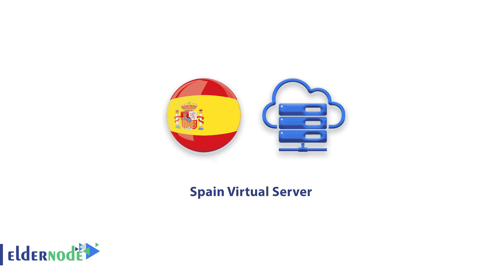

# 西班牙虚拟服务器-购买西班牙 VPS 服务器| ElderNode 博客

> 原文：<https://blog.eldernode.com/spain-virtual-server/>

开始提供西班牙虚拟服务器服务。

通过购买西班牙虚拟服务器，您将获得 IP 服务和 100%真实的位置。当您在西班牙 VPS 浏览器中打开页面时，您将以西班牙公民的身份打开该页面。

### 西班牙虚拟服务器功能:

*   专用 IP
*   专用资源
*   1-6 小时交货
*   99%的正常运行时间
*   100%真实位置
*   硬件防火墙
*   升级到更高计划的能力

注意:由于该国数据中心的限制，这个位置可以在 Linux 计划中提供。

点击订购 **[Linux VPS](https://eldernode.com/linux-vps/)** 服务器。