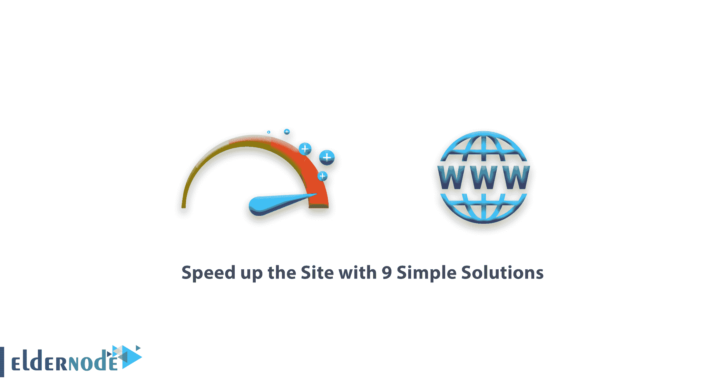

# 用 9 个简单的解决方案加速网站——elder node 博客

> 原文：<https://blog.eldernode.com/speed-up-the-site-with-9-simple-solutions/>

用 9 个简单的解决方案加速网站。今天互联网上有很多网站。如果你设身处地为用户着想，你更喜欢打开一个更快的网站，你可以非常快速地浏览网站。

在这篇文章中，我们将解释如何用 **9 个简单的解决方案**来提高网站速度，让你的网站比实际情况更乐观。本教程中提到的所有要点都是一般性的，并非在所有情况下都是强制性的。你将能够在你的网站上只实现你感兴趣的东西。

[**在 Eldernode** 的 VPS 托管计划](https://eldernode.com/vps-hosting/)

### 1。压缩 web 服务器输出文件

如你所知，今天的网络服务器有能力**压缩**输出文件。此功能允许 web 服务器将网站的输出压缩到访问者的浏览器中。

这将对你网站的速度产生非常积极的影响。建议您**启用** Gzip ，负责压缩您网站上的网站内容，压缩您网站上的输出文件。

### 2。压缩上传文件

另一种提高网站速度的方法是自己压缩网站文件。

网站包括 HTML 、 CSS 、 JavaScript 等文件。您可以在上传到主机之前对其进行压缩，使其体积变小。压缩文件**可以节省服务器上的** 带宽。

当然，这种压缩需要特殊的软件和方法。

**注意:** 如果你不是专门做网页设计和编程的，建议你在专家的帮助下做这件事。

### 3。图像优化

图片是网站最重要的部分。它也比 文本和网页代码大得多**。因此，你可以在你的网站上存储图像时使用它，通过观察重要的点，如正确的**尺寸**，正确的**颜色**组合，最后**存储**它以产生最佳图像。**

如果可能的话，使用一个内容管理系统，比如 WordPress 和网络优化插件。

**提示:** 优化你的网站图片有时可以让你的网站加载速度翻倍。

### 4。使用缓存

在您的网站上使用缓存将有助于您在网站因任何原因不可用时向用户显示内容。

缓存系统的工作方式是，如果用户第一次进入你的网站，它会从你的网络服务器加载所有信息。此外，如果用户第二次进入您的站点，所有信息都将从缓存中显示，并且只向您的 web 服务器请求更改。

同样，网站加载速度很快，服务器资源使用较少。

**注:** 有各种缓存插件用于 [WordPress](https://wordpress.com/) 、 [Joomla](https://www.joomla.org/) 等。你可以用它为你的网站提供一个缓存系统。

### 5。使用 CDN

内容交付系统是帮助您的网站更快打开的解决方案之一。使用一个 [CDN](https://en.wikipedia.org/wiki/Content_delivery_network) 可以让你免费为你的网站创建一个通用缓存系统，而无需做任何特殊设置。

各种 cdn 如 [Cloudflare](https://www.cloudflare.com/) 等。在互联网上免费提供他们的基本服务，我们建议你使用。

### 6。使用虚拟服务器或专用服务器

再好的虚拟主机也有它的缺点。共享网络服务器托管许多网站。这导致速度和硬件资源在这些网站之间共享。

因此，使用虚拟主机服务器或[专用服务器](https://eldernode.com/dedicated-server/)将为网络服务器提供更多的硬件资源。

### 7。网站图形

通过搜索互联网，你会遇到图形质量更高的网站，同时比简单的网站速度更快。

这样做的原因是使用了最佳的和专业的设计。使用最新的网页设计技术会让你用最少的编码得到最好的图形。

因此，除了使用正确的图形，尝试使用最新的技术来设计您的网站，以获得最佳的网页。

### 8。使用网站速度监控工具

互联网上有一些网站会审查你的网站，并告诉你一些提示，这些提示会帮助你加速并优化你的网站。

在这一领域著名和实用的网站中，可以提到以下网站:

–[gt metrix](https://gtmetrix.com/)

–[Pingdom](https://www.pingdom.com/)

–[网页测试](https://www.webpagetest.org/)

–[谷歌页面速度](https://developers.google.com/speed/pagespeed/insights/)

### 9。提高网站安全等级

你可能想知道如何提高网站的安全级别将有助于加快您的网站？

提高网站安全性会增加你的网站负荷。因为恶意工具将无法访问你的网站，因此你的硬件和服务器资源将不会被用来对付它们。

增加网站的安全级别，除了保证你网站的性能，对你网站的加载速度也有非常好的作用。

## 结论

有些解决方案对你来说可能成本很高，但是像优化图片、使用缓存、使用 CDN 、压缩上传的文件和在服务器上激活 Gzip 这样的方法是完全**免费的**，你可以使用这些方法。

**尊敬的用户**，我们希望您能喜欢这个[教程](https://eldernode.com/category/tutorial/)，您可以在评论区提出关于本次培训的问题，或者解决[老年人节点培训](https://eldernode.com/blog/)领域的其他问题，请参考[提问页面](https://eldernode.com/ask)部分，并尽快提出您的问题。腾出时间给其他用户和专家来回答你的问题。

好运。