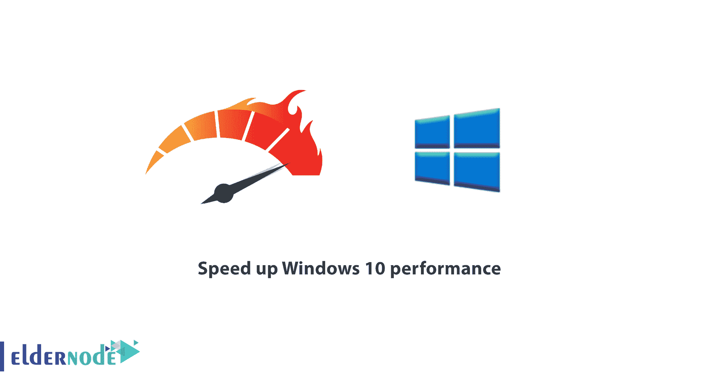
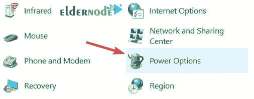
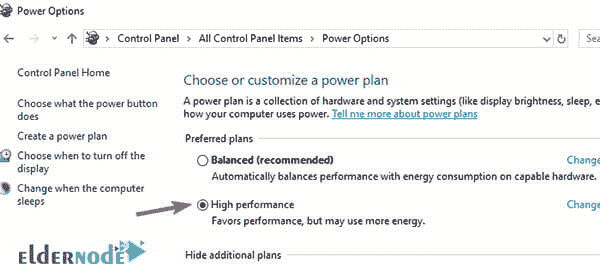
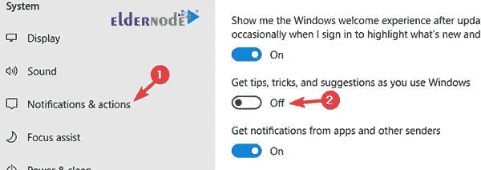
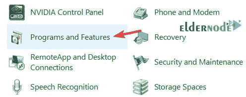
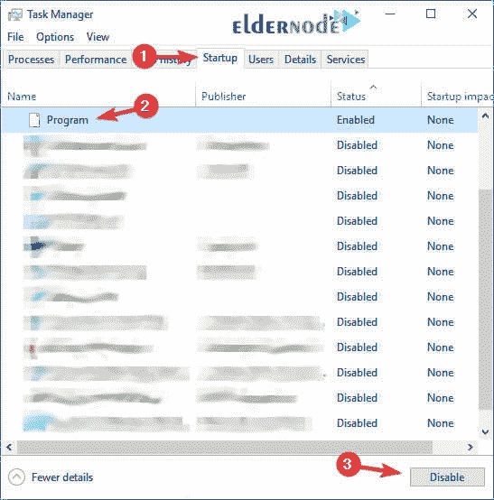
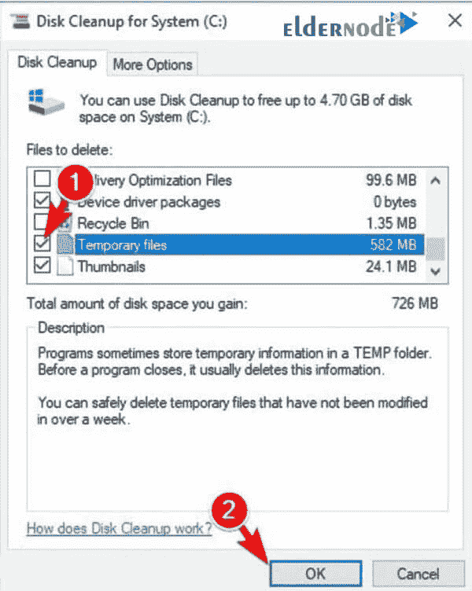

# 教程以 100%的实用性提升 Windows 10 的性能

> 原文：<https://blog.eldernode.com/speed-up-windows-10-performance/>

教程如何**用 100%实用的**加速 Windows 10 性能。通过禁用一些正在进行的选项和进程，您将能够加快 Windows 10 的速度并提高其性能。Windows 中总有一些你可能不需要的操作，它们会降低你的操作系统的速度。在这篇文章中，我们将教你如何通过禁用 Windows 10 的一些功能来加快和改善 Windows 10 的性能。你可以在 [Eldernode](https://eldernode.com/) 选择你最完美的 [Windows VPS](https://eldernode.com/windows-vps/) 服务器套装。和我们在一起！

## 如何提升 Windows 10 性能

除了升级系统硬件之外，还有其他更简单、更快速的方法来提高 Windows 的速度，下面将提到其中的一些方法。

### 了解如何更改电源设置以提高 windows 10 的性能

一些用户将他们的系统设置调整为**节电模式**到**延长电池**寿命并保护它。

然而，这种模式可能会**降低**电脑上 Windows 的**性能**。为了提高 Windows 10 的性能，建议您将电脑上的功耗设置设置为高性能或平衡。为此目的:

**1。**转到**控制面板**部分。

**2。**选择**硬件和声音**部分。

**3。**点击**电源**选项。

**4。**现在选择**平衡**或**高性能**选项。

***注意:*** 切记选择 **高性能** 选项会增加能耗。但是**平衡**选项在 Windows 性能和功耗之间取得了平衡。因此，平衡是更好的选择。

### 教程禁用 Windows 提示和技巧

Windows 10 的提示和技巧是 Windows 中另一个**不必要的**功能，你不需要太多。这个功能更多的是针对初学者和新手用户，为这部分用户提供了有用的窍门。

该功能有时会导致 **Windows 性能**出现问题。要禁用此功能:

**1。**打开**开始**菜单，点击**档位图标**。

**2。**点击**系统**。

**3。**从左侧面板中选择**通知&动作**部分。

**4。**现在**禁用****在使用 Windows** 选项时获得提示、技巧和建议。

### 如何卸载膨胀软件

开发者在系统上安装的不必要的软件被称为[膨胀软件](https://en.wikipedia.org/wiki/Software_bloat)。膨胀软件通常除了消耗系统资源和降低窗口速度之外什么也不做。为了提高 Windows 的性能，最好**从你的系统中卸载**这些臃肿的软件。要卸载这些不必要且无用的程序:

**1。**进入 Windows 中的**控制面板**。

**2。**首先选择**节目**部分，然后选择**节目和特色**。

**3。**现在**在想要的应用上右击**，从打开的列表中选择**卸载**选项，卸载不需要的程序。

尽管这是卸载一个程序最简单的方法，但它可能无法完全移除这个臃肿的软件。

有时，即使卸载了膨胀软件，该程序中的文件和信息仍会留在系统中。在这些情况下，我们建议使用诸如 [IOBit Uninstaller](https://www.iobit.com/en/advanceduninstaller.php) 之类的软件从计算机中完全删除膨胀软件。有了这个软件，你可以从你的电脑中彻底删除不必要的程序。

### 如何减少 [Windows 启动时运行的程序](https://blog.eldernode.com/disable-startup-delay-in-windows-10/)

当 Windows 启动时，启动程序会自动在系统上运行。随着时间的推移，您可能会停止使用其中的一些程序，这些程序会在系统中无故运行，并会降低您的 Windows 速度。

我们建议您按照以下步骤来解决这个问题:

**1。**按 **Ctrl + Shift + Esc** 打开**任务管理器**。

**2。**打开**启动**选项卡。

**3。**点击您想要的**程序****禁用**。

**4。**然后点击列表下方的**禁用**按钮，禁用该程序。

### 了解如何在 Windows 10 上运行磁盘清理

在你系统的不同部分有很多**临时的和无用的文件**，你可能没有意识到。“磁盘清理”是提高 Windows 性能的另一个好方法，可以帮助您清理系统上的临时文件和不需要的文件。

按照以下步骤使用磁盘清理并清理垃圾文件:

**1。**在**窗口搜索框**中，搜索**磁盘清理**并选中。

**2。**现在**选择**您想要删除的文件，如图所示，然后点击**确定**。

***注意:*** 为了提高你的 Windows 的性能，最好在你的系统中实现我们所描述的所有项目和提示来加速你的 Windows。

## 结论提升 Windows 10 性能

在这篇文章中，我们试图教你如何通过各种方法来提高 Windows 10 的性能，包括更改电源设置，禁用 Windows 提示和技巧，卸载膨胀软件，减少 Windows 启动时运行的程序，以及在 Windows 10 上运行磁盘清理。