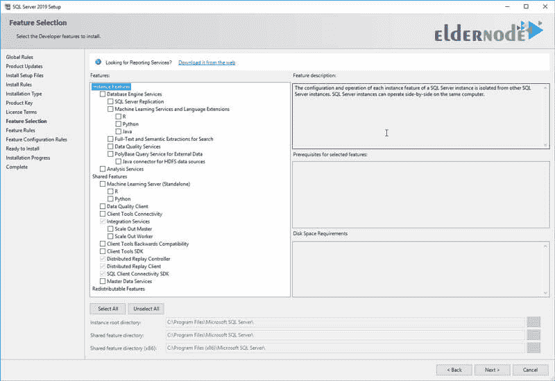

# 介绍各种 SQL Server 服务- ElderNode 博客

> 原文：<https://blog.eldernode.com/sql-server-services/>

介绍各种 [SQL Server](https://www.microsoft.com/en-us/sql-server/sql-server-downloads) 服务。如今，大多数企业都需要像 SQL Server 这样的软件来存储数据和信息。所以可以说，学习如何使用这种软件将会给你带来一个良好的职业前景。

在本文中，我们将介绍最重要的 Sql server 服务，并解释它们之间的差异。

[**在 Eldernode**](https://eldernode.com/windows-vps/) 选择您的完美 Windows 虚拟专用服务器包

### 1- 引擎或主 SQL Server 服务

这个服务是 **SQL Server** 最重要的服务或特性，甚至其他服务都依赖于它。

该服务处理数据处理的核心(任务如添加、编辑、删除、更新、优化)。

### 2- 代理服务

代理是另一个 SQL Server 服务，负责执行作业、提醒和发送邮件。

**作业**也是自动执行**备份**和**重建索引**等操作的 SQL Server 对象之一。在不同的时间间隔。

例如，您定义了一个每天晚上 11 点自动进行完整备份的作业。该服务是实例特征服务的一部分。这意味着对于每个实例，将在您的计算机上安装一个 SQL Server 代理服务。

### 3- 浏览服务

另一个 SQL Server 服务是 SQL Server 浏览器服务。

此服务允许您找出 SQL Server 安装在哪些计算机上。该服务是共享功能服务之一。这意味着**对于所有实例**，一个 SQL Server 浏览器服务将被安装在您的机器上。

### 4- 全文搜索服务

SQL 全文搜索服务是另一项 SQL Server 服务，它允许您在 SQL Server 中基于关键字对文本数据进行索引和**搜索。**

该服务是实例的部分，每个实例安装一次服务。

**注意:** 全文索引用于存储单词及其在一列中的位置。

### 5-SSIS

SSIS 是共享服务之一，也是 T2 领域最强大的工具。

SQL Server Integration Services是用于执行 ETL 操作的工具，如提取、转换、加载数据。

**注:** ETL 代表提取转换和加载。

在 **ETL 过程**中，数据从组织内部或外部所需的信息源中提取，如数据库、文本文件、遗留系统和电子表格，并转换成与特定格式兼容的信息。

然后它们被存储在一个仓库，通常是一个数据仓库。

### 6-SSAS

另一个 SQL Server 服务是 SQL Server Analysis Services。

SQL Server 包括一个非常强大的引擎，用于构建多维数据结构，允许您排序、聚集，以及分析 数据。

此服务是实例功能服务的一部分，每个实例安装一次。

### 【7】-(SSRS)

另一个 SQL Server 服务是 SQL Server Reporting Services。

这项服务**允许**组织和公司的用户和经理设计报告并创建非常准确的报告和非常复杂的管理仪表板。

**注意** 在 SQL Server 2017 及以后的版本中，这个服务会单独安装。

**重要说明:** 如下图安装 SQL Server 时，可以根据需要安装所需的服务。不幸的是，一些用户点击全选按钮来选择所需的服务并安装所有的服务。由于这些服务会降低系统的性能，换句话说，会给服务器增加额外的负载，所以请根据您的需求选择和安装它们。当然，一些用户安装了所有的服务，但最终，他们只激活了他们真正需要的服务，而禁用了其余的服务。

在上图中，如果您只是在您的机器或计算机上选择数据库服务引擎选项，三个名为 SQL Server 服务、 SQL Server 代理服务和 SQL Server 浏览器服务的服务将被激活。

### 如何在计算机上查看 SQL Server 服务

有两种方法可以查看 SQL Server 服务:

**1-** 进入服务环境。

为此，首先**进入**的运行窗口，然后进入 Services.msc 命令并点击 OK 按钮。在这种情况下，您将进入服务环境。

请注意，所有 SQL Server 服务都以单词 SQL 开头。

应该注意的是，您在计算机上安装的每个 SQL Server 都称为一个实例。你甚至可以根据需要在一台机器上安装**五十个 SQL** **服务器**。

例如，在你的机器上安装 SQL Server 20014 作为特定任务的实例。然后在同一台机器上安装 SQL Server 2016 作为另一个实例执行另一个任务。然后在同一台机器上再安装一个 SQL Server 2016 。你可以重复这个动作 50 次。

到目前为止，我们已经在**一台机器**上安装了三个实例，即一个 SQL Server 2014 和两个 SQL Server 2016。

**2-** 使用 SQL Server 配置管理器窗口，您只能看到 SQL Server 服务。在 Services.msc 窗口中，您会看到 **Windows 服务**和 **SQL Server 服务**。

要查看 SQL Server 服务，只需在**运行窗口**中输入SQL Server manager 15 . MSC**命令**并点击 OK 按钮。

如果你的机器上安装了 SQL Server 2016 ，那么你需要输入**命令**SQL Server manager 13 . MSC。换句话说，该数字可以追溯到您的 SQL Server 版本。

在这种情况下，将出现如下所示的窗口:

*

### 什么是默认实例和命名实例？

您在机器上安装的第一个 SQL Server 软件被称为默认实例。之后，您安装在设备上的其余实例将被称为，命名为实例。

如何区分默认实例和命名实例是，在服务窗口中，如果在 SQLSERVER 服务前面和括号中写有 MSSQLSERVER 字样，则该服务将呈现为默认实例。

如果 SQL Server 服务前面和括号中有另一个名称，那么该服务将作为命名的实例安装在该机器上。

### 如何连接默认实例和命名实例

当你想运行 SQL Server 时，在你**进入**运行窗口**中的 SSMS 命令**后，点击 OK ，**SQL Server Management Studio**将运行。然后出现“连接到服务器”窗口。

打开连接服务器窗口，连接到**默认实例**。在服务器名称字段中，输入该机器的名称或点字符，并点击连接按钮。

要连接到**命名实例**，只需输入该机器的名称或该机器的 IP ，然后输入字符( \ )，最后输入命名实例的名称，如下所示:

要了解机器上是否安装了 SQL Server ，拥有 **Management Studio** 程序并不足以在系统上提供 SQL Server 服务。

确保机器、计算机或系统上存在 SQL Server 的正确方法是从服务窗口**检查**。

在以下窗口中，检查是否安装了 SQL Server 服务:

**注意:** 在运行 SQL Server 之前，确保主 SQL Server 服务是启动。

如下图所示，主 SQL Server 服务已经被停止。

只需在**上右击**，选择开始。

**亦作，见:**

[教程在 Windows Server 上安装 SQL Server 2019 开发者版](https://eldernode.com/install-sql-server-developer-edition-on-windows-server/)

[如何用命令行迁移 SQL 数据库](https://eldernode.com/migrate-sql-databases/)

**尊敬的用户**，我们希望您能喜欢这个[教程](https://eldernode.com/category/tutorial/)，您可以在评论区提出关于本次培训的问题，或者想解决[老年人节点培训](https://eldernode.com/blog/)领域的其他问题，请参考[提问页面](https://eldernode.com/ask)部分，并尽快提出您的问题。腾出时间给其他用户和专家来回答你的问题。

好运。