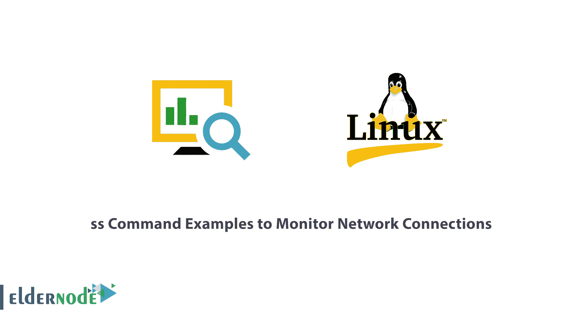

# 监控网络连接的 ss 命令示例- Eldernode

> 原文：<https://blog.eldernode.com/ss-command-monitor-network-connections/>



【更新】一个 Linux 系统管理员需要知道一些 Linux 命令。ss 命令是一个用于在 Linux 系统上显示网络套接字相关信息的工具。该工具显示比用于显示活动套接字连接的 netstat 命令更详细的信息。在本文中，您将学习 **ss 命令示例来监控网络连接**。如果你准备购买自己的 [Linux VPS](https://eldernode.com/linux-vps/) ，那么 [Eldernode](https://eldernode.com/) 的可用套装有经济型和 VIP。

## 教程监控网络连接的 ss 命令示例

加入我们这篇文章，看看如何使用 ss 命令在 [Linux](https://blog.eldernode.com/tag/linux/) 中显示各种套接字连接信息。在接下来的教程中，你将学习 12 个 ss 命令的例子。如果你是一个新用户，看看我们关于 [10 个对新手有用的 Linux 命令行技巧](https://blog.eldernode.com/linux-command-tricks-newbies/)的文章。

**注意**:如果您需要限制普通用户以 **root** 帐号登录和重新登录，您可以为我们的普通帐号设置超级用户或 root 权限。因此，普通用户应该在命令前加上 sudo 这个词，以管理权限运行命令。

### **如何列出所有连接(ss 命令示例)**

要列出所有连接，而不管它们处于何种状态，请使用不带任何选项的基本 ss 命令。

```
ss 
```

### **如何列出监听和非监听端口**

您可以使用使用**-一个** 选项来检索监听和非监听端口的列表。

```
ss -a
```

### **如何列出监听套接字**

要仅显示监听套接字，请使用 **-l** 标志。

```
ss -l 
```

### **如何列出所有 TCP 连接**

要显示所有 TCP 连接，使用 **-t** 选项。

```
ss -t 
```

### **如何列出所有监听的 TCP 连接**

使用 **-lt** 组合查看所有监听的 TCP 套接字连接。

```
ss -lt 
```

### **列出所有 UDP 连接**

使用 **-ua** 选项查看所有 UDP 套接字连接。

```
ss -ua 
```

### **如何列出所有监听的 UDP 连接**

要列出监听的 UDP 连接，使用 **-lu** 选项。

```
ss -lu 
```

### **如何显示套接字的 PID(进程 id)**

要显示与套接字连接相关的进程 id，请使用 **-p** 标志。

```
ss -p 
```

### **如何显示汇总统计数据**

要列出汇总统计数据，使用 **-s** 选项。

```
ss -s 
```

### **如何显示 IPv4 和 IPv6 的套接字连接**

如果你对 IPv4 套接字连接感到好奇，使用 **-4** 选项。

```
ss -4 
```

要显示 IPv6 连接，使用 **-6** 选项。

```
ss -6 
```

### **如何通过端口号过滤连接**

要过滤套接字端口号或地址号，也可以使用 ss 命令。例如，要显示 ssh 的目标或源端口的所有套接字连接，请运行命令。

```
ss -at '( dport = :22 or sport = :22 )' 
```

或者，您可以运行命令。

```
ss -at '( dport = :ssh or sport = :ssh )'
```

### **如何查看 ss 命令手册页**

要更深入地了解 ss 命令的用法，请使用下面的命令查看手册页。

```
man ss
```

## 结论

在这篇文章中 、 你复习了 12 个 ss 命令的例子。这些是 ss 命令的一些常用选项。该命令被认为比 netstat 命令更高级，它提供了有关网络连接的详细信息。在 [A 到 Z Linux 命令概述和示例](https://blog.eldernode.com/linux-commands-with-examples/)中找到一篇相关文章来了解 Linux 命令。