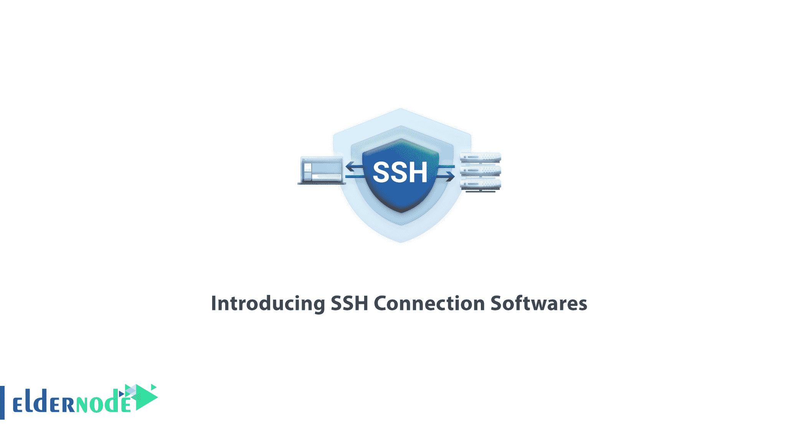
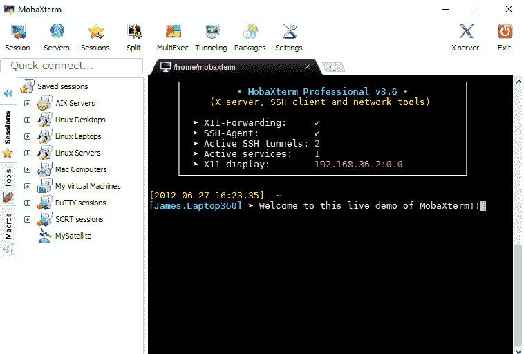
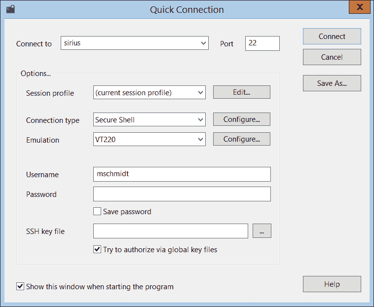
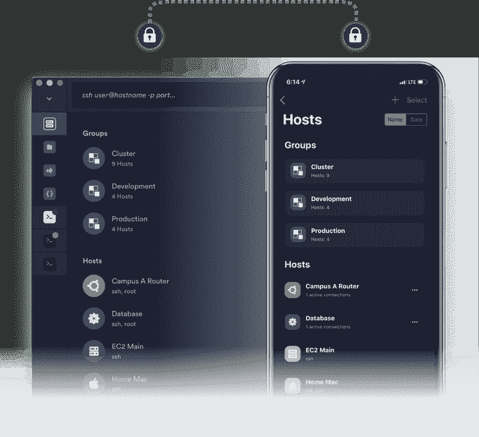

# SSH 连接软件简介- SSH 软件| Eldernode 博客

> 原文：<https://blog.eldernode.com/ssh-connection-softwares/>

【更新日期:2021-01-15】SSH 代表 **S** ecure **Shell。**它是客户端和服务器之间进行通信的安全协议。SSH 在将它们发送给用户之前对它们进行加密(无需用户干预),然后将它们发送给客户机。管理基于 [Linux](https://blog.eldernode.com/tag/linux/) 的服务器通常是通过 SSH 完成的，使用 Windows 的用户应该使用这些工具。ssh 使用的软件多种多样，在本文中，我们将**介绍适合 ssh 连接的 SSH 连接软件**。不要错过折扣，购买您自己的 [RDP 管理](https://eldernode.com/buy-rdp/)或 [Linux VPS](https://eldernode.com/linux-vps/) 。

## **最好的 SSH 连接软件**

要安全地建立和认证到 SSH 服务器的 SSH 连接，您只需要 SSH 客户机程序。您甚至可以使用多个 SSH 客户端。然而，和我们一起看看这个指南，看看哪一个更符合你的需求。

### **介绍油灰软件**

最流行和容易的是 SSH 软件。它支持几种常见的协议，包括 SCP、SSH、telnet 和 rlogin。

**下载 putty**

你应该从这个[地址](https://www.putty.org/)得到这个软件。

### **介绍 MobaXterm 服务器登录软件**

MobaXterm 是一个功能强大的软件应用程序，使用它的功能，程序员、web 设计人员、管理员和所有需要在网络上进行远程操作的用户可以监控和管理访问网络的系统。允许应用程序连接，并使管理人员能够在多台设备上同时执行多项任务。

比如复制粘贴文件，执行脚本等。远程的。它还允许您执行 Unix 命令、查看数字图像、发送文本或代码、通过操作系统的命令行脚本创建文件或目录，以及执行您在命令行环境中编写的任何命令。

**下载 MobaXterm 软件**

从这个[地址](https://mobaxterm.mobatek.net/download.html)获取这个软件。

### 介绍 ZOC 软件

ZOC 是一个专业的远程登录或安全壳(SSH)服务器和终端模拟器。有了这个软件，你可以通过 SSH 或隧道远程连接到 Linux 和 UNIX。

**下载 ZOC**

从[emtec.com](https://www.emtec.com/download.html)下载 ZOC。

### 介绍白蚁

您也可以使用 Mobile 通过 SSH 连接到服务器。允许你这样做的软件之一是 Termius，它提供了与 ios 和 Android 兼容的版本。

您也可以使用其他软件，如 juicessh、Mobile ssh，将 SSH 连接到移动设备。

## 结论

在本文中，您了解了 SSH 连接软件的介绍。根据你的需要，你可以选择以上任何一种客户端，因为它们各有优缺点。使用 SSH 客户端可以让您体验安全登录和文件传输。如果你愿意，可以阅读更多我们的相关文章。