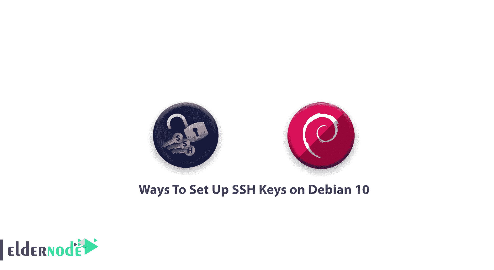

# 在 Debian 10 - Eldernode 上设置 SSH 密钥的方法

> 原文：<https://blog.eldernode.com/ssh-keys-debian-10/>



SSH 或安全外壳是一种加密协议，用于管理[服务器](https://eldernode.com/linux-vps/)并与之通信。当你在 Debian 10 的服务器上学习使用 SSH 时，你会发现你所有的时间都花在了通过 SSH 连接到你的服务器的终端会话上。由于我们上一篇关于 [SSH 教程](https://eldernode.com/tutorial-connect-to-ssh-on-linux/)，的文章，你可能已经熟悉了这个主题。

## 在 Debian 10 上设置 SSH 密钥的方法

让我们通过本指南的步骤向您展示在 Debian 10 上设置 SSH 密钥是多么简单和安全。并使用 [SSH 密钥](https://eldernode.com/configure-ssh-authentication-linux/)登录您的服务器。除了这些功能，建议所有用户都使用。

### 第一步:如何创建 RSA 密钥对

首先，让我们在客户机上创建一个密钥对。

```
ssh-keygen
```

输出

```
Generating public/private rsa key pair.  Enter file in which to save the key (/your_home/.ssh/id_rsa):
```

**注 1**:ssh-keygen的例程效果是创建一个 2048 位的 RSA 密钥对。有了这个，你可以确保安全。此外，考虑到您可以选择传入 -b 4096 标志来创建一个更大的 4096 位密钥。

**注 2** :不要忘记在命令提示行中替换您考虑的姓名或电子邮件。

现在，您需要将密钥对保存到中。ssh/ 子目录或者指定一个替代路径。为此，请按 enter 键。

您可能已经生成了一个 [SSH 密钥](https://eldernode.com/ssh-connection-softwares/)对。如果是，您将看到以下提示:

输出

```
/home/your_home/.ssh/id_rsa already exists.  Overwrite (y/n)?
```

**非常重要** :此时请注意，如果选择**是**，将无法反转。所以，当你确定的时候，选择覆盖磁盘上的密钥。因为在此之后，您就不能再使用之前的密钥进行身份验证了。

然后，您将看到如下所示的输出。

输出

```
Enter passphrase (empty for no passphrase):
```

现在，您可以输入一个安全的密码(可选)。这样，您会看到 passphrase 增加了一个额外的安全层，以防止未经授权的用户登录。如果您有兴趣了解更多关于安全性的知识，请阅读我们的指南[教程在 Linux 服务器上配置 SSH 基于密钥的认证](https://eldernode.com/configure-ssh-authentication-linux/)。

然后，您将看到下面的输出:

输出

```
Your identification has been saved in /your_home/.ssh/id_rsa.  Your public key has been saved in /your_home/.ssh/id_rsa.pub.  The key fingerprint is:  a9:49:2e:2a:5e:33:3e:a9:de:4e:77:11:58:b6:90:26 [[email protected]](/cdn-cgi/l/email-protection)_host  The key's randomart image is:  +--[ RSA 2048]----+  |     ..o         |  |   E o= .        |  |    o. o         |  |        ..       |  |      ..S        |  |     o o.        |  |   =o.+.         |  |. =++..          |  |o=++.            |  +-----------------+
```

因此，您有一个可以用来进行身份验证的公钥和私钥。现在，尝试将公钥放在您的服务器上，以便您可以使用基于 SSH 密钥的身份验证来登录。

### `第二步:如何将公钥复制到 Debian 服务器`

`让我们看看将您的公钥复制到 Debian 主机的最快方法是什么。您可以使用一个名为 ssh-copy-id 的实用程序。这里有一个简单的方法，非常值得推荐。如果您的客户机上没有可用的 ssh-copy-id 。在下文中，您将看到本节中提供的两种替代方法。`

### `如何使用 ssh-copy-id 复制公钥`

`您的本地系统上可能有 ssh-copy-id 工具，因为它在许多操作系统中默认可用。要让这种方法起作用，基于密码的 SSH 应该是可访问的。`

`使用该实用程序的最佳方式是指定您选择连接的远程主机以及您拥有 SSH 访问密码的用户帐户。正如您所猜测的，这是您的公共 SSH 密钥将被复制到的帐户。`

`以下是考虑过的命令:`

```
`ssh-copy-id [[email protected]](/cdn-cgi/l/email-protection)_host`
```

`输出`

```
`The authenticity of host '203.0.113.1 (203.0.113.1)' can't be established.  ECDSA key fingerprint is fd:fd:d4:f9:77:fe:73:84:e1:55:00:ad:d6:6d:22:fe.  Are you sure you want to continue connecting (yes/no)? yes`
```

`上面的输出告诉您，您的本地计算机无法识别远程主机。因为这是您第一次连接到新主机。像往常一样，键入 yes”并按 ENTER 键继续。`

`之后，该实用程序将扫描您的本地帐户，查找您之前创建的 id_rsa.pub 密钥。当它找到密钥时，您将提示输入远程用户帐户的密码。`

`输出`

```
`/usr/bin/ssh-copy-id: INFO: attempting to log in with the new key(s), to filter out any that are already installed  /usr/bin/ssh-copy-id: INFO: 1 key(s) remain to be installed -- if you are prompted now it is to install the new keys  [[email protected]](/cdn-cgi/l/email-protection)'s password:`
```

`现在，输入密码并按下键进入。因此，使用您提供的密码，该工具将连接到远程主机上的帐户。之后，它会复制你的的内容。ssh/id_rsa.pub key 到远程账号的 home ~/中的一个文件中。ssh 目录调用 authorized_keys 。`

`现在，您会看到如下所示的输出:`

`输出`

```
`Number of key(s) added: 1    Now try logging into the machine, with:   "ssh '[[email protected]](/cdn-cgi/l/email-protection)'"  and check to make sure that only the key(s) you wanted were added.`
```

`现在，您可以确保您的 id_rsa.pub 密钥已经上传到远程帐户。`

### `如何使用 SSH 复制公钥`

`在没有可用的 ssh-copy-id 的情况下，您可以使用传统的 ssh 方法上传您的密钥，但是您可以通过基于密码的 SSH 访问您服务器上的帐户。`

`使用 cat 命令，您可以做到这一点，让它读取本地计算机上的公共 SSH 密钥的内容，并通过 SSH 连接将其传输到远程服务器。`

`此外，您可以确保存在 ~/。ssh 目录，并在您使用的帐户下拥有正确的权限。`

`因此，您可以将我们通过管道传输的内容输出到这个目录中一个名为 authorized_keys 的文件中。您可以使用 > > 重定向符号追加内容，而不是覆盖内容。这样，您可以添加密钥，而不会破坏以前添加的密钥。`

`完整的命令如下所示:`

```
`cat ~/.ssh/id_rsa.pub | ssh username@remote_host "mkdir -p ~/.ssh && touch ~/.ssh/authorized_keys && chmod -R go= ~/.ssh && cat >> ~/.ssh/authorized_keys"`
```

`输出`

```
`The authenticity of host '203.0.113.1 (203.0.113.1)' can't be established.  ECDSA key fingerprint is fd:fd:d4:f9:77:fe:73:84:e1:55:00:ad:d6:6d:22:fe.  Are you sure you want to continue connecting (yes/no)? yes`
```

`通过接收此输出，您可以看到您的本地计算机无法识别远程主机。像往常一样，键入“yes”并按下键，输入继续。`

`在下面，将提示您输入远程用户帐户密码:`

`输出`

```
`[[email protected]](/cdn-cgi/l/email-protection)'s password:`
```

`一旦您输入密码，您的 id_rsa.pub 密钥的内容将被复制到远程用户账户的 authorized_keys 文件的末尾。`

### `如何手动复制公钥`

`如果您无法使用基于密码的 SSH 访问服务器，请尝试手动完成上述过程。`

`将您的 id_rsa.pub 文件的内容附加到 ~/中。远程机器上的 ssh/authorized_keys 文件将手动完成。`

`现在，在您的本地计算机中键入以下命令来显示您的 id_rsa.pub 密钥的内容。`

```
`cat ~/.ssh/id_rsa.pub`
```

`输出`

```
`ssh-rsa AAAAB3NzaC1yc2EAAAADAQABAAACAQCqql6MzstZYh1TmWWv11q5O3pISj2ZFl9HgH1JLknLLx44+tXfJ7mIrKNxOOwxIxvcBF8PXSYvobFYEZjGIVCEAjrUzLiIxbyCoxVyle7Q+bqgZ8SeeM8wzytsY+dVGcBxF6N4JS+zVk5eMcV385gG3Y6ON3EG112n6d+SMXY0OEBIcO6x+PnUSGHrSgpBgX7Ks1r7xqFa7heJLLt2wWwkARptX7udSq05paBhcpB0pHtA1Rfz3K2B+ZVIpSDfki9UVKzT8JUmwW6NNzSgxUfQHGwnW7kj4jp4AT0VZk3ADw497M2G/12N0PPB5CnhHf7ovgy6nL1ikrygTKRFmNZISvAcywB9GVqNAVE+ZHDSCuURNsAInVzgYo9xgJDW8wUw2o8U77+xiFxgI5QSZX3Iq7YLMgeksaO4rBJEa54k8m5wEiEE1nUhLuJ0X/vh2xPff6SQ1BL/zkOhvJCACK6Vb15mDOeCSq54Cr7kvS46itMosi/uS66+PujOO+xt/2FWYepz6ZlN70bRly57Q06J+ZJoc9FfBCbCyYH7U/ASsmY095ywPsBo1XQ9PqhnN1/YOorJ068foQDNVpm146mUpILVxmq41Cj55YKHEazXGsdBIbXWhcrRf4G2fJLRcGUr9q8/lERo9oxRm5JFX6TCmj6kmiFqv+Ow9gI0x8GvaQ== [[email protected]](/cdn-cgi/l/email-protection)`
```

`尝试访问您的远程主机，然后确保存在 ~/。ssh 目录。使用以下命令将在必要时创建目录，如果目录已经存在，则不执行任何操作。`

```
`mkdir -p ~/.ssh`
```

`是时候修改这个目录中的 authorized_keys 文件了。此外，您可以将您的 id_rsa.pub 文件的内容添加到 authorized_keys 文件的末尾。`

```
`echo public_key_string >> ~/.ssh/authorized_keys`
```

`在上面的命令中，用来自 cat ~/的输出替换 public_key_string 。您在本地系统上执行的 ssh/id_rsa.pub 命令。应该从 ssh-rsa AAAA 开始…`

`最后，键入下面的命令来确保 ~/。ssh 目录和 authorized_keys 文件有适当的权限设置:`

```
`chmod -R go= ~/.ssh`
```

`使用此命令会导致移除 ~/的所有“群组”和“其他”权限。ssh/ 目录。`

`请注意，如果您使用 root 帐户为用户帐户设置密钥，那么 ~/也很重要。ssh 目录属于用户，不属于根目录:`

```
`chown -R noodi:noodi ~/.ssh`
```

`正如您所猜测的，我们在本指南中的用户名为 noodi ，但是您应该将适当的用户名替换到上面的命令中。`

`此时，您可以尝试用您的 Debian 服务器进行无密码认证。如果您需要验证 CentOS 8 的情况，请查看我们的文章[教程在 CentOS 8 上设置 SSH 键](https://blog.eldernode.com/set-up-ssh-keys-on-centos-8/)`

### `步骤 3:如何使用 SSH 密钥认证 Debian 服务器`

`如果最近的所有步骤都已成功完成，您应该能够在没有远程帐户密码的情况下登录到远程主机。`

```
`ssh [[email protected]](/cdn-cgi/l/email-protection)_host`
```

`输出`

```
`The authenticity of host '203.0.113.1 (203.0.113.1)' can't be established.  ECDSA key fingerprint is fd:fd:d4:f9:77:fe:73:84:e1:55:00:ad:d6:6d:22:fe.  Are you sure you want to continue connecting (yes/no)? yes`
```

`**点**:当你第一次连接这台主机时，你看到上面的输出。`

`此外，它还告诉您，您的本地计算机无法识别远程主机。键入“yes”然后按回车继续。`

`因此，如果您没有提供私钥的密码，您将立即登录。然后，如果您在创建密钥时提供了私钥的密码，系统会提示您现在输入密码。毕竟，当验证完成时，您将会看到一个新的 shell 会话将会为您打开，并在 Debian 服务器上配置好帐户。`

`如果基于密钥的身份验证成功，您可以继续学习如何通过禁用密码身份验证来进一步保护您的系统。`

### `步骤 4:如何在您的服务器上禁用密码验证`

`在这一步中，您可以使用 SSH 登录到您的帐户，而不需要密码，只要您已经成功地为您的帐户配置了基于 SSH 密钥的身份验证。但是请注意，尽管您的基于密码的身份验证机制仍然有效，但是您的服务器仍然面临暴力攻击。`

`检查您是否为该服务器上的 root 帐户配置了基于 SSH 密钥的身份验证，或者最好为该服务器上具有 sudo 权限的非 root 帐户配置了基于 SSH 密钥的身份验证。`

`从现在开始，您将看到它将如何锁定基于密码的登录，因此确保您仍然能够获得管理访问是至关重要的。`

`当您确认您的远程帐户具有管理权限时，使用 SSH 密钥登录到您的远程服务器。它既可以作为根用户，也可以使用拥有 sudo 权限的帐户。然后，打开 SSH 守护程序的配置文件:`

```
`sudo nano /etc/ssh/sshd_config`
```

`在文件内部，搜索名为 PasswordAuthentication 的指令。这可能会被注释掉。取消对该行的注释，并将值设置为“no”。这将禁止您使用帐户密码通过 SSH 登录:`

`/etc/ssh/sshd_config`

```
`...  PasswordAuthentication no  ...`
```

`现在，您可以在完成后保存并关闭文件。你可以通过按 CTRL + X ，然后按 Y 确认保存文件，最后回车退出 nano。`

`要重新启动 sshd 服务并实现这些更改:`

```
`sudo systemctl restart ssh`
```

`为了更多地考虑安全性，请打开一个新的终端窗口，并在关闭该会话之前测试 SSH 服务是否正常工作:`

```
`ssh [[email protected]](/cdn-cgi/l/email-protection)_host`
```

`接下来，当您验证了您的 SSH 服务后，您可以关闭所有当前的服务器会话。请注意，Debian 服务器上的 SSH 守护进程现在只响应 SSH 密钥。已成功禁用基于密码的身份验证。`

## ``结论``

``您已经通过了本指南的四个步骤，并学习了如何在 Debian 10 上设置 SSH 密钥。您可能也有兴趣获得关于其他服务器上 SSH 的更多信息。我们推荐你看一下[如何在 Ubuntu 20.04](https://blog.eldernode.com/set-up-ssh-keys-ubuntu-20/) 上设置 SSH 密钥。但是，从现在开始，您已经在服务器上配置了基于 SSH 密钥的身份验证，允许您在不提供帐户密码的情况下登录。``