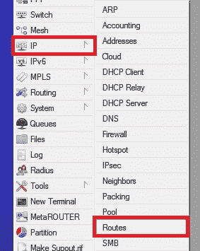
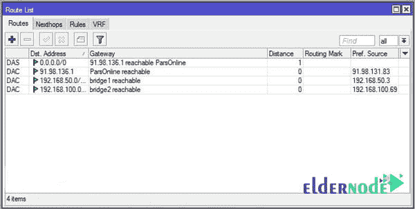
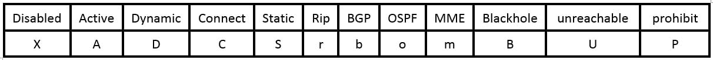
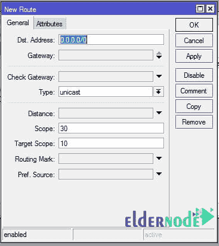
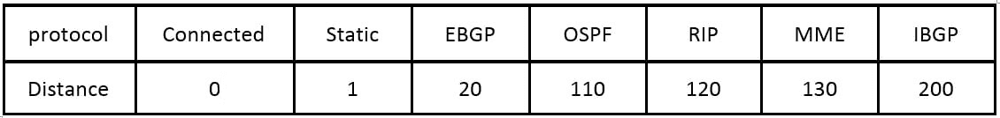

# 微数学中的静态路径|老年博客

> 原文：<https://blog.eldernode.com/static-route-in-mikrotik/>

[MikroTik](http://eldernode.com/mikrotik-vps-server/) 中的静态路由；

在 [MikroTik 培训](https://blog.eldernode.com/tag/mikrotik/)的这一部分，我们将重点介绍最重要的 MikroTik 配置之一。尽管有各种各样的动态路由协议，但在小型网络中使用静态路由器仍然更快、更容易、更高效。

### **静态路由:**

顾名思义，主要任务是路由，其余的功能其实都是厂商提供的额外服务。由于 MikroTik 是一款多功能路由器，所以路由部分也非常完整。

在 MikroTik 培训的这一部分，我们将只关注 MikroTik 路由器的配置。

路由分为静态和动态两部分。MikroTik 路由器支持所有标准路由协议，但没有专有协议(如思科路由器上的 **EIGRP 协议**)。

通过向每个 MikroTik 路由器接口添加一个 IP，向路由表添加一个路由行，该路由旁边显示有 **DAC** 标记。这条路线也被称为**接**路线。

要将**静态路由**添加到 MikroTik，首先从左侧菜单中选择 **IP** ，然后选择**路由**。您实际上看到了路由器的路由表。

您在 MikroTik 路由表中看到的快捷方式如下。

上述 DAC 术语表示自动创建的活动路由，并且是**连接的**类型。

Recommended Article: [MikroTik Firewall](https://blog.eldernode.com/mikrotik-firewall/)

MikroTik 中的静态路由

##### 点击**添加**按钮，添加新路线。然后，您将看到一个如下所示的窗口:

添加一条路线至少需要**目的地址**和**出口**两项。

目的地址实际上是目的网络地址。

送出端口可以是 IP 地址或接口。

在 MikroTik 中，IP 地址 **0.0.0.0** 表示所有 IP。到达目的地 0.0.0.0 的路由称为**默认路由**。如果您的路由表中有默认路由，**路由查找表**将永远不会遇到非目的地数据包。

MikroTik 检查一些项目，以确定数据包的正确路径。其中一项是**距离**。MikroTik 路由器的默认距离如下。

如果一个数据包有两条或多条路由，则距离较短的路由优先。(这些是默认距离值，用户可以更改它们)最后一个优先级是默认路线。

MikroTik 服务器中的静态路由；

祝您好运

Goodluck.