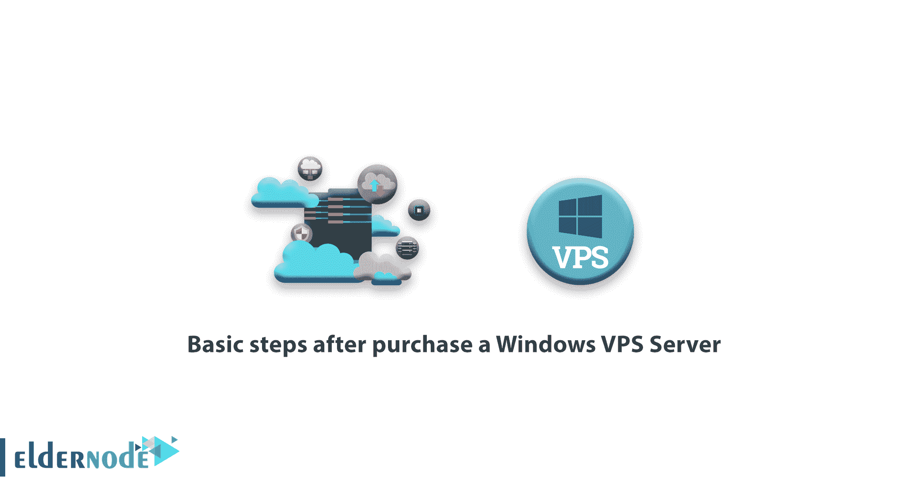
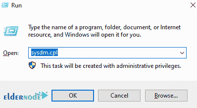
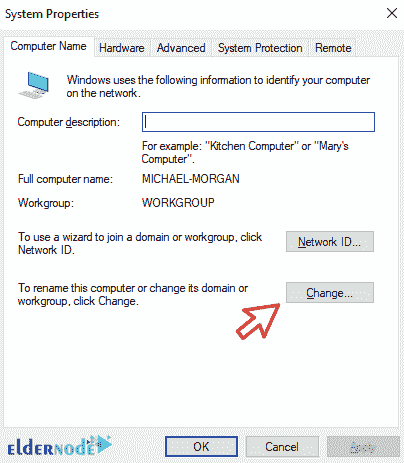
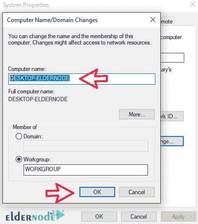
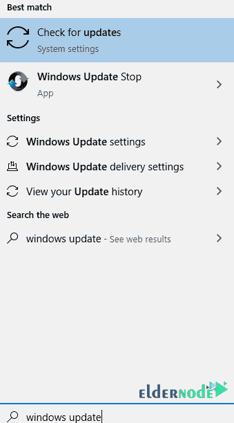
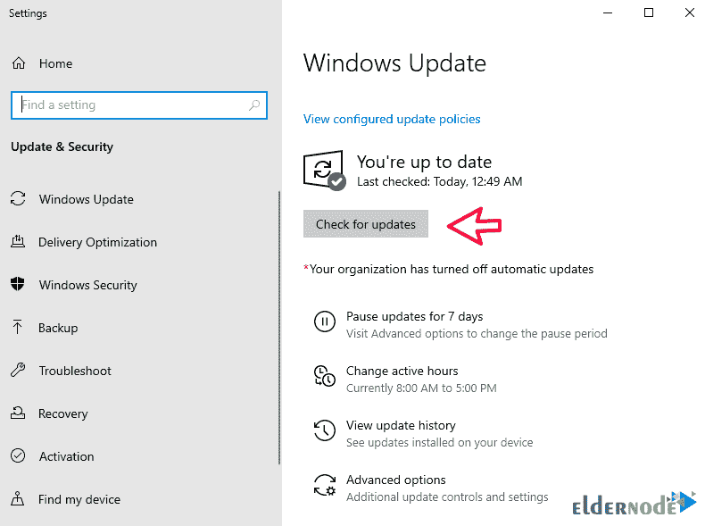

# 购买 Windows VPS 服务器后的基本步骤- Eldernode 博客

> 原文：<https://blog.eldernode.com/steps-after-purchase-windows-vps/>

今天，Windows VPS Server 是 Eldernode 在其安全平台和全球专用服务器上提供的最受欢迎的现代服务之一。在本文中，我们试着谈谈购买 Windows VPS 服务器后的**基本步骤。你可以访问 [Eldernode](https://eldernode.com/) 中提供的包来购买 [Windows VPS](https://eldernode.com/windows-vps/) 服务器。在购买和接受这项服务后，它需要一些用户必须完成的基本设置。请继续关注我们的这篇文章。**

## **4 接收 Windows VPS 服务器后的基本步骤**

1.重命名系统

2.[更改密码](https://blog.eldernode.com/change-windows-password-on-vps/)

3.完成操作系统更新

4.激活操作系统

如上所述，这四个步骤是选择 Windows VPS 服务器时要注意的一些事项。

### **重命名系统内的 Windows VPS 服务器**

安装后，Windows 已经为系统随机分配了一个名称，该名称将在安装所有服务(如 IIS、DNS 等)时使用。因此，您需要重命名您的系统，以使服务正常运行。

要在[窗口](https://blog.eldernode.com/tag/windows/)中更改系统名称，必须执行以下步骤:

1.按下 **Winkey + R** ，在**运行**窗口框中输入 **sysdm.cpl** ，点击**确定**。

2.在下图中，点击**改变**。

3.输入电脑的新名称，点击**确定**。

应用上述步骤后，系统必须重新启动一次，以便为您的计算机获得一个新名称。

***注意* :** 建议您在安装和配置角色和功能之前，对电脑进行重命名。

### **更改 Windows VPS 服务器密码**

密码更改当然是需要首先完成的最重要的操作之一。这个操作可以用不同的方式来完成，你可以根据自己的意愿用任何不同的方式来改变它。在以前的文章中，您学习了如何[更改您可以引用的 Windows VPS 服务器的密码](https://blog.eldernode.com/changing-windows-vps-server-password/)。

### **完成 Windows VPS 服务器更新**

今天，尽管操作系统面临许多安全威胁，供应商们仍在寻求维护他们操作系统的安全性。为此，他们不断提供安全更新。随着每个安全漏洞的发现，[微软](https://www.microsoft.com/en-us/)迅速发布了新的更新以防止其系统出现问题。

除了提供安全包之外，微软还提供更新以提高其操作系统的性能，这些更新修复并改善系统在服务交付方面的问题。所以最好在收到你的 [VPS 服务器](https://eldernode.com/vps/)之后，开始接收服务之前，完全更新。

#### **Windows VPS 服务器更新步骤**

1.点击**开始**栏，搜索 **Windows Update** 并打开。

2.打开 Windows 更新页面后，点击**检查更新** 。

等待 Windows 搜索新的更新并下载和安装它们。

完成 Windows 更新后，**重新启动**以便完全安装更新。

***注意** :* 根据更新的大小，系统重启需要 10 到 15 分钟。

### **启用 Windows VPS 服务器**

完成前三个步骤后，您必须激活您的 Windows。开始激活 Windows 对你来说可能不是问题，但在完成试用期后，你会遇到几条消息，过一会儿，服务就会失败。因此，我们建议您在收到服务后激活它。这将完成 Windows VPS 服务器的初始设置，您将能够使用它。

## 结论

Windows VPS Server 是一个虚拟服务器，具有强大的 Microsoft Windows Server 操作系统。在这个虚拟服务器中，您可以完全访问任何项目。这样，用比专用服务器更少的钱，您将拥有一台具有强大虚拟化和硬件资源的服务器。在本文中，我们试图教你购买 Windows VPS 服务器后的 5 个基本步骤。