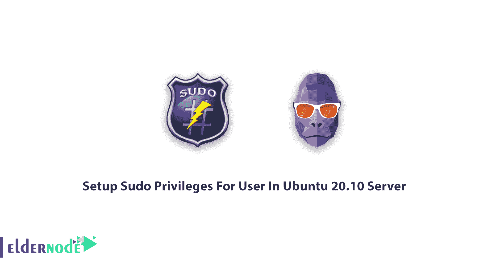

# 教程在 Ubuntu 20.10 server | Eldernode 中为用户设置 Sudo 权限

> 原文：<https://blog.eldernode.com/sudo-privileges-for-user-in-ubuntu-20-10/>



教程**在 Ubuntu 20.10 服务器**中为用户设置 Sudo 权限。根据标准定义，sudo 是一个用于类 Unix 计算机操作系统的程序，它允许用户以另一个用户的[安全](https://blog.eldernode.com/tag/security/)权限运行程序。购买一个 [Linux VPS](https://eldernode.com/linux-vps/) 来体验一下这个指南。

## 教程在 Ubuntu 20.10 服务器中为用户设置 Sudo 权限

作为管理员，您需要在 Linux 中运行您的应用程序。你可以选择两种方法来做这件事。首先，切换到超级用户，也称为 root，如果您使用这个解决方案，将使用 su 命令。第二种方式是利用须藤的**优势。由于您使用什么发行版，您应该决定哪种方式更适合。例如，如果您使用 Fedora、Red Hat 或 openSuSE，它们会启用 root 用户，但其他如 Ubuntu 和 Debian 则不会。然而，sudo 对许多 [Linux](https://blog.eldernode.com/tag/linux/) 发行版很重要，因为它允许一个用户以另一个用户的身份运行程序。有时这并不取决于你目前使用的发行版，总有一天你会不得不利用 sudo。**

## 如何在 Ubuntu 20.10 服务器上为用户设置 Sudo 权限

### 须藤和苏的区别

如果您习惯于使用传统的 Linux 设置，您可以使用 **su** 命令获得 root 权限，以 root 身份登录。但是**建议**不要以 root 用户身份登录。每次使用依赖于 su 并允许根用户登录的发行版时，以标准用户身份登录，并以 su 身份登录到根用户。但是在**基于 sudo 的**发行版中，你**不能**作为根用户登录。在一些像 [Ubuntu](https://eldernode.com/ubuntu-vps/) 这样的发行版中，根用户帐户被“禁用”，你会看到标准用户帐户被**限制**执行敏感任务，比如查看**/根**目录的内容。因此，您不能以 root 身份登录，也不能成为 root 用户。所以，用户需要 sudo 的帮助来获得管理权限来处理这个问题。此外，您将使用 **sudo** 命令作为处理提升权限的首选方法。使用 sudo 命令将在 **Ubuntu** 中授予 **15 分钟**的提升权限。

## 如何在 Ubuntu 中快速赋予用户 sudo 权限

正如你到目前为止所了解到的，故意的没有使用 sudo 的能力，用户所能做的事情是有限的。你当然不希望你系统上的每个用户都拥有**管理员权限**。然而，对于那些你想享受管理员权限的用户，他们必须能够使用 **sudo 命令**。很明显，您只是想将一个特定的用户添加到 sudoers 文件或 admin 组中，而不是添加到所有的用户中，因此应该谨慎操作，以免危及系统安全。最好的方法之一是简单地将该用户添加到 admin 组。您会注意到在 */etc/sudoers* 文件中的这一行:

*注 1* :如您所见，上面的命令意味着 admin 组的所有成员都拥有完全的 sudo 权限。要将您的用户添加到管理组，您可以发出命令。

```
sudo usermod -a -G sudo USERNAME
```

*注 2* :显然，**用户名**就是要添加的用户的名字。毕竟，一旦用户注销并重新登录，他们现在将享有完全的 sudo 特权。

让我们通过这些步骤(如果你想为现有用户配置 **sudo** ，跳到本指南的步骤 3) 来学习如何在 Ubuntu 20.04 上创建一个拥有 **sudo** 访问权限的新用户，而无需修改你的服务器的 **/etc/sudoers** 文件。

**第一步** : SSH 进入您的服务器作为 root 用户登录您的服务器:

```
ssh [[email protected]](/cdn-cgi/l/email-protection)_server_ip_address
```

**步骤 2** :使用 adduser 命令向您的系统添加一个新用户:

```
adduser noodi
```

*Note3* :你应该用你想要创建的用户名替换 **noodi** 。系统将提示您为用户创建并验证密码。此外，您需要填写新用户的一些信息。接受默认值并将该信息留空是可以的。

**Step3** :是时候键入 **usermode** 命令，将用户添加到 **sudo** 组中；

```
usermod -aG sudo sammy
```

第四步:在最后一步，你应该测试新的 **sudo** 权限是否正常工作。您可以使用 **su** 命令切换到新的用户帐号:

```
su - sammy
```

现在您已经创建了一个新用户，还需要验证您是否可以使用 **sudo** ，方法是将 sudo 添加到您希望以超级用户权限运行的命令前面:

```
sudo command_to_run
```

从现在开始，您可以列出通常只有根用户才能访问的 **/root** 目录的内容:

```
sudo ls -la /root
```

*Note4* :如果这是您第一次在会话中使用 **sudo** ，系统会提示您输入该用户帐户的密码。

### 如何删除 Sudo 用户

在任何需要的时候，您都可以删除用户的 sudo 权限。但是你可以做到这一点，而不必完全删除他/她。在 **Ubuntu systems** 中删除 sudo 用户时要小心，注意不要从“sudo”组中删除真正的管理员。考虑到系统中至少应该有一个 sudo 用户。

键入以下命令撤销用户的 **sudo 权限**:

```
sudo deluser ubuntuserver sudo
```

*Note5* :您可能会看到您的用户名，而不是“ **ubuntuserver** ”，并认为该命令只会将您的首选用户从 sudo 组中删除，但不会将该用户从系统中永久删除。

此外，您可以运行下面的命令来**撤销用户的 sudo 权限**。这样，用户就成为普通用户，不能使用 sudo 权限执行任何管理任务。

```
sudo gpasswd -d ubuntuserver sudo
```

**最后**，您可以通过键入以下命令来验证用户是否真的已经从“sudo”组中删除:

### 如何在 Ubuntu 20.10 服务器中永久删除用户

到目前为止，您只从**“sudo”组**中删除了用户。但是对于系统中仍然存在的用户应该怎么办呢？如果需要从 Linux 系统中完全删除用户，请以 root 或 sudo 用户身份登录并运行

```
sudo deluser <username>
```

此外，您可以删除用户及其主目录和邮件假脱机。为此，请运行以下命令:

```
sudo deluser --remove-home ubuntuserver
```

## 结论

在本文中，您了解了如何在 Ubuntu 20.10 Server 中为用户设置 Sudo 权限。毕竟，如果您的用户在正确的组中，并且您输入了正确的密码，那么您用 **sudo** 发出的命令将以 **root** 权限运行。另外，你可以在 Ubuntu 20.04 上阅读更多关于[初始服务器设置的内容。](https://blog.eldernode.com/initial-server-setup-on-ubuntu-20/)