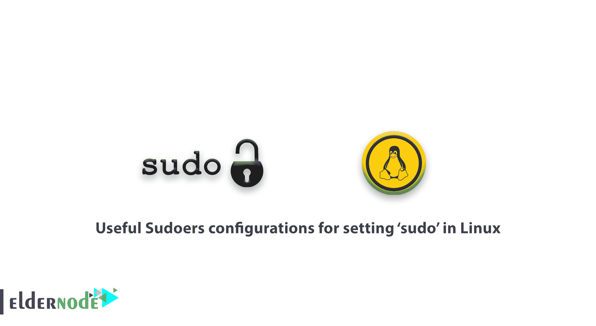

# 在 Linux | ElderNode 博客中设置“sudo”的有用 Sudoers 配置

> 原文：<https://blog.eldernode.com/sudoers-configurations-setting-sudo/>



一个 Linux 系统管理员需要知道一些 Linux 技巧。在本文中，您将了解到在 Linux 中设置“sudo”的有用的 Sudoers 配置。

在 Linux 和其他类似 Unix 的操作系统中，只有 **root** 用户可以运行所有命令并在系统上执行某些关键操作，如安装和更新、删除软件包、创建用户和组、修改重要的系统配置文件等。

具有根用户角色的 [系统管理员](https://en.wikipedia.org/wiki/System_administrator#:~:text=A%20system%20administrator%2C%20or%20sysadmin,user%20computers%2C%20such%20as%20servers.) 可以允许其他普通系统用户在 sudo 命令和一些配置的帮助下运行一些命令以及执行一些重要的系统操作，包括上面提到的那些。

此外，系统管理员可以共享 root 用户密码。但是不建议让普通系统用户通过 **su** 命令访问 root 用户帐户。

## Linux 中设置“sudo”的有用 Sudoers 配置

加入我们，完成本指南的步骤，了解 **Sudoers 配置**。

**sudo** 允许授权用户以 root 用户身份执行命令。您可以在下面查看安全策略。

1.  它读取并解析 **/etc/sudoers** ，查找调用用户及其权限，
2.  然后提示调用用户输入密码(通常是用户的密码，但也可以是目标用户的密码。或者可以用 NOPASSWD 标签跳过)，
3.  之后，sudo 创建一个子进程，在这个子进程中，它调用 **setuid()** 切换到目标用户
4.  接下来，它执行一个 shell 或上面的子进程中作为参数给出的命令。

现在，让我们看看十个 **/etc/sudoers** 文件配置，使用**默认值**条目来修改 **sudo** 命令的行为。

```
sudo cat /etc/sudoers 
```

/etc/sudoers 文件

```
This file MUST be edited with the 'visudo' command as root.    Please consider adding local content in /etc/sudoers.d/ instead of  directly modifying this file.    See the man page for details on how to write a sudoers file.    **Defaults	env_reset  Defaults	mail_badpass  Defaults	secure_path="/usr/local/sbin:/usr/local/bin:/usr/sbin:/usr/bin:/sbin:/bin"  Defaults	logfile="/var/log/sudo.log"  Defaults	lecture="always"  Defaults	badpass_message="Password is wrong, please try again"  Defaults	passwd_tries=5  Defaults	insults  Defaults	log_input,log_output**
```

默认条目类型

```
Defaults                parameter,   parameter_list     affect all users on any host  [[email protected]](/cdn-cgi/l/email-protection)_List      parameter,   parameter_list     affects all users on a specific host  Defaults:User_List      parameter,   parameter_list     affects a specific user  Defaults!Cmnd_List      parameter,   parameter_list     affects  a specific command   Defaults>Runas_List     parameter,   parameter_list     affects commands being run as a specific user
```

在本指南中，我们将在下面的表格中将第一种类型的**默认值**归零。参数可以是标志、整数值、字符串或列表。

请注意:标志是隐式布尔值，可以使用'！'关闭操作符，而列表有两个额外的赋值操作符， += (添加到列表中)和-=(从列表中移除)

1-设置安全路径

```
Defaults     parameter  OR  Defaults     parameter=value  OR  Defaults     parameter -=value     Defaults     parameter +=value    OR  Defaults     !parameter 
```

### 对于使用 sudo 运行的每个命令，您可以使用这个路径，它有两个**重要性**:

当系统管理员不信任 sudo 用户拥有安全的 PATH 环境变量时使用

1.  为了区分“根路径”和“用户路径”，只有由 **exempt_group** 定义的用户不受此设置的影响。
2.  要设置它:

2-在 TTY 用户登录会话上启用 sudo

```
Defaults secure_path="/usr/local/sbin:/usr/local/bin:/usr/sbin:/usr/bin:/sbin:/bin:/snap/bin" 
```

如果您需要从一个真正的 **tty** 中调用 sudo，而不是通过像 **cron** 或 **cgi-bin** 脚本这样的方法，请使用下面的命令:

**您可能会感兴趣:**

```
Defaults  requiretty 
```

[如何在 Debian 上创建一个拥有 root 权限的用户](https://eldernode.com/create-user-on-debian-with-root-access/)

3-使用 pty 运行 Sudo 命令

攻击者可以使用 sudo 运行恶意程序几次。如果发生这种情况，再次分叉一个后台进程，即使主程序已经完成执行，该进程仍保留在用户的终端设备上。

### 但是您可以通过配置 sudo 来防止它，并且无论 I/O 日志记录是否打开，都可以使用 **use_pty** 参数仅从**pseudo-pty**运行其他命令。

4-创建一个 Sudo 日志文件

```
Defaults  use_pty 
```

默认情况下，sudo 通过 syslog(3)记录日志。但是，要指定自定义日志文件，请使用 log file 参数，如下所示。

### 您可以使用 **log_host** 和 **log_year** 参数分别在自定义日志文件中记录主机名和四位数年份。

```
Defaults  logfile="/var/log/sudo.log" 
```

5- Log Sudo 命令输入/输出

```
Defaults  log_host, log_year, logfile="/var/log/sudo.log" 
```

您可以启用 **log_input** 和 **log_output** 参数，以使 sudo 能够在伪 tty 中运行命令，并记录所有用户输入和欺骗性地发送到屏幕的所有输出。使用 log_input 和 log_output 参数

### 默认情况下，I/O 日志目录为 **/var/log/sudo-io** ，如果有会话序列号，则存储在该目录中。您可以通过 **iolog_dir** 参数指定一个自定义目录。

支持一些转义序列，如 **%{seq}** 扩展为以 36 为基数单调递增的序列号，如 000001，其中每两个数字组成一个新目录，如 **00/00/01** ，如下例所示:

```
Defaults   log_input, log_output 
```

**[购买 VPS 服务器](https://eldernode.com/vps/)**

```
cd /var/log/sudo-io/  ls  cd  00/00/01  ls  cat log
```

6-讲座 Sudo 用户

您可以使用下面的**讲座**参数，向 sudo 用户讲解系统上的密码用法。

### 让我们回顾 3 个可能的值:

总是-总是教训用户。

仅在用户第一次执行 sudo 命令时讲解一次。

1.  永远不要对用户说教。
2.  7-输入错误的数独密码时显示自定义信息
3.  每当用户输入错误的密码时，都会在命令行上显示一条消息。默认消息是“**对不起，再试一次**”，通过使用以下命令，您可以使用 **badpass_message** 参数修改该消息。

```
Defaults  lecture="always" 
```

### 8-增加 sudo 密码尝试次数限制

要指定用户可以尝试输入密码的次数，可以使用 **passwd_tries** 参数。

```
Defaults  badpass_message="Password is wrong, please try again" 
```

### 此外，您可以使用下面的命令来设置密码超时(默认为 5 分钟)

```
Defaults   passwd_tries=5 
```

9-当你输入错误的密码时让须藤侮辱你

如果用户输入了错误的密码，Sudo 将在终端上显示带有侮辱参数的侮辱。这将自动关闭 **badpass_message** 参数。

```
Defaults   passwd_timeout=2 
```

### **好样的** ！至此，您已经完成了教程，并学习了一些新的有用技巧。按照顺序，你需要多阅读，遵循 [**Linux 的窍门**](https://eldernode.com/tag/linux-tricks/)

```
Defaults  insults 
```

亲爱的用户，我们希望您喜欢本教程，您可以在评论区提出关于本次培训的问题，或者解决 [Eldernode](https://eldernode.com/) 培训领域的其他问题，请参考 [提问页面](https://eldernode.com/ask) 部分并在其中提出您的问题。

**Good job**! at this point, you finished the tutorial and learned some new useful tips. In order, you need to read more, follow the [**Linux tricks**](https://eldernode.com/tag/linux-tricks/)

Dear user, we hope you would enjoy this tutorial, you can ask questions about this training in the comments section, or to solve other problems in the field of [Eldernode](https://eldernode.com/) training, refer to the [Ask page](https://eldernode.com/ask) section and raise your problems in it.