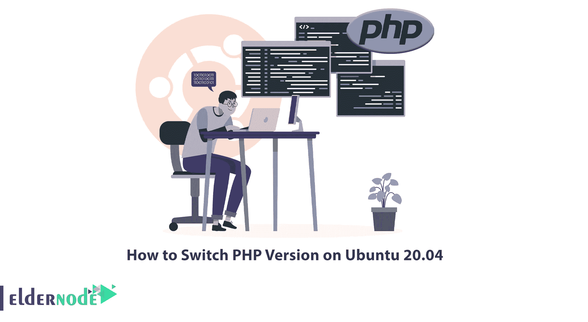
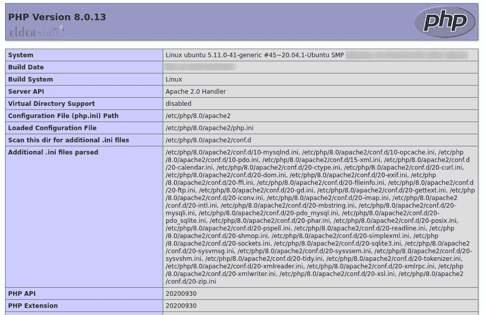

# 如何在 Ubuntu 20.04 上切换 PHP 版本

> 原文：<https://blog.eldernode.com/switch-php-version-on-ubuntu-20-04/>



PHP 编程语言在不断更新，网站上使用了不同的版本。所以每个程序员都有必要改变 PHP 版本，选择合适的版本。本文将教你如何在 Ubuntu 20.04 上切换 PHP 版本。如果你打算购买一台 [Ubuntu VPS](https://eldernode.com/ubuntu-vps/) 服务器，你可以查看 [Eldernode](https://eldernode.com/) 网站上提供的套装。

## **教程在 Ubuntu 20.04 上改 PHP 版本**

PHP 代表超文本预处理器，是一种开源的服务器端脚本语言，可以在任何类型的系统上运行和使用。更新你的 PHP 版本是最重要的事情之一。旧版本的 PHP 在安全性和性能方面非常弱，你应该尽快更新到新版本。使用 PHP 的更新版本是最好的选择，你越能保持你的 PHP 版本最新，你将拥有越多的安全性、效率和特性。

## **在 Ubuntu 20.04 上切换 PHP 版本**

在本节中，您将学习如何在 Ubuntu 20.04 上切换 Apache Web 服务器、CLI 和 Nginx 的 PHP 版本。为此，请遵循以下步骤。

### **阿帕奇网络服务器**

首先，使用下面的命令禁用 PHP 的当前版本，为 Apache web 服务器切换 PHP 版本。我们目前的版本是 PHP 7.0:

```
sudo a2dismod php7.0
```

输出应该如下所示:

```
Module php7.0 disabled.
```

现在**通过运行以下命令启用 PHP 8.0** :

```
sudo a2enmod php8.0
```

最后，您应该通过运行以下命令来重新启动 Apache Web 服务器:

```
sudo service apache2 restart
```

并且**使用网络浏览器刷新 info.php**:



您还可以配置选定的虚拟主机，以使用您指定的 PHP 版本。要做到这一点，你需要使用 PHP FPM 安装。

使用以下命令检查 PHP 7.0 FPM 的**状态:**

```
systemctl status php7.0-fpm
```

并运行以下命令来检查 PHP 8.0 的**状态:**

```
systemctl status php8.0-fpm
```

正如您在输出中看到的，PHP 7.0 FPM 和 PHP 8.0 FPM 都在运行。接下来，您需要启用 Apache2 来使用 PHP 的多个版本。为此，**通过输入以下命令安装 FCGID** :

```
sudo apt install libapache2-mod-fcgid
```

并使用下面的命令**启用**:

```
sudo a2enmod actions fcgid alias proxy_fcgi
```

然后**重启 Apache** 使更改生效:

```
sudo service apache2 restart
```

您需要更新虚拟主机，如下所示:

```
<VirtualHost *:80>  ----  ----        <FilesMatch \.php$>        # For Apache version 2.4.10 and above        SetHandler "proxy:unix:/run/php/php7.0-fpm.sock|fcgi://localhost"      </FilesMatch>    ----  ----  </VirtualHost>
```

最后，**使用下面的命令重新加载 Apache** :

```
sudo service apache2 reload
```

并使用浏览器再次检查 info.php 的输出。您将看到 PHP 7.0 特有的配置。

### **CLI**

首先，用下面的命令检查当前的 PHP 版本:

```
php --version
```

要配置安装在 Ubuntu 20.04 上的多个 PHP 版本，请输入以下命令。

**PHP 7.0:**

```
sudo update-alternatives --set php /usr/bin/php7.0 
```

```
sudo update-alternatives --set phar /usr/bin/phar7.0 
```

```
sudo update-alternatives --set phar.phar /usr/bin/phar.phar7.0
```

**PHP 8.0:**

```
sudo update-alternatives --set php /usr/bin/php8.0 
```

```
sudo update-alternatives --set phar /usr/bin/phar8.0 
```

```
sudo update-alternatives --set phar.phar /usr/bin/phar.phar8.0
```

运行以下命令在 PHP 7.0 和 PHP 8.0 之间切换:

```
sudo update-alternatives --config php 
```

```
sudo update-alternatives --config phar 
```

```
sudo update-alternatives --config phar.phar
```

并验证 PHP 版本，如下所示:

```
php --version
```

### **Nginx**

Nginx 使用 PHP FPM 来运行 PHP 脚本，你可以很容易地改变 Nginx 的 PHP 版本。

为此，请使用文本编辑器打开配置文件:

```
sudo nano /etc/nginx/sites-available/example.com
```

并将 PHP 脚本传递给 FastCGI:

```
location ~ \.php$ {          root /var/www/example.com/html;          fastcgi_intercept_errors on;          fastcgi_pass unix:/run/php/php7.0-fpm.sock;          fastcgi_index index.php;          fastcgi_param SCRIPT_FILENAME $document_root/$fastcgi_script_name;          include fastcgi_params;      }        ...      ...  }
```

保存文件并退出。

就是这样！

## 结论

每个程序员都应该切换 PHP 版本，选择合适的版本。在这篇文章中，我们教你如何在 Ubuntu 20.04 上切换 PHP 版本。我希望这篇教程对你有用，帮助你在 Ubuntu 20.04 上切换 PHP 版本。如果你有任何疑问或问题，可以在评论区联系我们。