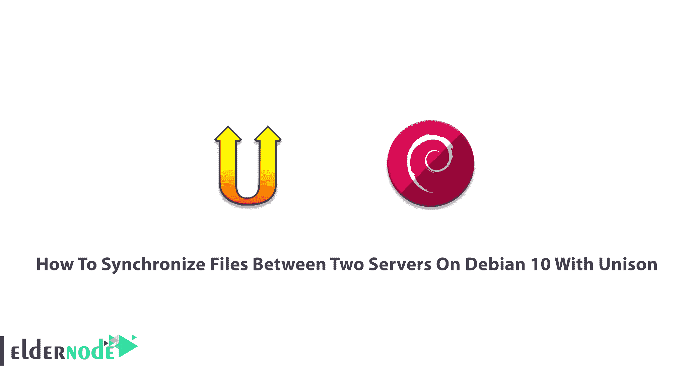

# 用 Unison 在 Debian 10 上的两台服务器之间同步文件

> 原文：<https://blog.eldernode.com/synchronize-files-between-two-servers-on-debian/>



Unison 是一个文件同步软件，它是为 OSX、Unix(如 Solaris、Linux、OS X)和 windows 设计的，类似于 rsync。有了这个工具，您的文件和文件夹在一个互连的系统上总是最新的。您可以 Unison 是免费的，并且在通用公共许可证下可以获得全部源代码。Unison 用于在不同的主机上存储文件和目录集合的两个副本，分别进行修改，然后通过将每个副本中的更改传播到另一个副本来更新。它也可以存储在同一主机的不同磁盘上。在本教程中，你将学习如何用 Unison 在 Debian 10 上的两台服务器之间**同步文件。如果你正准备购买一台新的 [Linux VPS](https://eldernode.com/linux-vps/) 你所需要的东西会以你能想象的速度出现。**

为了让本教程更好地发挥作用，请考虑以下**先决条件**:

拥有 sudo 权限的非 root 用户。

作为根用户运行 Unison。

要进行设置，请按照 Debian 10 的[初始设置进行。](https://blog.eldernode.com/initial-setup-with-debian-10/)

## 使用 Unison 在 Debian 10 上的两个服务器之间同步教程文件

加入我们这篇文章，学习如何用 Unison 在两台 Debian 服务器之间设置文件同步。您将看到在服务器 1 上更改的文件将被复制到服务器 2，反之亦然。Unison 的行为不同于简单的镜像或备份工具，它能够处理对分布式目录结构的两个副本的更新。您需要使用两台 Debian 服务器，并在两台服务器之间同步目录/var/www。让我们通过这个指南的步骤来学习和完成它。

### 如何安装 Unison

你应该在*服务器 1* 和*服务器 2* 上安装 Unison。您通过 [SSH](https://blog.eldernode.com/ssh-keys-debian-10/) 从服务器 1 连接到服务器 2，因此 SSH 包是必需的。要编辑文件，您可以在 shell 上安装并使用 nano 作为文件编辑器。让我们开始吧:

```
apt-get -y install unison openssh-server ssh nano
```

### 如何在服务器 1 上创建私钥/公钥对

运行以下命令在 server1.example.com 上创建一个私有/公共密钥对，并在询问时提示输入。

```
ssh-keygen -t dsa
```

然后，将您的公钥复制到 server2.example.com

```
ssh-copy-id -i $HOME/.ssh/id_dsa.pub [[email protected]](/cdn-cgi/l/email-protection)
```

```
# ssh-copy-id -i $HOME/.ssh/id_dsa.pub [[email protected]](/cdn-cgi/l/email-protection)
```

下一个。，检查服务器 1 的公钥是否正确传输到服务器 2:

```
cat $HOME/.ssh/authorized_keys
```

### 如何运行 Unison

此时，您可以第一次运行 Unison 来同步两台服务器上的/var/www 目录。在服务器 1 上运行以下命令:

*注意*:由于这是第一次齐步走，你必须回答一些问题。

```
unison /var/www ssh://192.168.0.101//var/www
```

要确保服务器 1 和服务器 2 的同步，请检查它们上的/var/www 目录。虽然您不希望以交互方式运行 Unison，但可以创建一个类似/root/的首选项文件。unison/default.prf .包含您必须在命令行上指定的所有设置:

```
nano /root/.unison/default.prf
```

不仅仅是路径的指令，命令应该让文件自我解释。但是如果您没有指定路径指令，那么根指令中的目录将被同步。如果指定 path 指令，则路径相对于根路径，因此只同步这些子目录，而不是根指令中指定的整个目录。看看 Unison 的 mn 页面，了解更多可用选项。

```
man unison
```

因为您已经将所有设置放在了一个首选项文件中，所以您可以不带任何参数地运行 Unison 了:

```
unison
```

### 如何为 Unison 创建 corn job

在这一步中，您需要在 server1.example.com 上为 Unison 创建一个 corn 作业来自动执行同步。

```
crontab -e
```

以下命令 Unison 将每 5 分钟运行一次。此外，您可以根据自己的需要进行调整。

```
man 5 crontab
```

您可以在这里使用 unison 的完整路径(/usr/bin/unison)来确保 cron 知道在哪里可以找到 unison。然而，你的调和位置可能是不同的。因此，要查看您的位置，请键入:

哪个齐奏

### 如何测试同音

t 检查设置是否完全工作，测试 Unison 的双向同步。要创建内容为“Test 1”的测试文件，请在服务器 1 上使用以下命令:

```
echo "Test 1" > /var/www/test.txt
```

然后，等待 5 分钟。要在屏幕上显示文件 test.txt 的内容，请在服务器 2 上运行以下命令:

```
cat /var/www/test.txt
```

现在，要将测试文件的内容更新为“Test 2”，请在服务器 2 上使用下面的命令:

```
echo "Test 2" > /var/www/test.txt
```

同样，您应该等待大约 5 分钟，然后在服务器 2 上运行以下命令:

```
cat /var/www/test.txt
```

就是这样。这就是在 Debian 10 上设置两台服务器之间的 Unison 文件同步所需要的一切。

## 结论

在本文中，您了解了如何使用 Unison 在 Debian 10 上的两台服务器之间同步文件。IPFs、FreeFileSync 和 Syncthing 是 Unison 的替代工具。它将为您提供一些功能，如配置管理包、分布式文件系统、单向镜像工具。