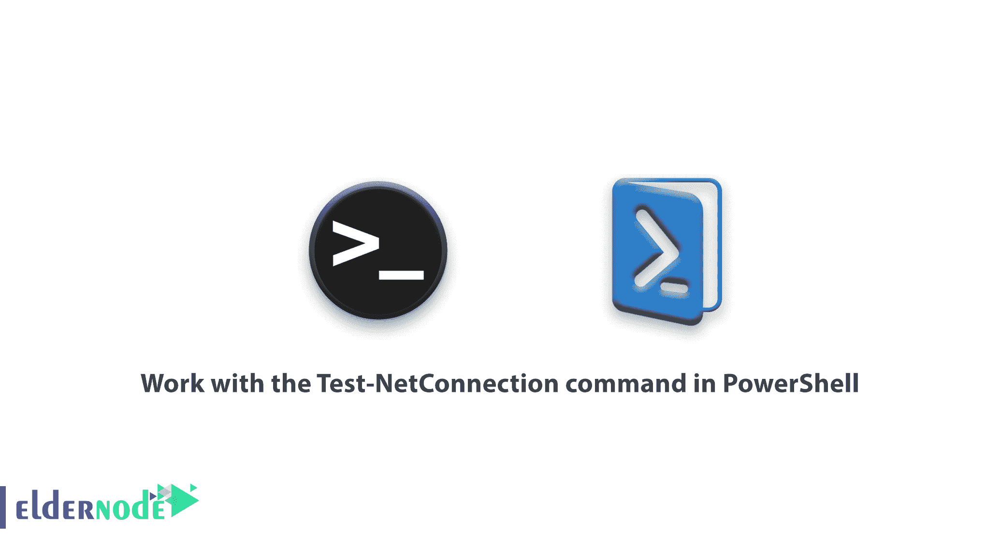

# 如何在 PowerShell - Eldernode 中使用 Test-NetConnection 命令

> 原文：<https://blog.eldernode.com/test-netconnection-command-in-powershell/>



如何在 PowerShell 中使用 Test-NetConnection 命令。在继续的 [PowerShell 教程](http://eldernode.com/tag/powershell-commands/)中，在这篇文章中，我们将教你如何在 PowerShell 中使用 Test-NetConnection 命令。

在上一篇文章中，我们教了[如何通过 PowerShell](https://eldernode.com/set-up-windows-network-with-powershell/) 设置网络，您已经熟悉了一些设置 IP 地址的命令，等等。在本文中，我们将解释一个可以用来测试网络的命令。您可能熟悉诸如 [Ping](https://en.wikipedia.org/wiki/Ping_(networking_utility)) 、 [tracert](https://support.microsoft.com/en-us/help/314868/how-to-use-tracert-to-troubleshoot-tcp-ip-problems-in-windows) 或 [NetStat](https://docs.microsoft.com/en-us/windows-server/administration/windows-commands/netstat) 之类的命令，并见过它们在 CMD 或其他操作系统中的使用。

在 PowerShell 中，可以使用 CMD 命令。PowerShell 和它的其他命令一样，提供了一个用于处理网络的特定命令，类似于 CMD 命令的功能，但有时会提供更完整的信息。

继续阅读，了解如何在 PowerShell 中使用 Test-NetConnection 命令。

[**买 Windows VPS 托管，便宜的 Windows VPS**](https://eldernode.com/windows-vps/)

## 在 PowerShell 中使用 Test-NetConnection 命令

PowerShell 命令与 CMD 命令相同，但是具有不同的功能，您将在下面看到。

### 测试网络连接命令

Test-NetConnection 命令是 CMD 中几个常用网络命令的组合，有几个参数。该命令的一般结构与其他 PowerShell 命令相同，输入命令后可以输入所需的参数或值。

参见下面的示例了解更多关于该命令的信息。

#### 测试网络连接命令的例子

您可以使用以下命令在 PowerShell 中 ping 一个 IP 地址。

```
Test-NetConnection 192.18.1.1
```

以下命令用于根据计算机名或域执行 ping 操作。

```
Test-NetConnection –ComaputerName google.com
```

PowerShell 结构特性将允许您输入 IP 的范围，以便 PowerShell 可以 ping 通所有 IP。

```
1..99 | % { Test-NetConnection -ComputerName 192.168.1.$_ } | FT –AutoSize
```

在上面的命令中，的值为 1..99 是 IP 地址的最后一个**号，而 x.x.x 是**网络地址**，您可以在这里输入您想要的值。PowerShell 将分别 ping 范围 **192.168.1.1** 到 **192.168.1.99** 的所有 IP 地址。**

该功能是 Test-NetConnection 命令最简单的功能。在下面，我们将解释这个命令的其他参数。

#### TraceRoute 参数

在 Tracert 网络中广泛使用的命令之一是 PowerShell，它已经成为 Test-NetConnection 命令的参数。要使用 tracert ，您可以进行如下操作。以下命令将与 Tracert 命令完全相同。

```
Test-NetConnection www.google.com –Traceroute
```

#### 状态参数

CMD 中存在的另一个在 PowerShell 中用作参数的命令是 Netstat 命令，它通过状态在 [PowerShell](https://docs.microsoft.com/en-us/powershell/) 中执行，并恢复所有建立的连接

```
Test-NetConnection –State Established
```

#### 端口参数

你将能够使用这个参数来**检查**一台计算机上的特定端口。

```
Test-NetConection –ComputerName google.com –Port 80
```

这个命令将**在**Google.com**服务器上检查**端口 80 的状态，并最终提供有关该端口的信息。

通过这个命令，您还可以使用common support参数来扫描特定服务上的所有端口。

例如，在下面的命令中，我们希望 **HTTP 端口**搜索 **192.168.1.10 服务器**。

```
Test-NetConnection 192.168.1.10 –CommonTCPPort http
```

输入上述命令后，PowerShell 开始扫描上述系统的所有端口。只要它能找到 **HTTP 服务**所在的端口，它就会输出给你。

您可以使用Test-net connection命令及其其他应用程序参数，并且不再为此使用附加组件。

使用 PowerShell 中的命令后的**获取关于的信息、其他参数以及 Test-NetConnection 命令的其他示例:**

```
Get-Help Test-NetConnection –detailed
```

**亦作，见:**

[Windows PowerShell 简介](https://eldernode.com/introduction-to-windows-powershell/)

[了解重要的 PowerShell 命令](https://eldernode.com/important-powershell-commands/)

[使用硬盘的 PowerShell 命令](https://eldernode.com/powershell-commands-for-hard-disk/)

**尊敬的用户**，我们希望您能喜欢这个[教程](https://eldernode.com/category/tutorial/)，您可以在评论区提出关于本次培训的问题，或者解决[老年人节点培训](https://eldernode.com/blog/)领域的其他问题，请参考[提问页面](https://eldernode.com/ask)部分，并尽快提出您的问题。腾出时间给其他用户和专家来回答你的问题。

好运。