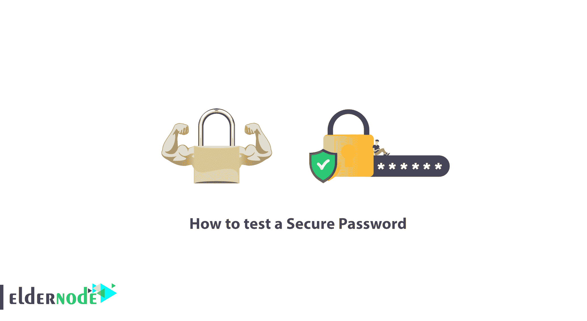
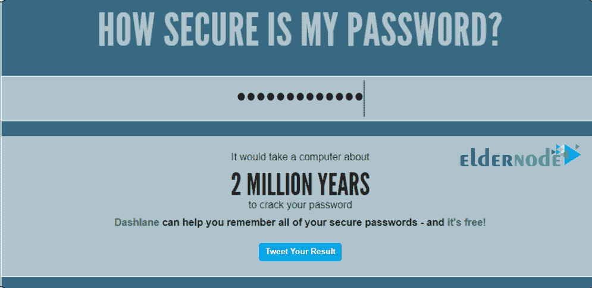

# 如何测试一个安全的密码-教程不可渗透的密码测试

> 原文：<https://blog.eldernode.com/test-secure-password/>

如何测试安全密码？你可能想知道你选择的**密码**是不是安全和无法破解。**答案**没有密码是无法破解的所有的密码都是易受攻击的，但是你的密码被黑客破解需要多长时间很重要。

在本文中，我们将告诉您如何测试安全密码，以便您可以测试您选择的密码的安全状态。

**[购买 VPS，便宜的 VPS 托管服务器带即时激活](https://eldernode.com/vps/)**

密码破解

## 密码破解在当今世界，密码破解是访问系统或账户最常见的方式之一。

像[暴力破解](https://eldernode.com/ftp-configuration-to-prevent-brute-force-attacks-on-windows-server-2012/)这样的攻击是用来获取密码的方法之一。在这种方法中，测试多个密码足以获得您的原始密码。

或者，您可以在 **Windows** 或 **Linux** 中检索密码文件，并加密您的密码散列以最终访问它。

在 Windows 操作系统上，有一个名为 **SAM** 的文件，在基本 Unix 操作系统上，有一个名为 **Shadow** 的文件，所有密码都存储在其中。这个文件在你的密码文件中被散列。

**密码** 哈希是可逆的，但不是你想的那么简单。如果密码很长，重新设置会更难。

**提示:** 使用符号、数字、大写和小写 **字母**可以使密码更加复杂，更难破解。

如何测试安全密码

### 在这篇文章中，我们将介绍一个名为我的密码有多安全的网站，它可以让你**输入**你的密码告诉你破解你的密码需要多长时间。

要**测试**您的密码，请点击下面的链接:

[**我的密码**](https://howsecureismypassword.net/) 有多安全

**1。** 进入站点后，**在指定字段中输入**您的密码。

**2。** 在指定的框中输入密码后，会通知你破解密码需要多长时间，或者更好的是**恢复**你的密码哈希需要多长时间。

例如，在这个站点我们输入了密码 **Donald2020)@#** 。

你可以看到，**破解**这个密码的 hash 需要两百万年，可以说是一个安全的，当然还有密不透风的密码。

这样你也可以测试你的密码。

**亦作，见:**

[如何在 vps 上更改 Windows 密码](https://eldernode.com/change-windows-password-on-vps/)

[更改 Windows VPS 服务器密码](https://eldernode.com/changing-windows-vps-server-password/)

[如何创建强密码](https://eldernode.com/how-to-create-strong-password/)

**尊敬的用户**，我们希望您能喜欢这个[教程](https://eldernode.com/category/tutorial/)，您可以在评论区提出关于本次培训的问题，或者解决[老年人节点培训](https://eldernode.com/blog/)领域的其他问题，请参考[提问页面](https://eldernode.com/ask)部分，并尽快提出您的问题。腾出时间给其他用户和专家来回答你的问题。

如何测试安全密码？

好运。

Goodluck.