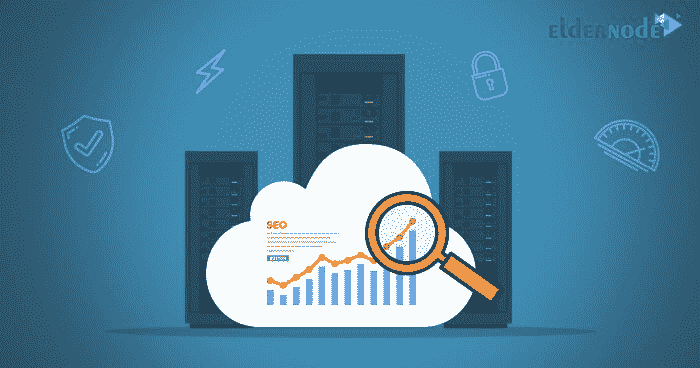

# SEO 工具的最佳 VPS-elder node

> 原文：<https://blog.eldernode.com/the-best-vps-for-seo-tools/>

互联网 80%以上的流量是由搜索引擎分享的，这足以吸引全球所有站长的注意力来赚取这个流量的一个百分比。但是 SEO 最重要的优势是网站的目标访问者。事实上，通过使用 SEO 技术，你可以引导那些想购买你的网站产品的人到你的网站，并把这些人中的很大一部分转化为顾客，从你的网站上赚钱。事实上，没有其他互联网营销方式有这样的投资回报。在这篇文章中，我们将解释网站搜索引擎优化，远程桌面及其功能和搜索引擎优化工具的最佳 VPS。和我们在一起。

## 搜索引擎优化工具的最佳副总裁

关于搜索引擎优化的伟大之处在于，你可以不用支付高额费用就可以做到这一点，与其他传统的互联网营销方式相比，你在搜索引擎优化上的投资将会有显著的投资回报，所以如果你想发展你的业务，你需要做的第一件事就是投资你的网站搜索引擎优化。选择一个合适的 [RDP 服务器](https://eldernode.com/buy-rdp/)，可以在网站 SEO 上取得很大的进步。

### 网站 SEO 的好处

你增加 SEO 的目标可以不同。这些目标可能包括增加收入，增加客户，或增加销售，这将有助于您的业务增长。同时，搜索引擎优化可以帮助你的营销和业务。通过增加网站内容的优化，我们可以逐渐看到业务中损失的资本或资本回报的增加。

搜索引擎流量是最好的进站站点，为什么？因为事实上，人们在互联网上寻找一个特定的主题，只有使用搜索引擎才能解决，你可以推动你的服务和业务的流量，说服人们购买，你不需要高昂的广告费用。搜索引擎流量已经是观众感兴趣的产品和服务，这就是为什么搜索引擎优化行业的价值为 650 亿美元，这是最重要的搜索引擎优化的好处之一。

SEO 的另一个好处是“免费”。获得一个客户比做广告要便宜得多。SEO 中唯一的成本就是雇佣最好的 SEO 公司的成本。如果你没有编码网站和谷歌算法的经验，你将需要一个人或公司谁在搜索引擎优化的必要专业知识。

随着你意识的增长，你的搜索引擎优化技巧也在增长，你对你的企业的访问越多，你就越有可能从你的企业购买它们。强大的搜索引擎优化排名将帮助你大大增加与潜在买家的接触点。

你的客户从搜索引擎开始他们的生意。迟早，如果你不使用你的搜索引擎来发展你的业务，你将不会有生意。

### 使用 RDP 的特点和优势

通过互联网远程访问计算机操作系统被称为“远程桌面”。使用这种方法，我们可以从任何地方连接到我们的计算机，并对它采取必要的行动。这种方法非常有用，尤其是对于使用服务器的人。希望向需要访问客户计算机的客户提供服务的软件公司也可以使用这项服务。使用该系统，可以检查软件的缺陷以及在客户系统上进行设置。

该程序的工作方式是，一旦连接建立，远程系统自动锁定，只要你连接到它，没有人可以访问它的程序，文件和其他资源。当你回到工作状态时，你可以通过按 CTRL + ALT + DEL 来解锁它。

该程序的另一个特点是能够同时登录几个系统(即使其他人已经登录到该系统)，并且用户可以同时运行他们的程序。

要访问这些功能并运行远程桌面程序，您必须考虑以下事项:

**–**安装了 Windows 并且可以访问互联网或网络环境的计算机。

**–**家中或公司同一地点的另一台计算机(通过内部网络连接)，可接入互联网，调制解调器。

**–**用户名、密码和适当的权限。

### 如何设置远程桌面系统

**1。**进入**控制面板**，选择**系统**选项。

**2。**在**远程**选项卡中，选择窗口底部的**允许用户远程连接到这台计算机**选项。

**3。**在远程桌面环境中，点击**选择远程用户…** 选项。

**4。**在远程桌面用户对话框中，选择**添加…** 。

**5。**在选择用户对话框中，点击**位置…** 指定搜索位置。

**6。**要确定你想要的对象类型，点击**对象类型**选项。

**7。**当你找到你想要的名字时，选择它然后点击**确定**。现在，您想要的名称出现在远程桌面用户列表中。

至此，系统已为远程通信做好准备。为此:

**1。**从开始菜单中选择**程序**，然后选择**附件**，从**通信**部分选择**远程桌面连接**。

**2。**在此步骤中，将出现远程桌面连接窗口。

**3。**选择**选项**允许您指定更多选项。

**4。**从**计算机**部分和下拉菜单中选择您想要的计算机名称，或选择**浏览更多…** 选项来访问其他计算机的名称。

**5。**在用户名、密码和域名框中，分别输入与网络相关的 ID 或用户名、密码和域名。

**6。**然后选择**连接**选项进行通信。

## 结论

网站加载速度很重要！特别是，网站的加载速度对你的业务很重要。站点页面加载如此重要的原因是速度和性能对用户体验的影响。为了证明这一点，我们参考最新的发现和统计数据:根据谷歌公布的信息图统计，随着网站加载速度的减慢，访问者的跳出率显著增加。这意味着，如果一个页面的加载速度从 1 秒增加到 10 秒，访问者跳转或离开网站的可能性增加了 123%。因此，可以说，如果你选择一个好的虚拟服务器如 RDP 服务器，它会对你的网站 SEO 产生积极的作用。