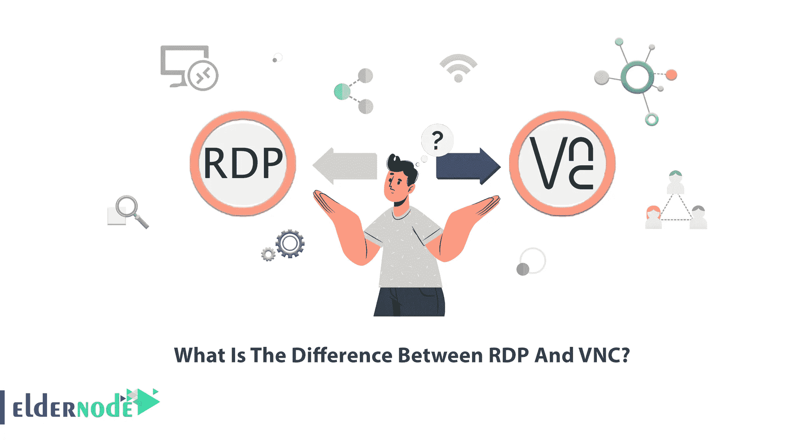
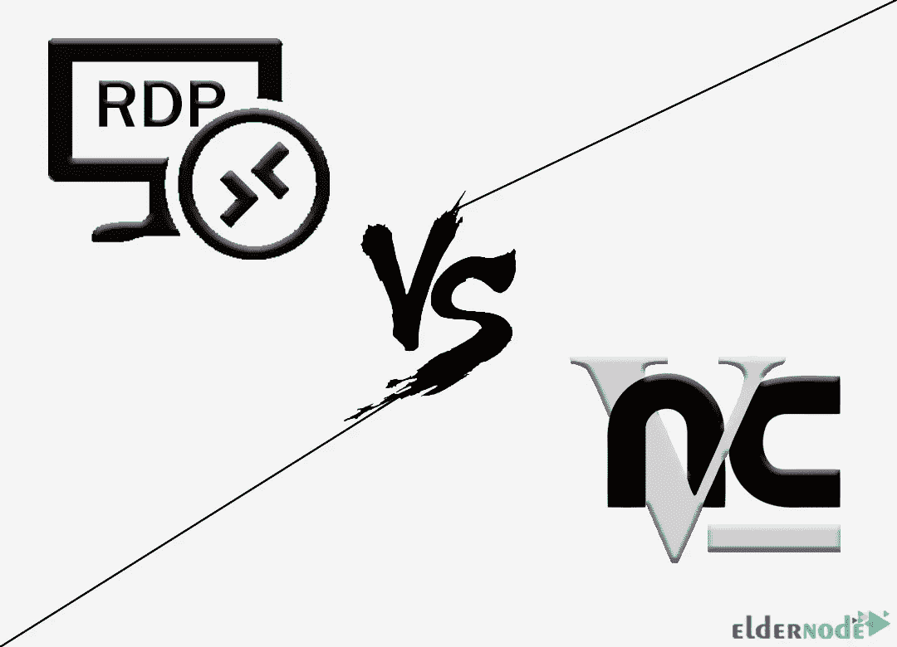

# RDP 和 VNC 有什么不同？

> 原文：<https://blog.eldernode.com/the-difference-between-rdp-and-vnc/>

如今，远程桌面技术系统，如 VNC 和 RDP，在家庭计算机网络中非常有用。这项技术允许用户即使不在家或无法访问他们的系统也可以使用他们的桌面。它们对于商业环境中的网络管理员也很有用，例如信息技术部门；因为当他们必须远程解决员工系统的问题时，这项技术可以帮助他们。本文将解释**RDP 的** **与 VNC 的**有何不同。如果你想购买自己的 **[购买 RDP](https://eldernode.com/buy-rdp/)** ，你可以查看 [Eldernode](https://eldernode.com/) 网站上提供的套餐。

## **RDP 和 VNC 是什么？**

**RDP** 代表远程桌面协议，是微软开发的一种安全网络通信协议。它适用于 [Windows](https://blog.eldernode.com/tag/windows/) 操作系统，并且只适用于特定的操作系统。该协议为通过网络远程连接到另一台计算机提供了图形用户界面。通过 RDP 协议远程访问的用户体验非常接近直接访问。

**VNC** 代表虚拟网络计算，是一个远程桌面共享系统，可以控制不同位置的另一台计算机。它允许用户远程控制计算机，而主用户可以进行交互和观看。这个桌面共享系统可以与 Windows、Mac、Linux、Raspberry Pi 和其他平台一起使用，在不同的计算机之间共享桌面。

### **RDP 特色**

这里我们将列出 **RDP** 的最佳特性:

–将图像数据从服务器传输到客户端

–使用网络级认证对用户进行认证

–访问您的本地打印机

–加密两台计算机之间发送的所有数据

–允许声音从远程桌面直接传到本地计算机

### **VNC 特色**

让我们列出 **VNC** 的主要特征:

–用户之间共享屏幕

–允许跨平台使用

–使用轻量级协议

–独立于平台

## **RDP 和 VNC 是做什么用的？**

RDP 和 VNC 用于连接到远程设备，并可以提供对设备图形用户界面的远程访问。它们需要服务器端和客户端的软件。服务器是要连接的设备，而客户端是连接设备。这些远程桌面允许支持人员远程协助对客户设备进行故障诊断。 [VNC](https://blog.eldernode.com/install-vnc-on-centos-linux/) 和 RDP 使用直接点对点通信将两台设备连接在一起。

## **RDP&VNC 有什么不同？**

RDP 和 VNc 有两个主要区别。首先，RDP 是客户/服务器模式，而 VNC 是点对点模式。其次，RDP 使用 TCP/IP，而 VNC 使用 UDP/IP。

让我们一起探索 RDP 和 VNC 的不同之处。

**–安全性:** RDP 支持 SSL/TLS，并在加密通道内运行。每次更新都提供了更多的安全改进。但是 VNC 并没有提供强大的安全实现，并给予远程用户完全的访问权限。这使得 VNC 更加不安全。

**–性能:** RDP 快速易用，提供更小的指令集。您可以使用它连接到 VPS 服务器，让许多用户访问同一个物理服务器。但是 VNC 在用户之间共享同一个桌面，这意味着如果两个以上的用户连接到 VNC，它将会非常慢，运行时会有更多的错误。

**–平台:** VNC 是一个独立于平台的工具，可用于 Windows、Linux、Mac 和 Raspberry Pi 设备。但 RDP 是预装在 Windows 电脑上的，只适用于特定的操作系统。您可以在 Mac、Linux、Android 和 iOS 等多种平台上的客户端应用程序中使用 RDP。

**–屏幕共享:** RDP 支持多个远程用户登录同一个服务器。VNC 通过共享屏幕、鼠标和键盘将用户连接到计算机本身，这样当多个用户连接到同一个服务器时，他们都可以看到同一个屏幕并在同一个键盘上打字。如果你需要大量系统的桌面共享，RDP 不是合适的系统。RDP 用户不能共享屏幕，但是 VNC 用户和管理员可以同时看到用户的屏幕。

**–用途:** RDP 是资源共享平台，VNC 是屏幕共享平台。VNC 允许您控制远程计算机，您可以使用它进行远程客户支持和教育演示。但是在 RDP，用户通过个人设备连接到另一台设备。

## **你该选哪个？**

不能说 VNC 比 RDP 好或 RDP 好，因为这两者用于不同的领域，在特定的情况下使用。现在我们将解释不同的情况，以便你知道在每一种情况下选择 RDP 还是 VNC。正如我们上面提到的，RDP 是一个本地远程连接，比 VNC 快。所以，如果你想要高效快捷的访问，你应该选择 RDP。但 VNC 是一个屏幕共享平台，可以在所有操作系统上运行。您可以将其用于远程客户支持和教育演示，最适合功能性环境。

## **我为什么需要了解 RDP 和 VNC？**

有时你需要远程访问一台计算机，因为你不能物理地访问它。此时，您应该使用远程访问解决方案之一。RDP 和 VNC 是你可以选择的远程桌面解决方案。你必须了解 RDP 和 VNC 的特点、相似之处和不同之处，这样你才能选择哪一个最适合你。

## 结论

RDP 和 VNC 都有非常不同的具体使用案例。在这篇文章中，我们解释了 RDP 和 VNC 的用途以及它们之间的区别。我希望本教程能够帮助您选择能够满足您需求的最佳远程访问解决方案。如果你面临任何问题或者有任何建议，可以在评论区联系我们。