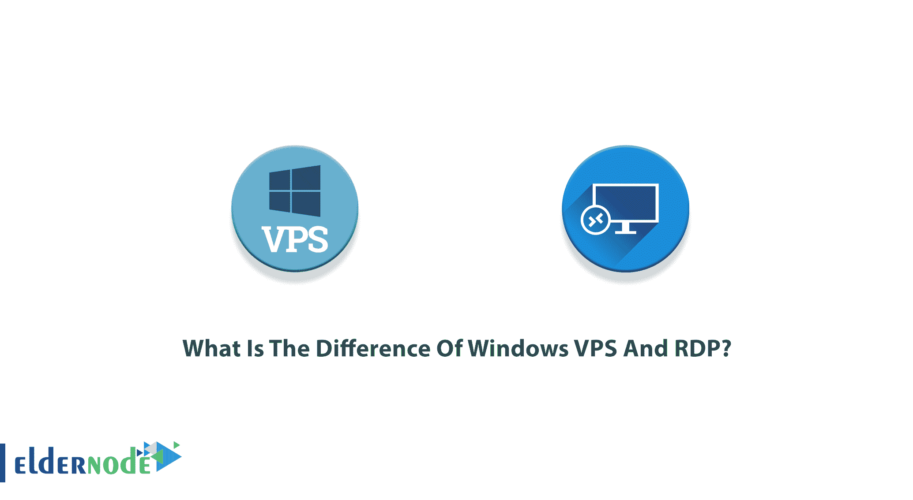
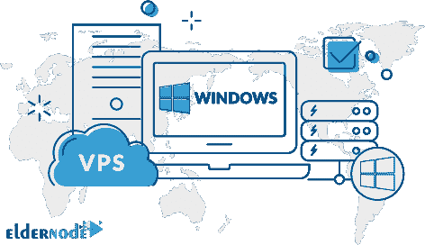
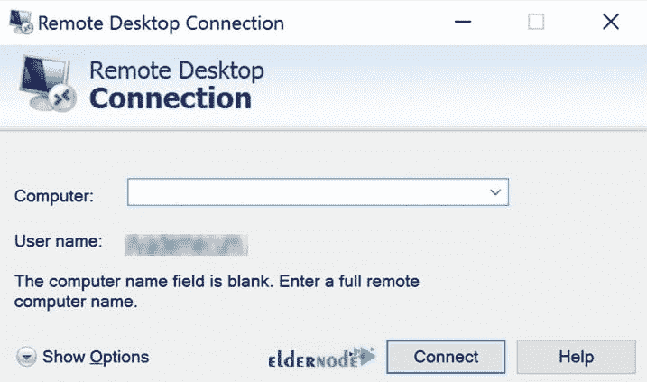

# Windows VPS 和 RDP 有什么区别？-埃尔德诺德

> 原文：<https://blog.eldernode.com/the-difference-of-windows-vps-and-rdp/>

Windows VPS 是虚拟专用服务器，RDP 是远程桌面协议。可以使用个人计算机通过“远程桌面连接”应用程序将它们连接起来。因此，视窗 VPS 也被称为视窗 RDP。说两者相同并不难，但区别点在哪里呢？在本文中，您将了解到**Windows VPS 和 RDP** 的区别是什么？提供商很重要！在 [Windows VPS](https://eldernode.com/windows-vps/) 和 [RDP Admin](https://eldernode.com/buy-rdp/) 的各种套餐中选择你想要的方案，或者联系 [Eldernode](https://eldernode.com/) 的支持团队购买最好的。

## **Windows VPS 与**T3【RDP】的区别

只要有需求，网络和电脑就提高。远程桌面协议和 VPS 代表相同的技术，帮助您通过一台服务器连接到所需客户端的电脑。但是本指南将向你展示 RDP 和副总统候选人的区别。要走完这门学科的真正定义，让我们看看这两个基本上是什么？

### **Windows VPS 及其特性**

使用 Windows 技术托管软件，这正是 Windows VPS 的含义。毫不夸张地说，现在 Windows VPS 或 [VPS](https://blog.eldernode.com/what-is-a-virtual-private-server/) (简而言之)是企业的一个话题，作为一种有效的工具，允许他们根据自己的特定目的配置服务器。VPS 带给你的是一个个性化的虚拟桌面和你最喜欢的应用程序。作为开发人员，您可以使用 VPS 的功能和实用性。用户和企业使用 Windows VPS 有几个好处。让我们回顾一些 Windows VPS 的**用法的例子，以了解更多。**

对于那些关心安全和使用邮件服务器的人来说，Windows VPS 可能是最好的选择。因为它使用特殊的加密软件。因此，许多企业使用 Windows VPS 作为他们的邮件服务器。另一方面，游戏玩家是 Windows VPS 的主要粉丝之一，因为它允许他们体验在线多人游戏。此外，当您准备并[连接到 Windows VPS](https://blog.eldernode.com/connect-to-windows-vps-server/) 时，您将能够在 Windows 设备上托管各种流行的应用程序。例如，如果你使用 Excel、Powerpoint、Office 和 Outlook，你可以在你的 VPS 上很好地使用它们。专用资源、操作系统选择、管理或根访问、不需要技术经验以及专用 IP 是 VPS 的一些特性。

### **视窗 VPS 缺点**

知道是否选择某样东西的最好方法之一就是了解它的缺点。如果缺点正是你想要的，那么忽略这个工具会有所帮助。以下是 Windows VPS 的主要缺点:

1-需要专业技术知识

2-其他用户可以影响你的网站

3-高价格

4-不能完全控制环境

### **远程桌面协议及其特性**

RDP 通过网络连接为运行在服务器上的基于 Windows 的应用程序提供远程显示和输入功能。它适用于 Windows、Unix、Linux 和 OS X。要访问客户端信息，您需要在 Windows VPS 上使用 RDP。它是一个协议或终端服务，而 VPS 本身就是一个服务器。此外，RDP 还用于远程访问 Windows 计算机。

使用 RDP，您可以查看虚拟机或远程计算机的桌面，并使用鼠标和键盘控制远程计算机。加密、漫游断开、剪贴板映射、虚拟通道、网络负载平衡和较低的成本是远程桌面协议的一些特征。毫无疑问，RDP 是一个伟大的工具来管理您的 Windows 服务器。虽然远程桌面本身是用来排查和修复远程电脑问题的，但是要解决它的连接问题，你可以[排查](https://blog.eldernode.com/troubleshoot-remote-desktop/)它，重新连接。

### **远程桌面协议缺点**

由于没有完美的服务，任何软件都会有缺点。让我们回顾一下 RDP 的缺点:

1-没有管理权限(增加了系统被攻击的可能性)

2-不支持多显示器

3-需要企业网络连接才能工作

4-停机时间

5-瓶颈

## **RDP Vs****Windows VPS**

既然您已经了解了更多关于 Windows VPS 和远程桌面协议的知识，让我们来看看本指南的主要目的和区别点。正如你所猜测的，主要的区别是 RDP 是与许多用户共享的，但是 VPS 是 T2 的私人服务器。你可以准备一个 VPS 服务，作为虚拟主机服务。由于 VPS 具有专用的 IP 和管理员访问权限，因此是一台独立的服务器。虽然 VPS 给你**完全的管理员权限**，但 RDP**没有**管理员权限。这意味着你将不能安装任何你想要的软件，甚至不能改变任何设置。但是，这取决于你！如果你需要**托管一个网站**，你必须提供一个 VPS 才能完全控制服务器。但是如果你不需要管理员权限，只想要一个共享服务器，一个 RDP 账户就足够了。

## 结论

在本文中，您了解了 Windows VPS 和 RDP 之间的区别。首先，您简要回顾了它们的功能，以帮助您考虑哪一个可能是您的更好选择。但是，就像很多其他的比较一样，说哪个更好并不科学。本教程解释了优缺点和主要差异。所以，根据你的观点和需求来决定吧。此外，你可以了解 Windows VPS 和 Linux VPS 之间的差异。