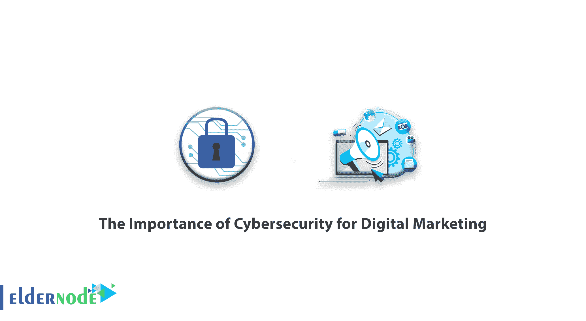

# 网络安全对数字营销的重要性——老年博客

> 原文：<https://blog.eldernode.com/the-importance-of-cybersecurity-for-digital-marketing/>

网络安全对[数字营销](https://eldernode.com/category/digital-marketing/)的重要性——你能做些什么来保持安全？

谈到数字营销，我们许多人都有忘记网络安全重要性的罪过。鉴于我们大量使用社交媒体、网站和电子邮件，保护我们的资源和数据应该是我们的首要任务之一。不用说，病毒和黑客是具有破坏性后果的真实威胁。一次成功的网络攻击的有形和无形成本都有可能摧毁一个企业。
面对这种令人不安的现实，数字营销人员需要做些什么来保护他们的数据和资源？此外，鉴于 GDPR——欧洲全面的数据保护法——的深远影响，你需要做些什么才能不违反法律？
继续阅读，了解网络安全对数字营销的重要性，以及你可以做些什么来防止容易预防的网络攻击。

A)管理 WordPress 的更新——如果你在 WordPress 网站上:

许多营销人员鼓励他们的客户在 WordPress 上托管他们的网站，WordPress 是托管平台的最强大的[网站之一。](https://eldernode.com/)

B)保护您的 CRM 平台

C)更加注意你的电子邮件营销

D)保护您的社交媒体账户

如有疑问或问题，可向[提问系统](https://eldernode.com/ask/)咨询，提供指导。