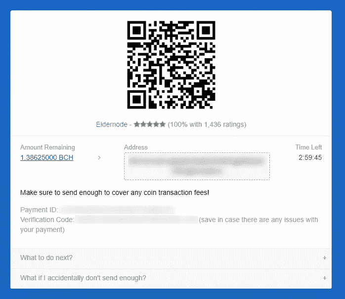

# 如何为您的 Unity 游戏购买合适的服务器

> 原文：<https://blog.eldernode.com/the-right-server-for-your-unity-game/>

玩游戏时，您还可能会遇到连接不良、延迟或其他连接问题。这一因素导致许多游戏玩家为此使用专用且可靠的服务器。这篇文章将教你如何为你的 Unity 游戏购买合适的服务器。我们提供[便宜的专用服务器](https://eldernode.com/dedicated-server/)，是你 Unity 游戏的最佳选择。

## **教程为 Unity 游戏购买专用服务器**

Unity 是通用的，也是当今最流行的跨平台游戏引擎之一。它由 Unity technologies 开发，支持 2D 和 3D 图形。这个游戏引擎已经被这个领域中非常大的公司使用，并且通过 C#和拖放功能来编写脚本。如果你想使用 Unity 游戏引擎，没有中断，没有连接问题，最好是为它弄一个[专用服务器](https://blog.eldernode.com/tag/dedicated-server/)。

### **专用服务器有哪些优势？**

让我们列出我们的专用服务器优于竞争对手的功能:

–即时服务器设置

–99.9%的正常运行时间

–专用 IP

–专用资源

–能够定制硬盘

–VNC 入口

–强大的备份系统

–最高质量的基础设施

–不同的操作系统

–实惠的价格

–DDoS 保护

–全天候专门支持

### **购买专用服务器运行 Unity 游戏**

如果你在玩游戏时遇到连接不好，滞后，或者其他连接问题，你应该购买专用服务器来解决这个问题。为此，请遵循以下步骤。

首先，导航到 [Eldernode 官网](https://eldernode.com/)，从页面顶部选择**专用服务器**:

您将看到以下屏幕。向下滚动并从 **[专用服务器](https://blog.eldernode.com/dedicated-server-and-its-benefits/)位置**中选择您想要的位置。在选择地点时，你应该小心选择离你最近的地点，这样你就可以使用最高的速度。我的首选是荷兰:

现在我们提供各种经济的荷兰专用服务器方案。你应该仔细检查，选择适合你需要的计划。我倾向于选择第一个选项，并点击**命令**:

将出现购物车页面，您可以在其中选择计费周期和可配置选项，并填写选项以配置您的服务器。我们提供每月、每季度、每半年和每年的**计费周期**付款。在**配置服务器**部分，您需要填写与主机名、根密码和 NS 前缀相关的字段。

在**可配置选项**部分，注册您的操作系统、附加 IP 和一次性安全配置。通常，配置您想要的选项并点击**继续**:

查看您之前选择的项目，然后按**结账**:

现在你应该在网站上注册。为此，请输入您的个人信息，选择您想要的付款方式，然后点击**完成订单**。但是如果你之前注册过，只要点击**就已经注册了**:

如你所见，我之前在网站上注册了，我的帐户出现了。要完成结账过程，请按**完成订单**:

选择您要支付的硬币，然后点击**完成结账**:

最后，您应该扫描条形码以完成支付方式:

这就是专门的服务器购买流程！

## 结论

专用服务器是你的 Unity 游戏最好的服务器。这篇文章教你如何为你的 Unity 游戏购买合适的服务器。我希望你觉得这个教程很有用，它能帮助你为你的 Unity 游戏选择和购买合适的服务器。如果你在购买过程中有任何问题，你可以在评论区联系我们。