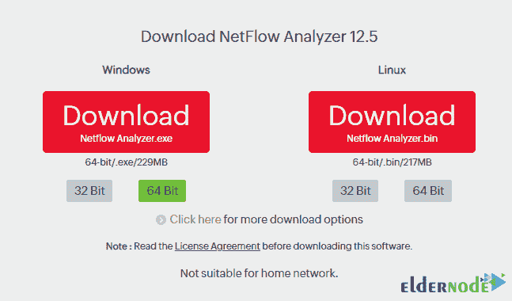
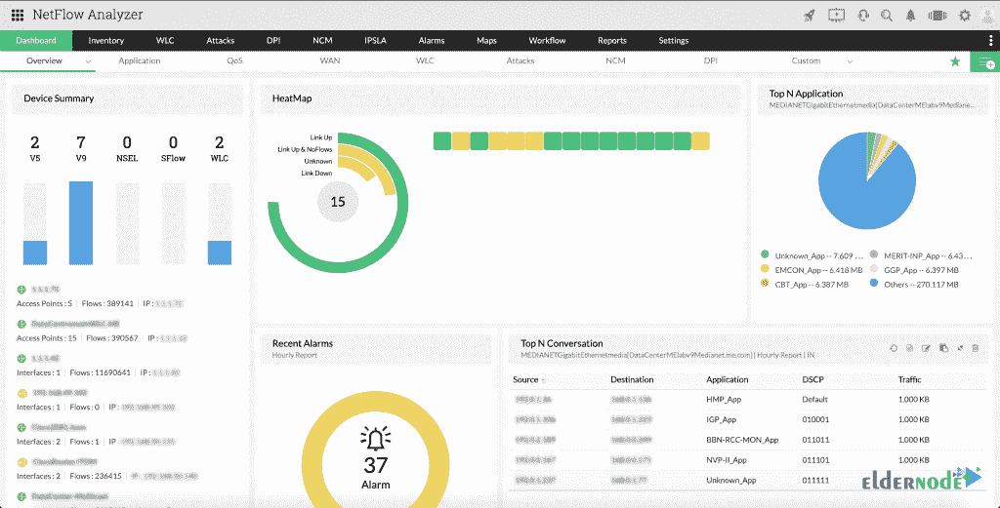
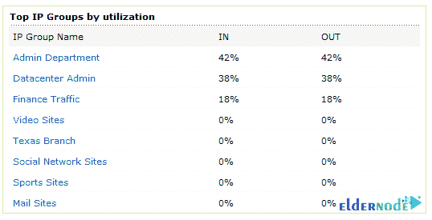
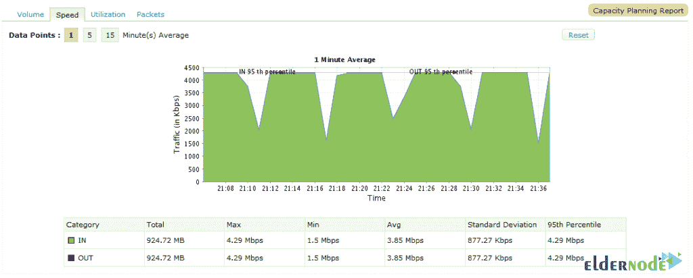
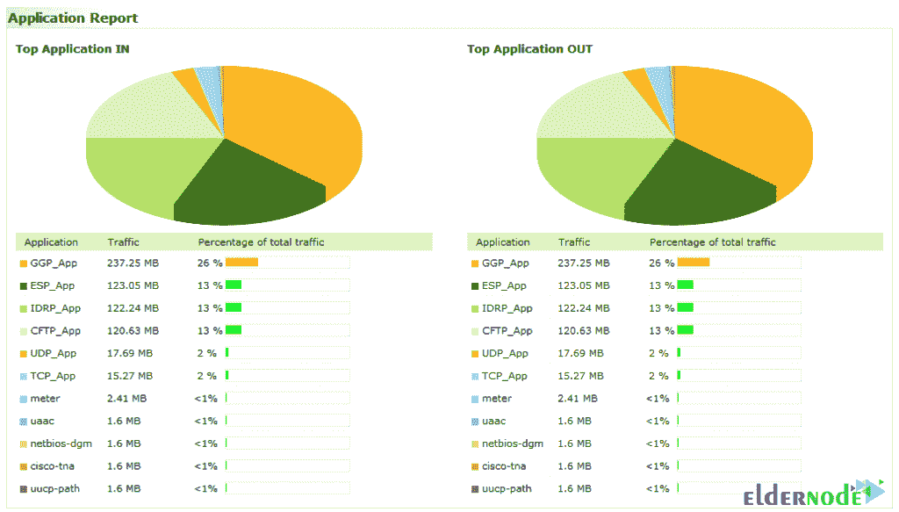

# 如何在 Windows 服务器上使用 Netflow - Eldernode 博客进行流量分析

> 原文：<https://blog.eldernode.com/traffic-analyzer-on-windows-server-with-netflow/>

**Netflow** 是思科提供的一项功能，可以在路由器等设备上实现。这个程序用来收集和控制网络流量。专业网络管理员使用 Netflow 来分析网络流量。使用此工具，网络管理员可以获得有关网络流量的来源和目的地、产生的流量等信息。在这篇文章中，我们试着学习**如何在 Windows 服务器上用 Netflow** 运行流量分析器。你可以在 [Eldernode](https://eldernode.com/) 看到购买 [Windows VPS](https://eldernode.com/windows-vps/) 服务器的可用包。

## **用 Netflow 一步一步讲解 Windows 上的流量分析仪**

使用 Netflow，您可以将获得的流量信息发送到 Netflow 收集器软件进行收集。该软件的其他应用包括准备各种报告。从这些报告中获得的信息也可以存储起来供将来使用。网络流基于数据包识别。要使用 Netflow，只需在路由器等设备上启用它，不需要对内部或外部网络进行任何更改。Netflow 对其他设备和用户完全隐藏，在每个设备上完全独立运行，不需要在所有设备上启用。在本教程的后续部分，我们试图向您介绍如何在 [Windows](https://blog.eldernode.com/tag/windows/) 服务器上使用 Netflow 进行流量分析。请加入我们。

### **网流好处**

Netflow 为其用户提供了许多好处和功能，其中一些我们将会提到:

**1。网络监控:** Netflow 允许您几乎实时地监控网络，从而控制网络上传输的流量。

**2。应用程序监控和分析:**使用该工具，可以识别网络中使用的软件。用户还可以看到这些应用程序使用任何流量。这些信息有助于网络管理员识别新服务并提供这些服务所需的资源。

**3。用户监控和配置:**通过这种方式，网络管理员可以了解用户和客户对网络和资源的使用情况。这些信息有助于规划访问、硬件和软件资源。

**4。网络规划:**长期存储来自 Netflow 的信息对于规划和预测网络增长非常有用。利用这些信息，我们可以预测网络的增长率，并据此规划增加设备、端口和带宽。网络流数据优化规划，从而降低成本。

由于这些通信的高成本，优化 WAN 端口上发送的流量非常重要。检测 WAN 端口上不需要的流量是使用此信息的另一个好处，它可以减少带宽消耗。

**5。安全分析:** Netflow 信息可以非常有效的控制和提高网络[安全](https://blog.eldernode.com/tag/security/)。Netflow 可以实时检测 DDOS 攻击、病毒和蠕虫。Netflow 还可以检测可能指示网络问题的网络更改。

**6。记账/计费:** Netflow 信息可以用来统计用户和客户的消费，是根据协议、目的地等各项来完成的。

### **如何在 Windows RDP 上安装并启动 NetFlow Analyzer**

在讨论 Netflow Analyzer 的工作原理之前，在本节中，我们将学习如何安装它。要安装 NetFlow Analyzer，第一步是[下载 Netflow Analyzer](http://www.netflowanalyzer.com/download.html) for Windows。

然后转到下载文件的位置并双击它，按照安装步骤进行安装。

***注意:*** NetFlow Analyzer 同时支持 [PostgreSQL](https://blog.eldernode.com/postgresql-installation-tutorial/) 和 MSSQL 作为数据库。

在下图中，您可以看到网络流量分析器仪表板。

### **使用 Netflow 工具的 Windows 服务器上的流量分析器**

NetFlow 由两个主要部分组成，如下所示:

1.网络流缓存或数据源是存储通信流信息的地方。

2.网络流或传输机制，负责将网络流数据传输到收集器软件进行报告和存储。

要开始使用 NetFlow Analyzer，您需要遵循以下步骤:

点击**启动** > > **服务** > >启动 **ManageEngine 网络流量分析器**启动服务。

可定制的仪表板允许用户根据速度、容量、使用和许多其他标准添加小部件，如高级设备、接口、接口组和 IP 组。仪表板中的小部件一旦创建，就可以在用户需要时拖动和释放。

### **如何在 Windows 服务器上使用 Netflow Analyzer**

**监控 NetFlow 带宽:**借助 NetFlow Analytics，您可以全面了解网络流量、应用性能、设备、接口、IP、无线网络、wan、SSIDs 和接入点，并控制带宽。NetFlow Analyzer 还支持各种 Cisco 技术，如 NBAR、CBQoS、AVC 和 IP SLA。

#### **如何在 Netflow Analyzer** 上绘制图形和报告

NetFlow Analyzer 提供了大量图表和图形，有助于准确识别网络中的流量。图形按网络设备、应用程序类型或其他自定义分组进行排序。它显示了谁是网络上的“**最大流量生成者**，以及他们产生了什么样的流量。

有用的仪表板，如下图所示，一目了然地显示您的网络。

“ **Top Applications** ”图表显示哪种应用程序使用的流量最多，NetFlow Analyzer 可以识别最常见的应用程序类型，因此几乎不需要猜测。

"**热门话题**"显示哪些数据流和设备产生的流量最大。

#### **识别带宽猪:**

设备分组允许管理员创建设备或网络子网的逻辑组。这使 NetFlow Analyzer 能够生成按这些自定义组排序的图表和报告。例如，管理员可以创建按不同分支分类的组，以确定特定工作组需要哪种数据。这对于故障排除或移动规划可能很有用。或者，它可以很容易地用于监控一组应用服务器的流量，帮助显示新服务的网络影响。

深入查看 IP 组以了解更多详细信息，包括总流量和入/出利用率。

接下来，您可以单击“**容量规划**”链接，跳转到该组的详细使用情况报告。该报告包括一些已经涉及的信息，以及一个非常有用的应用报告。应用程序报告按流量和占总流量的百分比显示使用最多的应用程序。

报告可以导出供其他应用程序使用。 [NetFlow Analyzer](https://blog.eldernode.com/?p=24595) 包括对通过电子邮件发送报告、导出到 PDF 或导出到 CSV 的本机支持，以便更容易地在 Excel 中挖掘数据。

## 结论

网络上有 Netflow 的好处是讨论安全性和调查可能的攻击。在发生网络攻击时，检查网络管理员的唯一方法是在第一时间获得目标，然后击退攻击。因为如果没有 NetFlow 流量监控功能，跟踪信息流和攻击目标将非常困难，在某些情况下甚至是不可能的。在这篇文章中，我们试图学习如何在 Windows 服务器上使用 Netflow 流量分析器，在此软件的完整介绍。