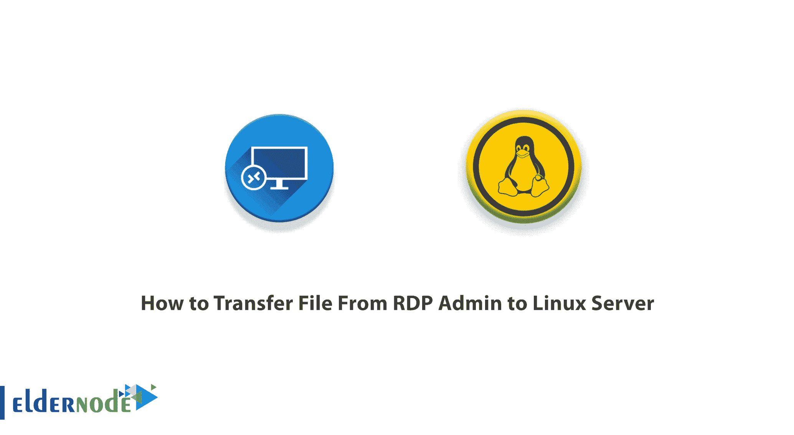

# 将文件从 RDP 管理员传输到 Linux 服务器的 4 大解决方案

> 原文：<https://blog.eldernode.com/transfer-file-from-rdp-admin-to-linux/>



如今，将文件从计算机传输到服务器以及从服务器传输到计算机是用户，尤其是站点管理员关心的问题之一，这取决于服务器操作系统的类型。这篇文章将教你如何将文件从 [RDP 管理员](https://eldernode.com/buy-rdp/)转移到 Linux 服务器。

## **教程将文件从 Windows RDP Admin 转移到 Linux VPS**


## **什么是 RDP？**

RDP 代表远程桌面协议，是远程连接台式计算机的常用协议。RDP 允许客户端计算机查看远程计算机屏幕，并建立一种控制台，但远程连接到它。RDP 协议是微软的专有协议，默认情况下使用 TCP 协议端口号 3389 进行通信。要使用 RDP，用户应使用 RDP 客户端软件或远程桌面连接，而主机需要运行 RDP 服务器软件。RDP 客户端可用于大多数版本的 Windows 和其他操作系统，包括 Linux、Unix、macOS、iOS 和 Android。

### **介绍 Linux 服务器**

一个 [Linux 虚拟服务器](https://eldernode.com/linux-vps/)是一个专用的 VPS，运行在其专有的 Linux 操作系统上。虚拟服务器托管在物理服务器上，可以独立管理。Linux 服务器比其他服务器更稳定，并且拥有最大的市场份额。

### **Linux 服务器的优势**

*   灵活的
*   负担得起的
*   使用方便
*   高度安全
*   能够为用户修改和改进虚拟服务器

## **将文件从 RDP 管理员转移到 Linux 服务器**

将文件从一台服务器传输到另一台服务器是服务器管理员面临的问题之一。当许多用户想要在两台服务器之间传输他们的文件时，他们会遇到困难，而使用正确的工具，这个过程会很容易。完成此过程的方法:

*   通过 SSH 复制文件
*   通过 FTP 传输文件
*   同步软件的使用
*   共享网络文件夹

### **通过 SSH 复制文件**

通过在 Linux 设备上设置和激活 SSH，您可以通过命令行将数据从一台服务器发送到另一台服务器。

第一步:打开终端，然后更新操作系统:

```
sudo apt update
```

第二阶段:安装 OpenSSH 服务器:

```
sudo apt install openssh-server
```

第三步:使用以下命令检查 OpenSSH 服务器是否激活:

```
sudo service ssh status
```

第四步:从 PuTTY 主页下载一个 SSH 客户端，比如 PuTTY 和 PSCP(安全拷贝客户端)工具。在您的系统上安装 PuTTY(不需要安装 PSCP)。将下载的 pscp.exe 文件保存到 Windows C: \驱动器的根目录下。您可以根据以下命令验证 Linux 设备的 IP 地址:

```
hostname -I
```

您可以将文件从 windows 传输到 Linux，如下所示:

```
c:\pscp c:  ome\path\to\a\file.txt [[email protected]](/cdn-cgi/l/email-protection):\home\user  ome\path  ewname.txt
```

您必须输入 Linux 计算机密码才能开始传输。

使用以下命令在同一个 SSH 会话中将数据从 Linux 复制到 Windows:

```
c:\pscp [[email protected]](/cdn-cgi/l/email-protection):\home\user  ome\file.txt .
```

注意结尾的句号——包括这个，否则转换将不起作用。

### **通过 FTP 传输文件**

您可以使用支持 SSH 的文件传输协议(FTP)程序。在基于鼠标的界面中通过 [SFTP](https://blog.eldernode.com/transfer-file-from-windows-to-linux-with-sftp/) 传输文件比使用键入的命令更容易。

在启动之前，SSH 服务器必须在 Linux 设备上运行。还要在 Windows 上安装一个 FTP 应用程序，比如支持 SFTP 的 FileZilla。

为此，首先运行 FileZilla，然后:

*   打开**文件>网站管理员**
*   创建一个**新站点**
*   将协议设置为 **SFTP**
*   将所需的 IP 地址添加到**主机**
*   指定用户名和密码
*   将登录类型设置为**正常**
*   准备好后点击**连接**


### **使用同步软件**

下一个选择是使用文件同步程序。这些应用程序是多平台的，并且使用加密密钥来管理设备之间的通信。

要同步数据，安装应用程序，创建同步文件夹后，创建密钥。在第二台计算机上进行设置。为此，我们引入了两个软件:

*   **Resilio Sync** :这款应用(以前叫做 BitTorrent Sync)可以在任何平台上使用。这款应用的免费版本足以同步两台设备。
*   SyncThing :这款应用是 Resilio Sync 的免费替代品，适用于 Linux、Windows、macOS 和 Android。

### 共享网络文件夹

在 Windows 和 Linux 机器之间共享文件最简单的方法是使用网络文件夹。通过创建共享网络文件夹，您可以通过网络在 Linux 上安装 Windows 目录，或者在 Windows 上安装 Linux 目录。所以你可以同时在 Windows 和 Linux 中使用相同的文件和文件夹。

要开始安装，请先编辑网络连接。为此，右键单击系统托盘上的网络连接图标。


然后从**打开网络&互联网设置**部分，选择**共享选项**并启用以下选项:

*   打开网络发现。
*   打开文件和打印机共享。


保存更改后，转到文件系统上要通过网络共享的文件夹。右击文件夹，选择**属性**。然后打开**分享标签**，点击**高级分享**，选择**分享该文件夹**。在同一个页面上点击**权限**按钮可以管理权限。最后保存设置。


要访问 Linux 系统上的窗口列表，请打开 Linux 系统的文件浏览器并选择 Network。现在，您可以从 Windows 托管的文件夹开始交换数据。

## 结论

在本文中，我们教你如何将文件从 RDP 管理系统转移到 Linux 服务器。在 Windows 和 Linux 之间共享文件很容易。有问题可以在评论里问。我希望你喜欢这篇文章。