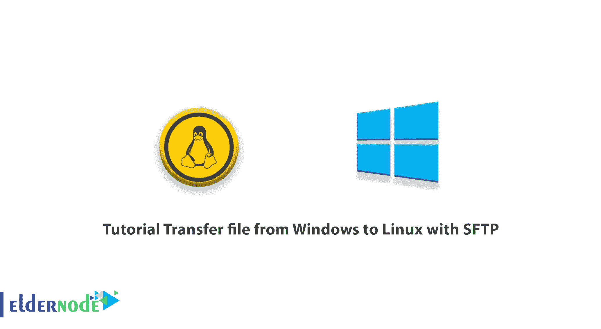
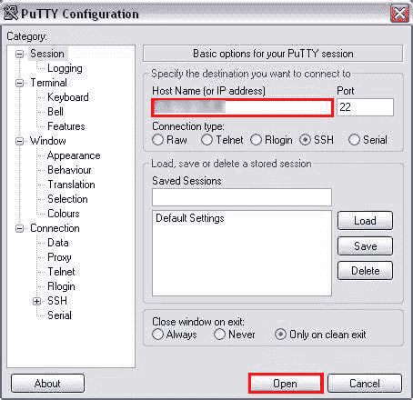

# 使用 SFTP -埃尔德诺德博客将文件从 Windows 转移到 Linux 的教程

> 原文：<https://blog.eldernode.com/transfer-file-from-windows-to-linux-with-sftp/>



将文件从一个系统转移到另一个系统很简单，并不复杂，但有时我们可能会遇到问题。例如，两个系统可能有不同的文件类型和不同的显示文本和数据的方式，它们也可能有不同的文件夹结构。这就是为什么你需要知道数据传输协议。在本文中，我们将向您介绍 SFTP 协议，并教您如何使用 SFTP 将文件从 Windows 传输到 Linux。如果你想购买一台 [**Linux VPS**](https://eldernode.com/linux-vps/) 服务器，你可以访问 [Eldernode](https://eldernode.com/) 中的软件包。

## **什么是 SFTP？**

SFTP 代表安全文件传输协议，是 FTP 协议的安全版本，支持在安全环境中访问和传输数据。SFTP 协议对你的数据进行加密，并在密不透风的条件下进行传输。SFTP 也被称为“SSH 文件传输协议”，因为 SFTP 使用 SSH 来传输文件。FTP 客户端无法使用 SFTP 服务器。这些服务器专用于使用 SSH 协议访问、传输和管理文件的 SFTP 客户端。

### **要求**

*   在 windows 系统上安装 PuTTY
*   在 Linux 系统中安装 open ssh

## **如何用 SFTP** 将文件从 Windows 转移到 Linux】

如果您还没有在您的 [Linux](https://blog.eldernode.com/tag/linux/) 服务器上启用 SFTP，您可以使用下面的命令:

```
sudo apt-get install openssh-server
```

```
sudo apt-get install ssh
```

首先，远程登录到您的 Linux 系统。您可以在 Windows 环境中使用 PuTTY 作为您的 SSH 客户端。为此，在开始菜单上键入 PuTTY 并打开它。PuTTY 打开后，您应该键入您的 IP 并单击 Open。



现在你应该输入你的用户名和密码。然后将/home/user/server 目录更改为/server$目录。

在这一步中，您应该会在/server$文件夹中看到您的文件。

然后输入要从 Windows 传输到 Linux 的文件的名称。指定该文件的目标文件夹，然后该文件将从 Linux 机器粘贴到 Windows。

您可以在本地磁盘 c 上找到任何程序文件，如 PuTTY。打开 PuTTY 文件夹并确保 pscp 文件存在。现在，您应该复制相关的文件夹路径。然后打开命令提示符，以管理员身份运行它，并粘贴您之前复制的路径。

接下来输入以下命令:

```
C:\Program Files\PuTTY>pscp.exe -P 22 [[email protected]](/cdn-cgi/l/email-protection)_Address:/home/user/server/filename.py C:\Users\Public\user
```

22 是 SSH 的端口号。请注意，您应该输入用户名、远程系统的 IP 地址和用户文件的密码。

最后，将所需文件复制到目标文件夹。

## 结论

在本文中，我们教你如何用 SFTP 将文件从 Windows 转移到 Linux。跨平台(比如在 Windows 和 Linux 之间)传输数据的过程很简单，在本文的帮助下，您可以轻松完成。