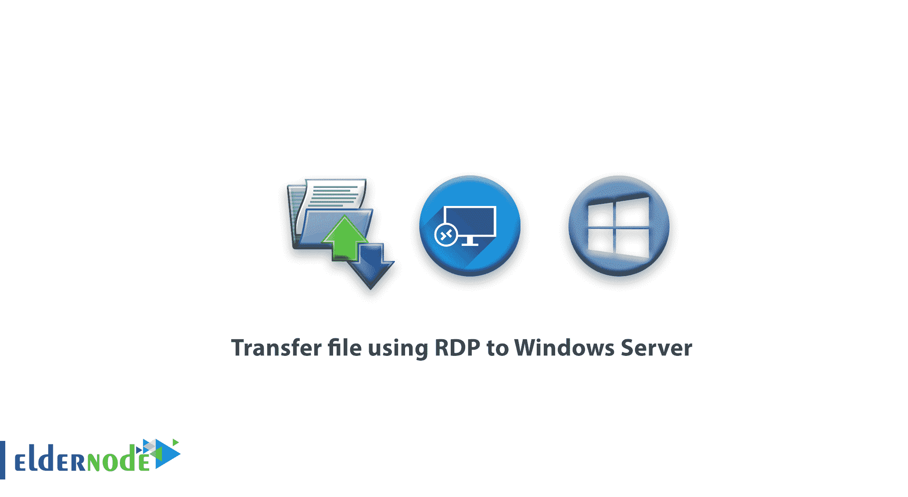
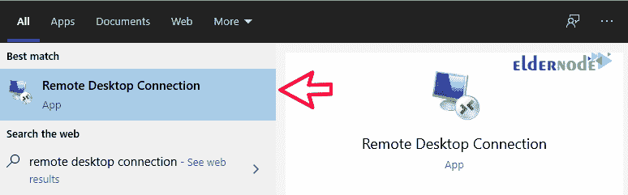
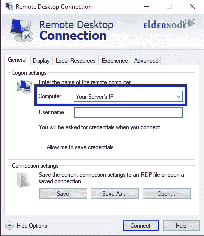
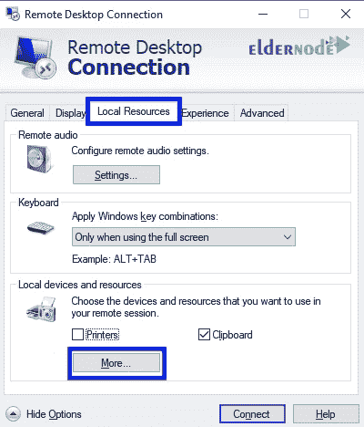
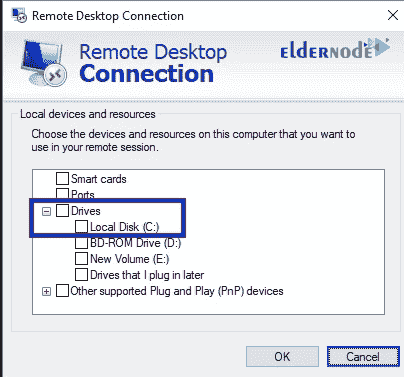
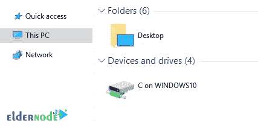

# 如何使用 RDP 将文件传输到 Windows Server - Eldernode

> 原文：<https://blog.eldernode.com/transfer-file-using-rdp-to-windows-server/>

如何使用 [RDP](https://en.wikipedia.org/wiki/Remote_Desktop_Protocol) 将文件传输到 Windows 服务器。我们经常需要将文件从计算机或笔记本电脑传输到服务器，反之亦然。
最好的方法是从远程桌面传输文件。从远程桌面传输文件的方法非常合适，因为您可以使用此方法复制任何类型的文件(可执行文件、图像文件、电影、文本文件等)。)任意大小。您也不需要中间上传网站来传输，您可以直接从源位置复制文件并将其放在目标位置。在本文中，我们将教你如何通过远程桌面将文件传输到 Windows 服务器。

[**买便宜的 RDP**](https://eldernode.com/buy-rdp/)

## 如何使用 RDP 将文件传输到 Windows 服务器

**1。** 要开始，从**开始菜单**打开远程桌面。

**2。** 在电脑栏中输入您服务器的 IP 地址。

**3。** 在本地资源选项卡中，点击更多，选择你想要的驱动器。

**4。** 展开驱动器部分，选择本地磁盘 C: (或任何其他驱动器)。

**5。** 选择通用选项卡，然后保存保存这些设置。

**6。T3 现在点击连接进入服务器。在“我的电脑”服务器中，您将看到您的驱动器，并且您可以轻松地在驱动器服务器和您的计算机中所选的驱动器之间移动文件。**

**亦见:**

[Windows Server 2016 上的 RDP 限制设置](https://eldernode.com/rdp-limit-settings-on-windows-server-2016/)

[教程在 Windows Server 2019 上启用 RDP](https://eldernode.com/enable-rdp-on-windows-server-2019/)

[如何购买 rdp 比特币](https://eldernode.com/how-to-buy-rdp-bitcoin/)

**尊敬的用户**，我们希望您能喜欢这个[教程](https://eldernode.com/category/tutorial/)，您可以在评论区提出关于本次培训的问题，或者想解决[老年人节点培训](https://eldernode.com/blog/)领域的其他问题，请参考[提问页面](https://eldernode.com/ask)部分，并尽快提出您的问题。腾出时间给其他用户和专家来回答你的问题。

好运。