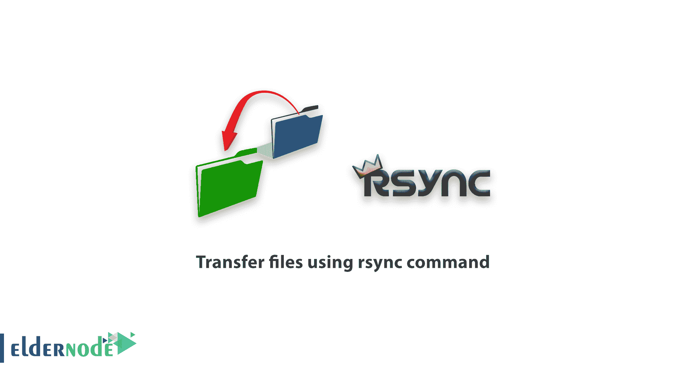

# 如何使用 rsync 命令传输文件

> 原文：<https://blog.eldernode.com/transfer-files-using-rsync/>



【更新于:2021-01-04】**R**emote**Sync**是一个著名的命令，用于远程复制和同步文件、数据和方向。您可以跨目录(在 Linux/Unix 中)、跨磁盘和网络远程和本地执行所有这些活动，在两台 Linux 机器之间执行数据备份和镜像。加入我们这篇文章，学习如何使用 rsync 命令来**传输文件。虽然你希望使用 Linux VPS 或 RDP 管理员，但这篇文章对你会很有用。**

## **教程使用 rsync 命令传输文件**

为了让本教程更好地发挥作用，请考虑以下**先决条件**:

源系统和目标系统上都应该安装了 ***rsync*** 实用程序。如果您以前没有安装它，您可以通过发行版的软件包管理器进行安装:

对于 **Ubuntu** 和 **Debian** :

```
sudo apt install rsync
```

对于 **CentOs** 和 **Fedora** :

```
sudo yum install rsync
```

## **用 rsync 命令一步步传输文件**

如果您远程操作系统，使用 rsync 命令复制和同步文件会很有效，因为它支持复制链接、所有者、组和权限。使用 ***rsync*** 命令的主要原因是它比**S**ecure**C**o**p**y 要快

***rsync*** 命令的基本语法如下:

```
rsync options source destination
```

可以使用 ***rsync*** 命令将文件传输到 SSH。

```
rsync [options] source destination 
```

示例:传输多个文件:

```
rsync [[email protected]](/cdn-cgi/l/email-protection):/root 
```

您可以使用自己的用户名代替 root。

***rsync*** 命令也有许多选项，最好在使用该命令时使用:

-a: 存档模式

-v: 详细模式

-z:传输过程中的压缩(为了更快的传输)

–进度:显示已提交项目的列表

示例:

```
rsync -azv --progress *[[email protected]](/cdn-cgi/l/email-protection)92.168.1.10:/home 
```

如果 ***rsync*** 命令被中断，可以使用-a 选项。使用此选项可以防止文件被覆盖，并且只传输不在目标位置的文件。

默认情况下， ***rsync*** 命令使用 SSH 协议的端口 22。如果目标服务器不使用端口 22，您可以使用以下选项:

```
--rsh='ssh -p22' 
```

请输入您最喜欢的端口号，而不是 22。

如果您在执行此命令时收到以下错误，这是因为目标服务器上没有安装 ***rsync*** 数据包。

```
rsync: Connection unexpectedly closed (0 bytes recived so for ) [Sender]    rsync: Error: Rewrote command not found (code 127/ atioc 456) [Sender] 
```

### **学习使用 rsync 命令传输文件**

## 结论

在本文中，您学习了如何使用 rsync 命令传输文件。使用远程更新协议，rsync 命令允许只传输两组文件之间的差异。rsync 命令第一次将文件或目录的全部内容从源复制到目标，但随后会将更改的块和字节复制到目标。如果您有兴趣阅读更多内容，可以找到我们关于 SSH 和 Linux 中最常用的 21 个命令的相关文章。