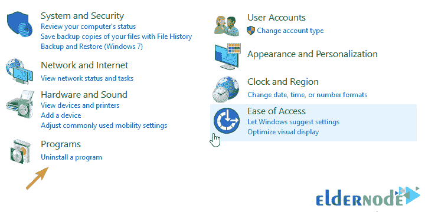
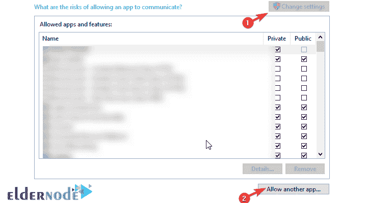
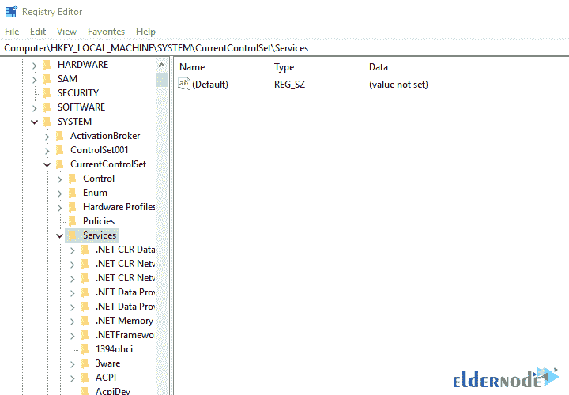
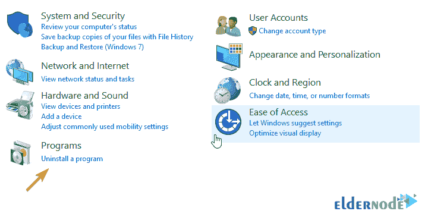

# Windows 10 中的 Cisco VPN 故障排除- Eldernode

> 原文：<https://blog.eldernode.com/troubleshoot-cisco-vpn-in-windows-10/>

Windows 10 中的 Cisco VPN 故障排除。思科 VPN 在 **Windows 10** 中表现相对较好。最大的问题发生在最近的 Windows 更新中，导致该应用程序出现问题。这些问题并不常见，但如果真的发生了，Cisco VPN 客户端就完全没用了。在这篇 [教程](https://eldernode.com/category/tutorial/) 中，我们列举了在 Windows 10 中解决和排查思科 VPN 的解决方案。和我们在一起。

## 如何在 Windows 10 中排除思科 VPN 故障

**1)** 修理安装

**2)** 允许 VPN 通过防火墙自由通信

**3)** 在注册表中应用更改

**4)** 重新安装

### 1-如何修复安装以排除思科 VPN 故障

你需要做的第一件事是修复安装。许多第三方应用程序在重大操作系统更新后会遇到问题。因此，始终建议您在更新操作系统后再次更新它们。

甚至建议你更新后删除各种错误。当然，如果您在更新之前没有删除 Cisco VPN，您将需要修复软件安装。

如果你不知道如何修复思科 VPN，请遵循以下步骤:

**A.** 在 Windows **搜索**部分，键入**控制面板**并选中。

**B.** 点击左下方的**卸载**一个程序。

**C.** 点击**思科系统 VPN 客户端**然后点击**修复**。

**D.** 按照步骤操作，直到安装完成。

### 2-如何允许 VPN 在防火墙中自由通信

系统更新可以将操作系统设置更改为默认值。这也会影响 [Windows Defender 设置](https://eldernode.com/windows-defender-configuration-tutorial/)。如果发生这种情况，所有需要从防火墙发送流量的应用程序都有可能出现这种问题。这就是我们建议您检查设置并确保允许应用程序通过互联网流量的原因:

**A.** 在 Windows 搜索部分，输入**允许一个 app** 显示**允许一个 app 穿越 Windows 防火墙**选项，找到该选项后选中。

**B.** 点击**改变设置**。

**C.** 确保 Cisco VPN 在列表中，并且允许流量通过防火墙。如果思科 VPN 不可用，点击**允许另一个应用**将此选项添加到授权应用列表。

**D.** 检查私有和公共选项。

**E .应用**更改，然后**打开**思科 VPN。

### 3-注册表中的操作

像所有其他可用的 VPN 一样，思科 VPN 需要一个**虚拟网络适配器**。该设备的故障是另一个常见事件，由**错误代码 442** 指示。你需要做的第一件事是在**设备管理器**中检查虚拟网卡驱动。

为此，请按照下列步骤操作:

**A.** 点击**开始**，打开**设备管理器**。

**B.** 打开**网卡**部分。

**C.** 右击**虚拟适配器**，**更新**它。

****重置**电脑。**

**如果问题仍然存在，您必须**操作注册表**。这样大概就能彻底解决问题了。你需要**管理员权限**来修改注册表。**

*****注意*** 如果您对注册表进行了更改，请谨慎操作，因为如果您在注册表中注册更改时出错，可能会导致系统错误。**

#### **如何更改注册表和修复思科 VPN**

****A.** 编写**注册表编辑器**并打开注册表编辑器。**

****B.** 在地址栏中输入**跟随路径**，然后按**进入**:**

*****HKEY _ 本地 _ 机器系统当前控制设置服务虚拟塔*****

****

****C.** 右击**显示名称**按钮，选择修改 。**

****D.** 在 **值数据** 部分，确保有思科 VPN 适配器文本。对于 64 位版本，此文本采用 64 位 Windows 系统 VPN 适配器的形式。**

****E.** **保存**更改，**再次运行**思科 VPN。**

### **4-如何重新安装思科 VPN 软件**

**最后，如果以上方法都不起作用，最后一招就是卸载重装软件。当然，这种安装应该是这样的，您删除所有现有的文件，不保留操作系统中的任何设置，这需要存在第三方软件，如 **[Ashampoo](https://www.ashampoo.com/uk/gbp/dld/2203/Ashampoo-UnInstaller-FREE/)** 卸载程序。**

**按照以下步骤重新安装 Cisco VPN:**

****A.** 进入**控制面板**，打开**卸载一个程序**。**

****

****B.** 删除思科系统 VPN 客户端。**

****C.** Ashampoo 卸载程序(或运行任何第三方清理软件)**

****D.** 从软件文件夹中删除任何与思科软件相关的内容。**

****E.** 再次下载思科 VPN 客户端。**

****F.** 安装后再次运行。**

## **结论**

**有时会观察到在 Windows 10 中安装思科 VPN 后，运行这个程序会出现问题。在本教程中，我们尝试对 Windows 10 中的 Cisco VPN 进行故障排除。我们希望你会喜欢这个教程。**