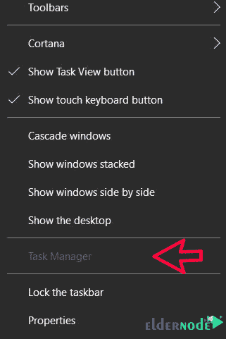

# 如何排除非活动任务管理器- Eldernode 的故障

> 原文：<https://blog.eldernode.com/troubleshoot-inactive-task-manager/>


如何解决非活动任务管理器的问题？在本[教程](https://eldernode.com/category/tutorial/)中，我们将一步步教你如何排除[任务管理器](https://en.wikipedia.org/wiki/Task_Manager_(Windows))不活动的故障。

有时在 Windows 中，我们会看到菜单或部分被禁用。这些突然的行动和事件是两个重要的点。

1-管理员用户已禁用此功能。

2-病毒或恶意软件破坏了 Windows 并使一个部件崩溃。

对于第一个原因，您可以通过联系您的网络管理员来解决问题。但是有时你是你自己系统的管理者，你会遇到表明病毒或恶意软件的问题。

有些恶意软件会在登录到您的系统后禁用您的任务管理器。

恶意软件通常通过修改 Windows 注册表来实现这一目的。

> ##### 您可以从 eldernode 选择最完美的 [Windows VPS](https://eldernode.com/windows-vps/) 服务器套装。

## 如何排除非活动任务管理器的故障

**1-** 首先，确保任务管理器被禁用。



**2-** 确认无误后，打开你系统的运行窗口。

要打开 Run，您可以在开始菜单中搜索 Run，或者使用 Win + R 组合键。

**3-** 打开运行窗口后，键入“ regedit ，点击 ok 。


**4-** 在打开的窗口中，按照下面的步骤操作，如果看到短语“ DisableTaskMgr ，删除它。

```
HKEY_CURRENT_USER\Software\Microsoft\Windows\CurrentVersion\Policies\System    HKEY_LOCAL_MACHINE\Software\Microsoft\Windows\CurrentVersion\Policies\System    HKEY_USERS\.default\Software\Microsoft\Windows\CurrentVersion\Policies\System 
```


清除所有 3 条路径后，任务管理器选项将被激活。


**尊敬的用户**，我们希望您能喜欢这个[教程](https://eldernode.com/category/tutorial/)，您可以在评论区提出关于本次培训的问题，或者想解决[老年人节点培训](https://eldernode.com/blog/)领域的其他问题，请参考[提问页面](https://eldernode.com/ask)部分，并尽快提出您的问题。腾出时间给其他用户和专家来回答你的问题。

好运。